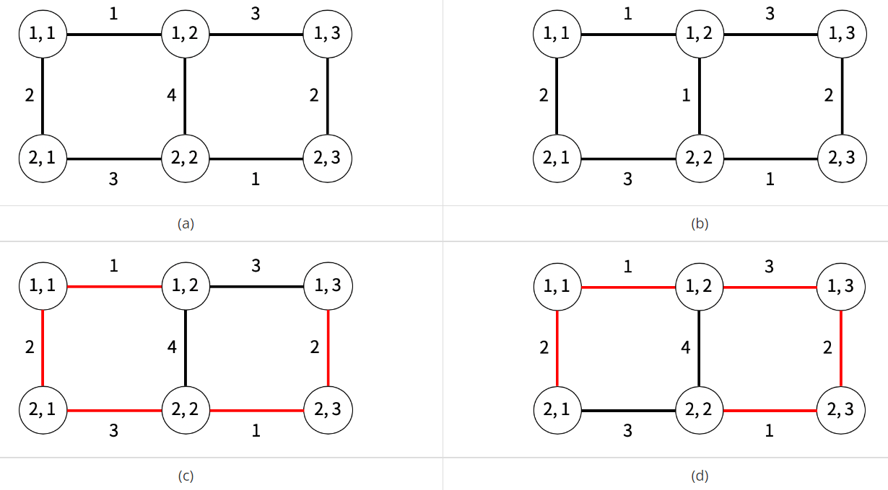

# Description
Your consulting firm needs to help a client decide how to setup a grid of supercomputers. These supercomputers are located in a grid (one supercomputer per node in the grid), and your client wants to minimize the cost of installing petabit networks lines so that any pair of supercomputers can communicate with each other (they do not have to be directly connected as they can communicate through other connected supercomputers).

The grid consists of R rows and C columns such that each node contains one supercomputer. A petabit network can be installed between any two adjacent nodes, horizontally or vertically. The cost of connecting a pair of (adjacent) nodes varies, but it is always an integer between 1 and 4 (inclusive). Interestingly, the costs of installing petabit networks for any node would be distinct.



For instance, in Figure (a), there are six nodes, and the costs of installing petabit networks for any specific node are all distinct. In Figure (b), there are six nodes as well, but node (1, 2) and node (2, 2) have non-distinct costs (for instance, node (1, 2) has two petabit networks whose cost is 1).

Given the grid in Figure (a), we can install five petabit networks whose overall cost is 9 (which is optimal), and allow every pair of supercomputers to communicate.  There are two ways to do so, as illustrated in Figure (c) and Figure (d). Given a grid network and costs of installing petbit network for adjacent nodes, compute the minimum cost of installing petabit networks so that every pair of supercomputers can directly or indirectly communicate with each other.

## Input
The first line will contain the number of test cases, T.

The first line of each test case will contain two numbers, R and C, separated by a whitespace. The following R lines will contain C-1 integers each, describing the cost of installing a petabit network between two horizontally adjacent nodes. The following R-1 lines will contain C integers each, describing the cost of installing a petabit network between two vertically adjacent nodes.

## Output
For each test case, you must output the minimum cost in a single line.

## Limit
```
1 ≤ T ≤ 10
2 ≤ R, C ≤ 500
1 ≤ cost of connecting a pair of nodes ≤ 4
```
## Subtask 1 (4 Points)
2 ≤ R, C ≤ 7
The total number of edges in a grid is at most 20.

## Subtask 2 (9 Points)
2 ≤ R, C ≤ 500

## Sample Input
```
3
2 3
1 3
3 1
2 4 2
2 2
1
1
2 2
3 3
1 2
1 4
4 3
2 3 3
3 2 1
```

* **Sample Ouput 1**
```
9
4
15
```
# Solution:
The problem to get a minimum cost of set up all super computers  which located in a grid to be connected.

When you make a server network, you don't need to make all server connection directly, it's possible that some server connect to the other server via another server. In other word, let the server as a node, the network between servers as a edge, you have to find the minimum cost to make a tree which have all nodes and no cycle.

A tree which has one path from one node to another node and no cycle is a spanning tree, and when sum of all weight of edge in tree is minimum, it called that minimum spanning tree (MST).

A Figure in below is show that all of spanning tree in the example grid of super computers. There will be total 21 (7C5) spanning trees which include trees shown in the figure. 

Kruskal and Prim algirithms are well know algirhtms to find MST in a graph.

Kruskal algorithm : sort the edges with weight of edge and select the edge from the smallest weight to make MST while not to make a cycle. To not make a cycle, skip the edge which make a cycle.

Prim algirhtm: from one node increase edges to make MST. In every adding a edges, select a edge to minimize increase total weight.

The time complexity of both algorithm is O(ElogV), so the TLE will occurs because the maximum value of each R and C is 500. But, time complexity of Kruskal algorithm when all edges are already sortedwill be O(E), so you can pass the tests.

The range of the weight which represents cost of computer network is 1≤weight≤4. So, you don't need to sort the edges by it's weight, just make edge groups, which have same weight edge when read an input data. You can use this edge groups instead of sorted edges.

You can get minimum cost using Kruscal algorithm and weight edge groups.