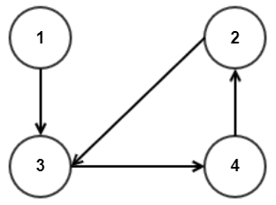
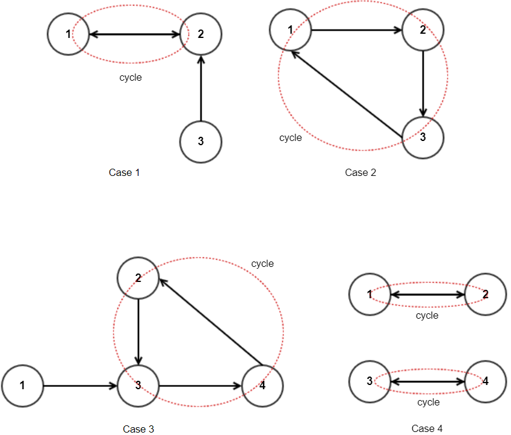
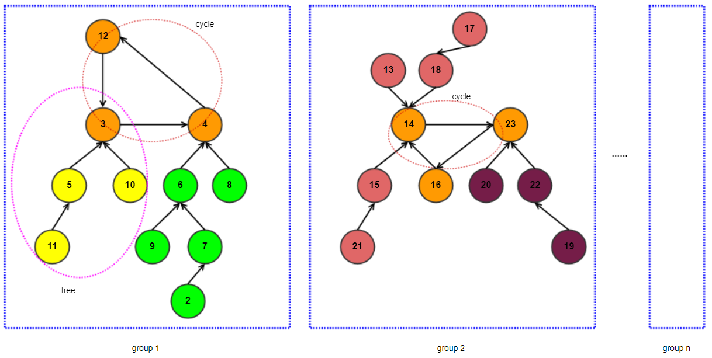
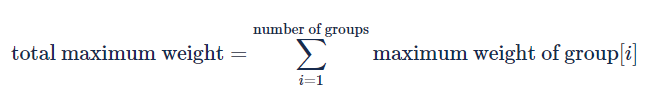
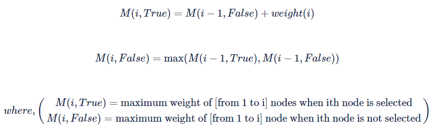

# Description
Rick the Scientist recently succeeded in synthesizing new ultra-nano scale materials.

He's synthesized n kinds of materials (labeled as 1 to n), and material i's weight is wi.

Rick wants to present these materials at the upcoming Conference on "Unstable Ultra-nano Scale materials".

Yet, since these materials are tiny and unstable, there are some limitations.

material i may explode if it is put into the same container as another material Qi.

Given this information, Rick wants to choose some materials that are not going to explode when put into the same container together.

For instance, suppose n = 3 and their weights are w1 = 3, w2 = 5, and w3 = 1.

In addition, material 1 reacts to material 2 (Q1 = 2), material 2 to material 1 (Q2 = 1), and material 3 to material 2 (Q3 = 2).

In other words, if materials 1 and 2 are put together, then they would both explode. Material 3 would explode if material 3 and material 2 are put together.

In this case, having material 1 and material 3 is safe, and they can be put together in the same container (whose overall weight is 4).

On the other hand, putting material 2 alone in the container is also safe, and its weight is 5 -- therefore this is optimal.

Rick wants to find out the maximum sum of weights of these materials that he can bring to the conference (in a single container) without causing explosions.

## Input
The first line will contain the number of test cases, T.

For each test case, the first line will contain the number of materials, n.

Each of the following n lines will contain two numbers, separated by a whitespace, that are wi and Qi, respectively.

## Output
For each test case, you must output the maximum achievable weight of materials Rick can bring to the conference without causing explosions.

## Limit
```
1 ≤ T ≤ 10
2 ≤ n ≤ 100,000
1 ≤ wi ≤ 1,000,000
1 ≤ Qi ≤ n
Qi ≠ i
```

* **Subtask 1 (6 Points)**
2 ≤ n ≤ 1,000

* **Subtask 2 (21 Points)**
2 ≤ n ≤ 100,000

* **Sample Input**
4
3
3 2
5 1
1 2
3
3 2
2 3
2 1
4
1 3
2 3
3 4
4 2
4
2 2
3 1
4 4
3 3
* **Sample Output**
5
3
5
7
* **Explanation of sample result**
- Test case 1: It's optimal to bring material 2 alone.
- Test case 2:It's optimal to bring material 1 alone.
- Test case 3: It's optimal to bring material 1 and material 4.
- Test case 4: It's optimal to bring material 2 and material 3.

* **Hints**
Note that the total sum of weights may exceed 231-1.

# Solution:

When we refer to the material as a node, an edge with a direction that points to it as a substance that cannot exist together, the third example is shown as follows.



If you look at the condition of the problem here, you can see one characteristic when you think that all materials point to one other material that cannot be flown together. That is, the number of nodes and the number of edges are the same. And that means it have one cycle on the graph.  If all nodes are not connected to each other and are divided into multiple connection graphs, each graph has one cycle.

It is painted as follows.



What we need to figure out in this picture is that we choose nodes so that the weight sum are as heavy as possible without selecting nodes that are adjacent to each other. If the graph is a tree, you can easily solve the problem by dynamic programming, but it is not easy to set the recurrence relation because the cycle exists. However, if the entire graph is made up of a single cycle, you can get the answer with a simple ignition system.

In other words, if the graph is in the shape of a tree, or if it is a single circle, the recurrence relation can be set up to obtain the answer.

The above two characteristics can be used to solve the problem.

Due to the constraints of the problem, the graph must have one or more independent, interconnected groups of nodes. These node groups must have a single cycle, and nodes that do not belong to the cycle can be represented by a tree-shaped graph of the node that belongs to the cycle.

Therefore, the maximum weight of each tree can be obtained when the root node is selected and not selected, and then the maximum selected weight of the nodes in the cycle can be calculated.



In the figure above, the blue dotted lines represent a bundle of nodes connected to each other, and the orange nodes are nodes belonging to a cycle, each of which can be its own root and make a tree. Each node in each cycle consists of a tree.



**Getting cycle nodes from a graph**

First, the simplest way to get a cycle from a direction graph is to see if you revisit the nodes you visit while performing DFS on all nodes. However, this problem can be used to find cycle nodes at a lower cost. That is, when performing DFS on all nodes, you can reduce the number of nodes you visit except those that you visited during the previous dfs.

In addition to this method, you can get cycle nodes using SCC algorithms.

**Getting the maximum weight when the root node of the tree is selected/non-selected**

Once the cycle node has been obtained, you can set up the recurrence relation that obtains the maximum weight sum of the tree with the nodes in the cycle as the root node.

At one node i, the maximum weight can be defined as follows.


Maximum weight when the current node is selected = sum(Maximum weight when child node is not selected) + Weight of that node
Maximum weight when the current node is not selected = sum( max(Maximum weight when child node is selected, Maximum weight when child node is not selected))

After each calculation of the maximum weight of the tree, you can now finally obtain the maximum selected weight of the cycle node.

**Getting the maximum weight of the cycle node**

Set any one node in the cycle as the start node. The maximum weight is obtained up to the last node of the cycle when the start node is selected and not selected.

The recurrence relation is as follows.



Maximum weight when the current node is selected = Maximum weight when the previous node is not selected + Weight of that node

Maximum weight when the current node is not selected = max(Maximum weight when the previous node is selected, Maximum weight when the previous node is not selected)

The final results can be calculated as follows


Maximum weight of the cycle = max(Maximum weight when the start node is selected and the last node is not selected,
                          max(Maximum weight when the start node is not selected and the last node is selected, Maximum weight when the start node is not selected and the last node is not selected))


In this way, the maximum weight of each group can be obtained, and the answer can be obtained by adding the maximum weight of all groups.