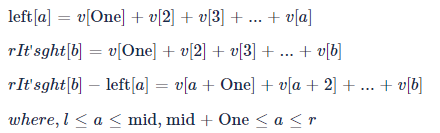

# Description

Let A be a matrix of N rows and M columns and x be an integer.

You want to count the number of sub-matrices of A whose entry-sum does not exceed x (i.e., less than or equal to x).

For instance, suppose N = M = 2 and x = 5, and let A be the following:
```
1 2
3 4
```

In this case, four sub-matrices of size 1x1 all have their (respective) entry-sum no greater than x.

The 2x1 sub-matrix that contains 1 and 3 (whose entry-sum is 1+3 = 4) and the 1x2 sub-matrix that contains 1 and 2 (whose entry-sum is 1+2 = 3) also satisfy the condition.

All other sub-matrices of A would violate this condition, and thus the answer in this example would be 6.

In another example, consider the following matrix A with N = 2, M = 3, and x = 0.
```
0 -1 -2
-3 -4 -5
```

In this case, every sub-matrix of A has its entry-sum less than or equal to 0, and therefore the answer is 18 (there are 18 sub-matrices of A).

Given N, M, x, and A as input, count the number of sub-matrices of A whose entry-sum does not exceed x.

## **Input**
The first line will contain the number of test cases, T.

For each test case, the first line will contain N, M, and x separated by a whitespace.

Each of the next N lines will contain M integers separated by a whitespace.

## **Output**
Output the number of sub-matrices of A whose entry-sum is less than or equal to x.

## **Limit**
```
1 ≤ T ≤ 10
-1,000,000,000 ≤ x ≤ 1,000,000,000
-100,000 ≤ each entry of A ≤ 100,000
Subtask 1 (6 Points)
1 ≤ N ≤ 50
1 ≤ M ≤ 50
Subtask 2 (18 Points)
1 ≤ N ≤ 300
1 ≤ M ≤ 150
```

## **Sample Input 1**
```
4
2 2 5
1 2
3 4
2 3 0
0 -1 -2
-3 -4 -5
4 1 3
1
2
1
2
3 3 1
10 10 10
10 -100 10
10 10 10
```
## **Sample Output 1**
```
6
18
7
16
```

* Case 1 and Case 2 are discussed in the problem statement.

* Case 3:

The four 1x1 sub-matrices count. The three 2x1 sub-matrices that contain one 1 and one 2 also count. The answer is 7.

* Case 4:

For a sub-matrix to have its entry-sum no greater than 1, it must contain -100. Every sub-matrix that contains -100 would satisfy the condition, so the answer is 16.

# Solution: Divide and Conquer Method

The problem of finding the number of sub-matrices where the sum of the elements of sub-matrices is less than or equal to a certain number, given the`n×m` matrix.


Make the `m×n`matrix composed as shown in Figure 1 as the prefix sum for each row as shown in Figure 2. In this way, two specific coulmns can be selected and the sum of the sub-matrices whose columns constitute the left and right of the sub-matrix can be expressed as a one-dimensional array.


That is, as shown in Figure 3 above, when an arbitrary column `L=j, R=k (j<k)` is selected, the sub-matrix (blue box) with left column as L and right column as R is equals to the array that is subtract the column (L-1) from the column R. This way, you can change the two-dimensional problem to a one-dimensional problem, and perform this calculation on all column combinations to check the sum of the entire sub-matrices. Now, you only need to check the number of sub-arrays whose sum is less than or equal to a given value. There are many ways to do this, but you can get it quickly by using the divide and conquer method, which is a slight modification of the merge sort method.


The method of finding the number of sub-arrays whose sum is less than or equal to a specific value in a one-dimensional array is as follows.

1. Create an array of prefix sums for arrays. (eg, original: [1, 3, 5] → prefix sum: [1, 4, 9])
2. Divide the array into two parts, left and right, according to the merge sort method.
3. The number of sub-arrays that satisfy the condition in two divided arrays is equal to the sum of the following two.
    * Number of sub-arrays that satisfy the conditions of the left and right divided parts
        * Each divided left and right part is obtained by dividing it into smaller sections again by the divide and conquer method.
    * Number of sub-arrays that satisfy the condition among sub-arrays that cross two parts
        * After selecting the first value `L` in the left part, all the values ​​in the right part `R[i]`the i-th value in the right part) are sequentially taken out and the conditions are compared. `R[i]-L<x`
        * At this time, the values ​​in the left and right parts are sorted values, so if there is a value that exceeds the condition, there is no need to check the remaining values.


## Complexity:
O(M^2 * Nlog(N))