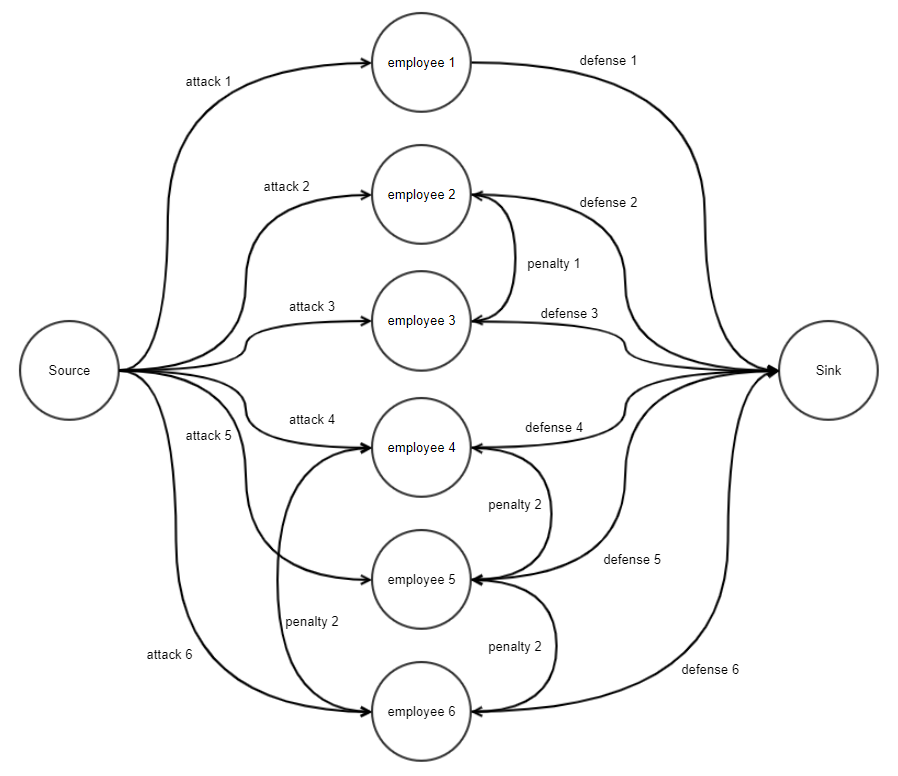

# Description:

Another Security Hackathon is happening soon!

There are N employee participants, and each of them needs to be assigned to group A (for attacking a dummy system) or to group B (for defending the dummy system). Everyone's ability of attacking or defending is quantified based on their previous participation in a similar event. For convenience, let A[i] and B[i] be the i-th employee's attack score and defense score (the higher, the better).

There are 2N ways to assign N employees to two teams, and we wish to maximize the "fitness" of such partition. The fitness can be quantified by adding the attack scores of everyone in group A, the defense scores of everyone in group B, and applying a "penalty" that's to be described below.

There are M task forces in the company, and each task consists of 2 or more, but no more than N, employees.  If two employees in the same task force are separated by the team assignment, then the "fitness" would be penalized by the (pre-defined) penalty of the said task force (each task force has an integer penalty value associated with it). Such penalty would be applicable to every pair of employees within the same task force (see the sample test cases).

For instance, suppose N = 3 and the following describe attack scores and defense scores.

* Employee 1: A[1] = 10 and B[1] = 0
* Employee 2: A[2] = 10 and B[2] = 5
* Employee 3: A[3] = 5 and B[3] = 5
In addition, suppose M = 1 and the only task force has Employee 1 and Employee 2 with a penalty of 100.

If we assign Employees 1 & 2 to group A and Employee 3 to group B, then the overall fitness would be 10+10 (from group A) + 5 (from group B) - 0 (penalty from task force(s)) = 25. If we assign Employee 1 to group A and Employees 2 & 3 to group B, then the overall fitness would be 10 (from group A) + 5 + 5 (from group B) - 100 (penalty from task force(s)) = -80. Lastly, if we assign all three employees to group A and none to group B, then the overall fitness would be 10+10+5 + 0 - 0 = 25. In this example, the maximum fitness we can obtain is 25, using either of the two team assignments described above. Note that it is allowed to assign all employees to either of the two groups because the company's cyber security team members will be assigned to group A and group B, in addition to the N employees.

Given N, M, attack scores, defense scores, and information on task forces, compute the maximum fitness that we can achieve and output a team partition that results in the maximum fitness.

## Input
The first line will contain the number of test cases, T.

For each test case, the first line will contain two integers, N and M, separated by a whitespace.

Each of the next N lines will contain two integers, describing an employee's attack score and defense score, separated by a whitespace.

The next 2M lines will describe M task forces (two lines for each task force).

To describe the i-th task force: The first line (of the two lines) will contain Ki, the number of employees in this task force, and a penalty, Si for this task force.

The second line will contain Ki integers describing employees in the task force. You can assume that these Ki numbers will be distinct.

## Output
For each test case, you must output two lines.

The first line will contain one integer that is the maximum achievable fitness.

The second line will describe group A such that the first integer will be the number of employees in group A, followed by that many integers describing employees in group A.

If there are many ways to achieve the maximum fitness, you may output any one of them.

The order of employees in your output can be arbitrary.

## Limit
```
1 ≤ T ≤ 10
0 ≤ A[i], B[i] ≤ 1,000,000
2 ≤ Ki ≤ N
1 ≤ Si ≤ 1,000
An employee may belong to multiple task forces.
Subtask 1 (4 Points)
2 ≤ N ≤ 16
1 ≤ M ≤ 100
Subtask 2 (18 Points)
2 ≤ N ≤ 120
1 ≤ M ≤ 100
```

## Sample Input 1
```
4
3 1
10 0
10 0
5 5
2 100
1 2
4 2
10 0
20 10
5 10
1 5
2 2
1 2
3 1
2 3 4
4 2
100 0
200 10
50 10
10 5
2 2
1 2
3 1
2 3 4
4 1
100 0
4 8
2 15
3 51
4 3
1 2 3 4
```

## Sample Output 1
```
25
2 1 2
43
2 1 2
360
4 1 2 3 4
165
1 1
```

* Case 1:

This is discussed in the problem statement. "3 1 2 3" is another correct answer as stated earlier.

* Case 2:

Group A = {Employee1, Employee 2} and Group B = {Employee 3, Employee 4} would result in the sum of 45 from attack and defense scores.

Task force 1 has penalty of 2, thanks to group A, no penalty would be applied.

Task force 2 has three employees, and due to (Employee 2, Employee 3) pair and (Employee 2, Employee 4) pair, the penalty would be applied twice (it's applied once per such separated pair).

Hence, the overall fitness is 45 - 2 = 43.

* Case 3:

By assigning everyone to group A, we can achieve the fitness of 360.

* Case 4:

Group A = {Employee 1} and Group B = {Employee 2, Employee 3, Employee 4}.

The sum of attack scores and defense scores is 100 + (8+15+51) = 174.

The sole task force has everyone in it, and its penalty is 3.

Since Employee 1 is separated from the other three, the penalty should be applied three times: The fitness is 174 - 3*3 = 165, which is maximum in this case.

# Solution: Max Flow Min Cut

* **(Task 1) N<=16, M<=100**
For the maximum 16 employees that can be given as input, check all possible combinations that can be distributed to the attack/defense team.

You can implement this by checking the number between 0 and 2^(N+1) in bit units.

If the penalty when each pair of employees in the same task force is divided into different groups is calculated in advance, the combination with the highest fitness score in the combination can be obtained in time.

The time complexity for this case is O(2^(N+1)×N^2)

* **(Task 2) N<=120, M<=100**
With the method provided above, the time complexity increases as N increases, so the problem cannot be solved in time.

Therefore, you have to consider another method.

You can modeling this problem as a graph which cost have the score of attack or defense. The solution of the problem is that split the graph into two parts to get maximum cost.

* **Min Cut Method:**

Make a graph, the node of the graph is employees, the capacity of edges from the source node to employee nodes is the score of attack and the capacity of edges from employee nodes to the sink node is the score of defense. And, make both direction edges for all combinations of two employees in same task force. And the capacity of that edge is the penalty of that task force. The drawing is as follows.



Split this graph into the minimum cut and dividing it into the source part S and the sink part T is as follow drawing.


Looking at the path of the minimum cut (c) where the red line dividing the two groups, S and T, passes through, you can find out that the minimum cut (c) is the sum of the following scores. defense scores (of nodes belonging to S), the attack scores (of nodes belonging to T) and the penalties (two split nodes in the same task force).

That is: 

Since min cut(c) is a value that minimizes these values, it can be seen that the defense value of the S group is minimized, the attack force of the T group is minimized, and the penalty between nodes belonging to the same task force is minimized.

Therefore, by subtracting the minimum cut from the sum of the attack power and the defense power of all the nodes, it is possible to obtain a value that maximizes the attack score of the S group + the defense score of the T group - all penalties.

That is: 

This value divides the employees we want to obtain into two groups, and shows the fitness value that maximizes the sum of the defense power of the attacking team (S) and the defense of the defense team (T) and minimizes the penalties.

Now, what is left is a method for finding a node belonging to group S in this state.

The min cut is equal to the maximum flow in the flow graph, and after the maximum flow has been flowed out, the flow rate graph is completely divided into two parts, no matter how much flow is sent from the source, the sink is no longer reached. That is, it can be said that a node that can be reached based on the residual flow in the source belongs to the S group. This can be obtained immediately by starting at source and traversing dfs or bfs.


