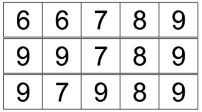

# Description
Albert has n digit cards. Each card has one digit (between 1 and 9, inclusive) written on it, and 6 and 9 are indistinguishable if a card is rotated. More formally, let `x_i` be the number of digit cards with digit i written on it (thus, x1 + x2 + ... + x9 = n).
*For example*: `0 0 0 0 0 2 1 1 1` indicates `2 cards` with value `6`, 1 card, each with values `7`, `8`, and `9`.

Albert often plays a solitaire with these cards at home, and the rules are as follows.
First, Albert arranges the n cards from left to right on the floor in an arbitrary order. Albert can arbitrarily rotate cards with 6 or 9.
According to the following rules, Albert will take one card at a time to create a large number.
First, Albert will take the leftmost card from the floor.
Next, Albert will take the rightmost card from the floor, and places it to the right of the card picked earlier.
Henceforth, Albert will alternate between choosing the leftmost and rightmost card, and place a card to the right of the card picked right before it.
After taking all n cards from the floor, Albert will have created a number consisting of n digits, which Albert wishes to maximize.

For instance, suppose n = 5 and Albert's cards are `[7, 6, 6, 8, 9]`. Albert can rearrange the card from left to right.
Consider the following three ways to arrange these cards from left to right, and the final number Albert will create for each scenario.
- Starting with 6 6 7 8 9: Albert will take 6 (the leftmost), 9 (the rightmost), 6 (the second leftmost), 8 (the second rightmost), and 7 (at center), to end up with 69687.
- Starting with 9 9 7 8 9: Albert will take 9 (the leftmost), 9 (the rightmost), 9 (the second leftmost), 8 (the second rightmost), and 7 (at center), to end up with 99987.
- Starting with 9 7 9 8 9: Albert will take 9 (the leftmost), 9 (the rightmost), 7 (the second leftmost), 8 (the second rightmost), and 9 (at center), to end up with 99789.
- In this example, 99987 is the largest number Albert can make and thus the initial arrangement should be `[9 ,9 ,7 ,8 ,9 ]`



Given n cards, find how Albert must arrange the cards initially so that the n-digit number obtained at the end is maximized.

* **Input**
The first line will contain T, the number of test cases.

Each test case will be given in a single line, consisting of 9 integers (x1, x2, ..., x9) separated by a whitespace.
* **Output**
For each test case, output a single line that describes how to arrange n cards (from left to right), separated by a whitespace.
* **Limit**
```
1 ≤ T ≤ 50
2 ≤ n ≤ 1,000 (n = x1 + x2 + ... + x9)
0 ≤ xi ≤ 1,000 (1 ≤ i ≤ 9)
```
* **Sample Input**
```
4
0 0 0 0 0 2 1 1 1
1 1 1 1 1 1 1 1 1
1 1 3 0 0 0 0 0 0
1 2 2 0 0 0 0 0 0
```
* **Sample Output**
```
9 9 7 8 9
9 8 5 3 1 2 4 7 9
3 3 1 2 3
3 2 1 2 3
```

Case 1: Used in the problem statement.

Case 2: Albert will first rotate the card with 6 on it (to obtain a 9), and arrange the cards accordingly (as suggested in the output). The final number will be 998754321.

Case 3: No explanation.

Case 4: No explanation.

# Approach
## Algorithm
## Complexity