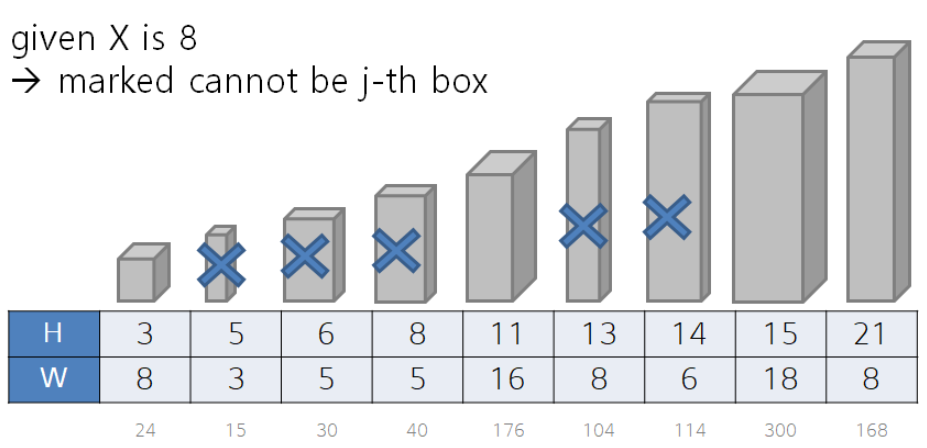

# Description:
Albert has n boxes with distinct height where each box is a cuboid (for convenience, boxes are numbered from 0 to n-1). The i-th box's height is H[i] and the (surface) area of its bottom face is W[i]. Hence, its volume is H[i] × W[i] (note that W[i] is the area of the bottom of a box).

Since Albert always sorts his boxes by height, we know that H[0] < H[1] < ... < H[n-1].

Alice wants to borrow two boxes from Albert, and Albert is very reluctant -- hence, Albert asked Alice to meet the following condition:

* Condition: The two boxes that Alice borrows must not exceed X in their height difference (that is, if the i-th and j-th boxes are picked, then | H[i] - H[j] | ≤ X must be satisfied).
Alice accepted, and since she needs boxes for moving, she wants to maximize the sum of volumes of two boxes.

For instance, suppose n = 3, H = [3, 5, 8], W = [8, 16, 6], and X = 3.

* Boxes' volumes are 24, 80, and 48, respectively.
* There are two pairs of boxes that satisfy the condition of Albert's: (0, 1) and (1, 2).
* If Alice goes with box 1 and box 2, then the total volume will be 80 + 48 = 128.
* In the same example, if X = 1, then there are no pairs of boxes that satisfy the condition (see Sample Output).

In another example, suppose n = 4, H = [3, 10, 18, 20], W = [8, 11, 9, 3], and X = 7.

* Boxes' volumes are 24, 110, 162, and 60, respectively.
* There are two pairs of boxes that satisfy the condition of Albert's: (0, 1) and (2, 3).
* If Alice goes with box 2 and box 3, then the total volume will be 162 + 60 = 222.
* In the same example, if X = 8, then Alice can borrow box 1 and 2 instead to achieve total volume of 272.

Given n, X, and H[0] ... H[n-1] as well as W[0] ... W[n-1], help Alice find a pair of boxes with maximum total volume while meeting Albert's condition. Note that n is large in this problem, and therefore the input will consist of how H's and W's can be generated instead of their actual values (see Sample Input).

## Input
The first line of the input will contain a single integer, T, the number of test cass.

Each test case will consist of three lines.

The first line will contain n and X, separated by whitespace. The second line will contain four integers, hs, ha, hb, and hc, separated by whitespace. The third line will contain four integers, ws, wa, wb, and wc, separated by whitespace.

Using these, you will compute H[i]'s and W[i]'s according to the formula below (recall that 0 ≤ i ≤ n-1): ("%" is the arithmetic modulo operator typically used in modern programming languages)

When i = 0:
H[i] = (hs % hc) + 1
W[i] = (ws % wc) + 1
For i with 1 ≤ i ≤ n-1:
H[i] = H[i-1] + 1 + ( (H[i-1] * ha  + hb) % hc)
W[i] = (W[i-1] * wa + wb) % wc + 1
(64-bit integer types are recommended to avoid integer overflow issues.)

## Output
For each test case, if Alice can't borrow boxes, then output -1. If she can, then output the maximum total volume of two boxes she can achieve.

## Limit
```
1 ≤ T ≤ 10
2 ≤ n ≤ 5,000,000
1 ≤ X, hs, ha, hb, hc, ws, wa, wb, wc ≤ 109
For each test case and for each i with 0 ≤ i ≤ n-1: 1 ≤ H[i], W[i] ≤ 109
Subtask 1 (9 Points)
2 ≤ n ≤ 100,000
Subtask 2 (16 Points)
2 ≤ n ≤ 5,000,000
```

## Sample Input 1
```
7
3 1
2 3 7 5
7 3 8 17
3 3
2 3 7 5
7 3 8 17
4 7
2 3 7 10
7 3 8 11
4 8
2 3 7 10
7 3 8 11
10 20
1 17 31 23
7 4 8 41
6 1000000000
123456 1 1 180001
654321 1000000000 1 180161
6 1000000000
123456 1 1 180001
2021 1000000000 1 180161
```
## Sample Output 1
```
-1
128
222
272
6311
182109717128
178794695372
```

Cases 1-4: Discussed in the problem statement.

Case 5: Values for H and W are as follows:

H = [2,22,37,54,61,72,86,108,113,134]
W = [8,41,9,4,25,27,35,26,31,10]
Case 6: Values for H and W are as follows:

H = [123457,246916,313833,447667,535334,710668]
W = [113839,172370,109296,122144,9432,179310]
Case 7: Values for H and W are as follows:

H = [123457,246916,313833,447667,535334,710668]
W = [2022,129668,123587,119610,146310,141374]

## Hints
Below, you can find sample code that can generate H[0 ... n-1] and W[0 ... n-1] in each language. You may use the provided code as-is or you may implement your own. (Intended solutions do use the same code as below and can produce correct answers within time limit.)

```
int n, x;
long long hs, ha, hb, hc,
          ws, wa, wb, wc;
// Take input from stdin.

long long H[n], W[n];

H[0] = hs % hc + 1;
W[0] = ws % wc + 1;
for(int i = 1; i <= n-1; i++) {
  H[i] = H[i-1] + 1
       + (H[i-1] * ha + hb) % hc;
  W[i] = (W[i-1] * wa + wb) % wc + 1;
}
```

# Solution:
Let's consider every possible pair of boxes.

The procedure of considering every possible pair of boxes are shown below.

For each boxes(i-th),

1. Pick the biggest volume of box which can be picked with i-th box(height difference is lower than X).
2. Find the maximum among these pairs


As described in problem statements, boxes were already sorted in increasing order.

So, we can make an equation of picking the biggest other box(j-th) for each box(i-th).


To solve this equation, we can simply try brute force approach.

However, if we try brute force to solve this problem, it will cause time limit exceeded error.

This is because the time complexity of brute force approach is O(N2) and this is somewhat complicated even for the inputs of subtask 1(N<=100,000).

So, we need to find the way to compute the equation more efficiently.

* **subtask 1**

With the equation we've defined above, now we're facing the sub problems of maximization within a range with some constraint.

The range mentioned here is from i+1 to the index of box which has height difference with i-th box as equal or smaller than X. To say, [i+1, i+k].

Now we need to find j-th box, which was within range and has maximum volume, with proper data structure and computation.

* *Segment Tree*
To find maximum value among the range, we can try "Segment Tree" data structure.

By building "Segment Tree" for N boxes initially, we can get the maximum volume box for any range query with O(log N) time complexity.

* *Maximum Binary Heap*

We can also try "Maximum Heap" data structure.

"Maximum Heap" data structure has computational benefit to find maximum because of partial sorting mechanism within.

And as range queries are sequential and continuous, we can also get lessen computation time to find maximum by maintaining elements of "Maximum Heap".

The total time complexity of the approach mentioned above are O(N log N), which is sufficient to solve subtask 1.

* **subtask 2**

As given input N is very big(<=5,000,000), we cannot solve subtask 2 with O(N log N) time complexity approaches.


Let's carefully think about using maintained elements in "Maximum Heap" which was talked above.

You can see that some of boxes are never considered as maximum volume(j-th box) while finding maximum on "Maximum Heap".

Below is an example of this case.



How to find maximum volume of box while not considering those boxes(so that we can get computational benefit from this)?

* *Monotone Double-Ended Queue*
Let's think about using "Monotone Queue" data structure.

By using this data structure, we can only maintain possible maximum candidate boxes within it(dropped boxes which cannot be maximum).

Within a range, a box smaller than the other and also preceding its index are never can be a candidate of maximum. So, maintaining queue sorted(non-increasing in this case) to do this job.

By using this data structure we can get maximum box for each i-th box from the beginning of queue.


This approach is a kind of DP algorithm because it is using pre-computed selection to find maximum volume box and these computations are overlapped.

The time complexity of this approach is O(N), because every box enqueued and dequeued only once while computing..

It has a lot less computational complexity approach compared to the other shown above.