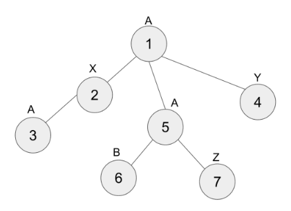

# Description:
`T` is a tree with `n` nodes (that are numbered from `1` to `n`) where each node is labeled with an uppercase English alphabet ('A' - 'Z'). Bob is interested in finding longest simple paths in `T` (a simple path is a path that does not visit the same node more than once).

Alice, after watching Bob playing this game, suggested Bob to find "nice simple paths" according to the following definition: For any simple path `P`, `P` is said to be a "nice simple path" if the labels of the nodes in `P` are written out to create a string such that the string does not have the same alphabet repeated consecutively.



For instance, the tree in the image above contains `7` nodes.

* Path `1 \to 5 \to 7` is a simple path of `3` nodes, but their labels produce the string "AAZ" in which 'A' is repeated consecutively. This is not a nice simple path.
* Path `3 \to 2 \to 1` is a simple path of `3` nodes, which is a nice simple path (their labels produce the string "AXA" where no alphabet is repeated consecutively).
* Paths `3 \to 2 \to 1 \to 4` and `4 \to 1 \to 2 \to 3` are nice simple paths of `4` nodes. Note that these two paths are considered as the same path since they contain the same set of nodes -- see the sample input and output.
* Paths `7` and `4` are nice simple paths that happen to contain only one node.
* The longest nice simple path in this tree contains `4` nodes, and there exists only one longest nice simple path.

Alice and Bob want to know the length of the longest nice simple paths in this tree, and how many different such paths exist. Help them compute the correct answer.

## Input
The first line of the input will contain `T`, the number of test cases.

Each test case will consist of three lines. The first line will contain `n`, the number of nodes. The second line will contain a string of length `n` (without space), describing the label of each node. The third line will contain `n` numbers separated by whitespace, describing each node's parent node. The root node's parent will be given as `0`.

## Output
For each test case, output two integers separated by whitespace.

The first number must be the number of nodes contained in any longest nice simple path, and the second number must be the number of unique longest nice simple paths.

## Limit
```
 `1 ≤ T ≤ 10` 
It is guaranteed that each node's label is one of uppercase English alphabets ('A' - 'Z').
Subtask 1 (10 Points)
 `1 ≤ n ≤ 1\,000` 
Subtask 2 (20 Points)
 `1 ≤ n ≤ 100\,000` 
```
## Sample Input 1
```
6
7
AXAYABZ
0 1 2 1 1 5 5
7
QXZQQPZ
0 1 2 1 1 5 5
5
LGBOJ
4 4 4 0 4
5
AAABC
3 3 0 1 2
7
GGGGGGG
0 1 2 1 1 5 5
10
UUQYQYQQQU
3 8 8 8 2 8 3 0 6 8
```

## Sample Output 1
```
4 1
3 2
3 6
2 2
1 7
5 1
```

Case 1: Discussed in the problem statement.

Case 2: This tree has the same structure as the one in Case 1, except for the node labels. There are two nice simple paths: `1\to 2 \to 3` and `6 \to 5 \to 7`.


Case 3: Every simple path of length `3` in the tree below is a nice simple path.


Case 4: `1 \to 4` and `2 \to 5` are the two longest nice simple paths.


Case 5: As mentioned in the problem statement, nice simple paths may only contain one node.

# Solution:

A tree with n nodes is given. Each node is labeled with an alphabet.

A path that does not revisit the same node is called a "simple path".

A simple path which does not have the same alphabet repeated consecutively is called a "nice simple path".

It is a problem to find the longest length among nice simple paths and the number of nice simple paths with that length.

## Search all cases

Since it is a tree, there is only one simple path between any two nodes.

We can solve the problem by creating all the simple paths, finding the longest nice simple path and counting them.

DFS can be used to find the path.

The time complexity is O(n^2).

## Divide and conquer (and merge)

In subtask 2, since n is large, searching all cases may cause timeout.

You can solve the problem using divide and conquer (and merge) by dividing the problem into smaller subproblems and combining the results.

## Division

The longest nice simple path from the point of view of a particular node x is one of two cases.

1) nice simple path through node x

2) nice simple path that does not go through node x

A nice simple path that does not go through node x can be found by solving the same problem for all children of node x.

## Conquest

In order to find the longest nice simple path through node x, we first need to know the length and number of path from the children of node x to the leaf node. Let L(y) be the longest length from child y to the leaf node, and let C(y) be the number of lengths equal to L(y) from child y.

Then one of the following three cases is the length and number of the longest nice simple path through node x.

  1) If there is no child whose label is different from x

    length = 1, count = 1

  2) If y has one child whose label is different from x

    length = L(y)+1, count = C(y)

  3) If there are two or more children with different labels from x

    In this case, it can be divided into two cases again according to the size of L.

3-1) When there is more than one child with max(L)

  For example, let's say the corresponding children are a, b, and c. The length is max(L) * 2 + 1. Every paths that starts anywhere and ends anywhere is the nice simple path, so the number of path is C(a) * C(b) + C(b) * C(c) + C(c) * C(a).

  length = max(L) * 2 + 1, count = combination of the number of nodes with length = max(L)

3-2) When there is one child with max(L)

  Let the second largest L after max(L) be 2nd(L). Then the length is max(L) + 2nd(L) + 1. Let the children corresponding to max(L) be a, and the children corresponding to 2nd(L) be b, c, d. Then the number of paths becomes C(a) * (C(b) + C(c) + C(d)).

  Length = max(L) + 2nd(L) + 1, count = (number of nodes with max(L)) * (sum of the number of nodes with 2nd(L))

L(x) also needs to be updated. If L(y) is known for all child nodes, then L(x) can be obtained.

  1) If there are no children with different labels

    L(x) = 1, C(x) = 1

  2) If there are children with different labels

    L(x) = L(y) + 1, C(x) = sum of C(y)


## Merger

Using DFS, after reaching the leaf node, while going backwards we find the number of L(x) and C(x), and the longest nice simple path through the node x.

And if it is longer compared to the longest nice simple path found so far, it is updated.

If the lengths are the same, just add the count.

Since it starts at the root node and ends when all nodes are visited, the time complexity becomes O(n).

