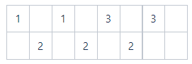

# Description:
Bob has `n` kinds of candies -- and many of them. For convenience, let candy types be numbered from `1` to `n`, and suppose Bob has `v{i}` candies of type `i` and let `m` be the total number of candies he has. Formula for m: !{image info}(./1.png)

Bob has decided to eat all of his candies - but, as always, he would play a game while eating them, with the following conditions:

1. First, he would NOT eat the same type of candies back-to-back. Just because he thinks it'll taste better to try different candies.

2. If he can eat all of his candies while satisfying the above condition, then he wants to choose the way that comes lexicographically first. An array of length `m` can describe one way of Bob eating `m` candies where each number describes the type of a candy.

    For instance, suppose that there exist two ways `X` and `Y` to eat all candies (where `X` and `Y` are, as mentioned above, integer arrays of length `m`). If `k` is the first index at which `X` and `Y` differ (i.e., For `1 ≤ i < k`, `X{i} = Y{i}` but `X{k} != Y{k}`), then `X{k} < Y{k}` implies `X` comes before `Y` and `X{k} > Y{k}` implies `Y` comes before `X`. In this problem, we compare numerical values of `X{k}` and `Y{k}`, so if `X{k} = 10` and `Y{k} = 5`, then `X{k} > Y{k}`.

For instance, suppose `n = 2` and `v = {2, 2}`. There are two ways to eat all candies while satisfying the first condition.

* Method `1`: `{1, 2, 1, 2}` 
* Method `2`: `{2, 1, 2, 1}` 

Between these two methods, the first method comes lexicographically first.

To give another example, suppose `n = 3` and `v = {2, 1, 4}`. There are `3` methods to eat all candies while satisfying the first condition (which are sorted lexicographically).

* Method `1`: `{3, 1, 3, 1, 3, 2, 3}` 
* Method `2`: `{3, 1, 3, 2, 3, 1, 3}` 
* Method `3`: `{3, 2, 3, 1, 3, 1, 3}` 

Given `n` and `v{i}`'s, determine whether Bob can eat all of his candies while satisfying the first condition. If possible, then determine the method that comes lexicographically first (let `Z` be an integer array of length `m` describing such method), and compute the sum. !{image info}(./2.png)

Since this value can be very large, output the value modulo `987654323`.

# Solution:

**Full Search**
The easiest way is to make all the permutations without consecutive numbers and find the first permutation in lexicographical order. However, in subtask 2 where n is large, because the number of permutations is very large, so it is impossible to solve it within the time limit with a full search.

**Observation**
Let's think of a permutation as not one line but two lines of odd-numbered and even-numbered lines. And fill in the smallest number from the front. Then, we can make a permutation in lexicographical order without consecutive numbers.

Keep in mind that we've split it into two lines, so we'll have to tracking the smallest and second smallest numbers together at each point in time as we fill in.

**Exceptional case**
Unfortunately, there is exceptional case to consider. When we fill out the numbers in the same way as above, there may be no space to fill when you reach the end.

For example, in the case of {1, 1, 2, 2, 2, 3, 3, 3}, there is not enough space in the odd-numbered line when filling the last 3 as shown below.

There are two possible solutions depending on how this exception case is handled.

* **A solution using Heap**
While filling in the numbers, check the space remaining in the current line and the number of the most remaining numbers at time.

We can use Max Heap, which is a data structure that can easily get the most remaining number.

The time complexity is O(m log n).

* **A simple solution**
First, solve the problem according to the method obtained in "Observation" above and check if there are a number that cannot be put in at the end.

Process that number which is exceptional case first, and then solve the problem one more time in the same way.

The time complexity is O(m).

