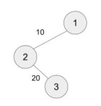
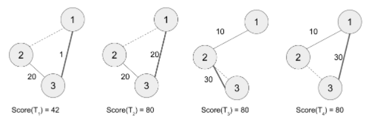
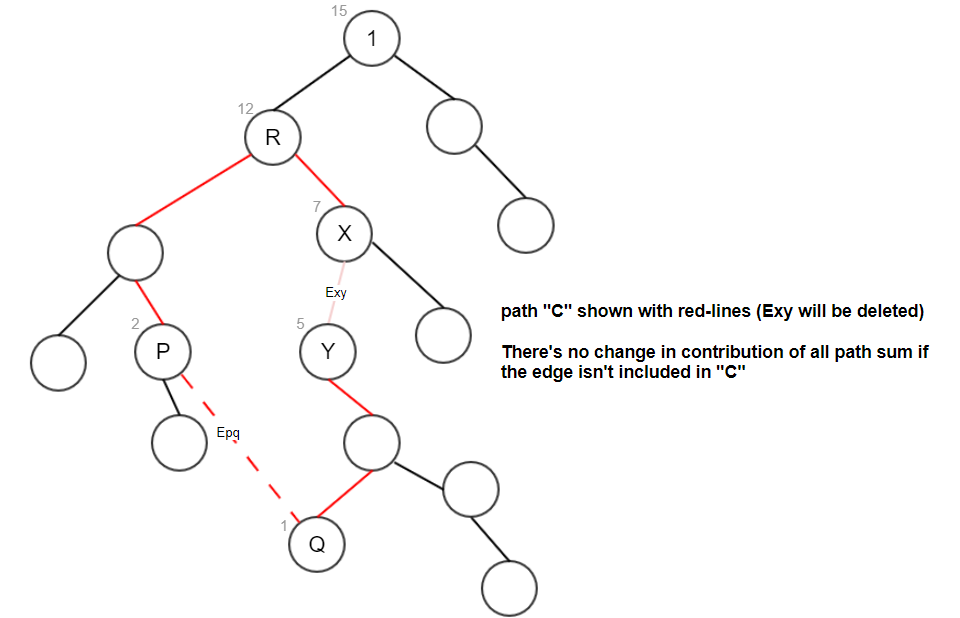

# Description

Bob has recently been playing a scoring game on trees -- let `Score(S)` for an arbitrary tree `S` be defined as follows:``

* Assume that every edge in (undirected) tree `S` has a positive weight.
* If `x` and `y` and `x!=y` are two nodes of `S`, then let `Dist(x, y)` be the shortest path distance between `x and y`. That is, if `P(x, y)` is the (unique) shortest path between `x` and `y`, then the sum of the edge weights on `P(x, y)` is the shortest path distance.
* Then, we define `Score(S) = Sum of Dist(x,y)` where `x` and `y` and `x!=y` are two nodes of `S`

That is, the score of a tree is the sum of the shortest path distances of all pairs of nodes in it. If `S` contains fewer than 2 nodes, we define `Score(S)` to be `0`.

For instance, notice that the following tree contains `3` nodes.

* According to Bob's definition, `Dist(1, 2) = 10, Dist(2, 3) = 20, and Dist(1, 3) = 30`.
* Therefore, the score for this tree is 10 + 20 + 30 = 60.``



While watching Bob playing this game, Alice suggested to play a new game. First, they together create a tree with `n` nodes and `n-1` edges, which we call `T0`, the "base tree". For convenience, the base tree `T0`'s nodes are labeled by integers from `1` to `n`, and the `n-1` edges are labeled by integers from `1` to `n-1` (the edges' labels (or indices) will be used later). Let the `i`-th edge of `T0` be `E[i] = (v, w, d)` which connects two nodes `v and w` with weight (or distance) `d`. For instance, `E[1] = (1, 2, 10)` and `E[2] = (2, 3, 20)` would describe the tree above; in particular, the edge connecting `(1, 2)` has index `1` and the edge connecting `(2, 3)` has index `2`.

Next, Alice can apply an "edge swap" operation to `T0` during which Alice removes one edge from `T0`, and then adds an edge to it to create a new tree. Formally, Alice will apply in total `m` "edge swaps", and obtain m new trees from `T0` which we will call `T0`, `T1`, ..., `Tm`

* To apply the j-th "edge swap", Alice will provide Bob with `4` integers (`j = 1, 2, ..., m`)
  * `A[j]` The index of an edge in `T0`, which is to be removed from `T_0`. That is, if `E[ A[ j ] ] = (v, w, d)`, then Bob would remove the edge connecting `v` and `w`.
  * `x[ j ]`, `y[ j ]`: The two new nodes that Alice wishes to connect. (`x[ j ] \ne y[ j ]`)
  * `z[ j ]`: The weight (distance) of the new edge.``
* Let `T_j` be the resulting graph by removing an edge from `T_0` (whose index is `A[ j ]`) before adding an edge of weight `z[ j ]` connecting `(x[ j ], y[ j ])`, (where `j = 1, 2, ..., m`). In this problem, it is guaranteed that `T_j` will be a tree, and let us call it the `j`-th "modified tree".
* Each "edge swap" operation is applied to the base tree, `T0`, independently from other operations (see examples below).



For instance, suppose that the base tree `T0`  is given by `E[1] = (1, 2, 10)` and `E[2] = (2, 3, 20)` as in the example above. Alice will apply `4` edge swaps, and assume that `A = [1, 1, 2, 2]`, `x = [3, 1, 2, 3]`, `y = [1, 3, 3, 1]`, and `z = [1, 20, 30, 30]`. The four images below (form left to right) show the four modified trees (`T_j`'s) and their scores. The dotted line in each image highlights a removed edge and a thick line represents an added line.

* T1: `1`st edge (`E[1]`) is removed from `T0` and a new edge connecting `3` and `1` (of weight `1`) is added. The new score is `Score(T1) = 42`. (Minimum among all `T_j` scores.)
* T2: `1`st edge (`E[1]`) is removed from `T0` and a new edge connecting `1` and `3` (of weight `20`) is added. The new score is `Score(T2) = 80`. (Maximum among all `T_j` scores.).
* T3: `2`nd edge (`E[2]`) is removed from `T0` and a new edge connecting `2` and `3` (of weight `30`) is added. The new score is `Score(T3) = 80`. (Maximum among all `T_j` scores.) In this case, the deleted edge and the new edge are connecting the same pair of nodes, which is an allowed "edge swap" operation.
* T4: `2`nd edge (`E[2]`) is removed from `T0` and a new edge connecting `3` and `1` (of weight `30`) is added. The new score is `Score(T4) = 80`. (Maximum among all `T_j` scores.)``

Given the base tree(`T_0`) and `m` "edge swap" operations, help Bob compute each modified tree's score. To ease Bob's job, Alice is asking for three values: Score of `T0`  and the minimum/maximum scores across `m` modified trees (`T1`, `T2`, ... , `T_m`).

## **Input**
The first line of the input will contain `T`, the number of test cases.

The first line of each test case will contain `n` and `m`, separated by whitespace. The next `n-1` lines will describe each edge in `T_0` where each line will contain three integers: The first two are nodes' labels and the third is the weight of the edge. The next `m` lines will contain `4` integers in each line where the `j`-th line will describe the `j`-th edge swap operation: `A[ j ]`, `x[ j ]`, `y[ j ]`, and `z[ j ]`, separated by whitespace.

## **Output**
Output each test case's answer in each line.``
``
Each line must contain three contains, separated by whitespace. The first number must be the score of `T_0`, the second number must be the minimum score over `m` modified tress, and the third the maximum score over `m` modified trees.``

## **Limit**

For each test case:``
```
 `1 ≤ A[j] ≤ n - 1` (`j = 1, 2, \dots, m`)``
 `1 ≤ x[j] , y[j] ≤ n and x[ j ] != y[ j ] (j = 1, 2, ... m)``
 `1 ≤ z [j] ≤ 20, 000` (`j = 1, 2, \dots, m`)``
```
See subtasks for limits on `T`, `n`, and `m`.

Some subtask(s) may have an additional limit on the diameter of the base tree.

The diameter of a tree is defined as follows: Let `P(x, y)` the shortest path connecting two nodes `x` and `y`, and let `C(x, y)` denote the number of edges in  `P(x, y)` . Then, the diameter of a tree is the maximum value of `C(x, y)` over all `x`, `y` in the tree.

## **Subtask 1 (10 Points)**``
```
 1 ≤ T ≤ 10
 2 ≤ n ≤ 1000
 1 ≤ m ≤ 500 
 1 ≤ Diameter of T_0  ≤ 200
```

## **Subtask 2 (20 Points)**``
```
 1 ≤ T ≤ 10 
 2 ≤ n ≤ 50000
 1 ≤ m ≤ 20000
 1 ≤ Diameter T_0  ≤ 200
```

# Solution:
* **Subtask 1:**
First things to know is, a shortest path distance between nodes are uniquely defined in undirected tree.

With this condition, we can divide the problem to compute contributions for each edge.

This is done by summing up how many times of an edge contributes to the score(sum of the shortest path distances of all pairs of nodes).

Let's assume the tree shown below,


The contribution for an edge Eab can be computed as below.

1. split the tree by removing Eab
2. count how many nodes are exist in two splitted subtrees
3. the contribution for Eab is "count(subtree including A) * count(subtree including B) * Wab"


Counting the number of node in each subtree can be computed in a tree traverse(dfs or bfs). And it's time complexity is O(N).
While traversing tree, use the equation shown above to compute the contribution for each edge to the final score.

As there're M queries given, the required time complexity for this approach is O(MN).

And this is sufficient for subtask1.

* **Subtask 2:**

As the number of queries and nodes are quite big, the approach of O(MN) time complexity is not sufficient for subtask2.

Let's look into the problem description carefully, with the below terms.

After that, we can gather some observations.


1. Pick a root node of given tree(we consider here #1 as root node).
2. An edge Exy(X->Y) as deleted edge, and an edge Epq(P->Q) as newly added edge.
3. A node X as parent of node Y, and node Q as a node within subtree of Y
4. R as a lowest common ancestor node of two parent nodes(=LCA(X,P))
5. By given problem statement and conditions, there is a path shown below always exist. Let's call it C.
	Y -> ... -> Q -> P -> ... -> R -> ... -> X


Let's consider given tree shown below.

If we erase Exy and add Epq for the initial tree, the number of node in each subtree will be changed.

However, this change only effect for nodes along with path C.

This is easily checked by dividing each edge and count the number of nodes in two divided subtree.

There's no change in number of nodes in divided subtree for edge unless it's not in path C.



In conclusion, to solve the subtask2, we only need to find updated contribution for edges in path C.

If we can compute updated contribution directly for these edges, with diameter of tree as K, the required time complexity is O(KM).

As shown in the problem statement, K<200. So, it's sufficient to solve subtask2.

The way to compute contribution for each edge directly are shown below.

1. Compute score based on initial tree by traversing.
  In this step, while traversing tree, memoize the number of nodes in subtree started at each node(we define it as "Si").

2. For each query, tracking updated contribution of edges in path C.
  These scores need to be computed from initial tree score. The update schemes are shown below.

  1. Epq & Exy
    1. add contribution of Epq & subtract contribution of Exy
      updated += (N - Sy) * Sy * (Wpq - Wxy)

  2. "Y -> ... -> Q"
    1. from Q to Y, the value of S within [Sy-Sz, Sy-Sq] range (The Z here represent a direct child node of Y)
    2. add contribution for each edges : "(Sy-Si) * (N-(Sy-Si)) * Wij"
    3. subtract contribution for each edges : "Si * (N-Si) * Wij"
    4. compose step 2 & 3 and unfold the equation
      updated += Wij * (N - Sy) * (Sy - 2*Si), for all i in C[Q,Y)

  3. "P -> ... -> R"
    1. from P to R, the value of S within [Sy+Sp, Sy+Sr] range
    2. add contribution for each edges : "(Sy+Si) * (N-(Sy+Si)) * Wij"
    3. subtract contribution for each edges : "Si * (N-Si) * Wij"
    4. compose step 2 & 3 and unfold the equation
      updated += Wij * Sy * (N - 2*Si - Sy), for all i in C[P,R)

  4. "R -> ... -> X"
    1. from X to R, the value of S within [Sx-Sy, Sr-Sy] range
    2. add contribution for each edges : "(Si-Sy) * (N-(Si-Sy)) * Wij"
    3. subtract contribution for each edges : "Si * (N-Si) * Wij"
    4. compose step 2 & 3 and unfold the equation
      updated += Wij * Sy * (2*Si - N - Sy), for all i in C[X,R)

* **Subtask 3:**
  * *How to get the score of the original tree*

Each edge must be passed when connecting nodes on both sides of the edge. For example, if there are 10 nodes connected on one side of a particular edge and 20 nodes connected on the other side, then the 10 * 20 combinations must pass the edge. In other words, this edge contributes to the score by 10 * 20 * weight. The same goes for all the edges in the tree. After all, where the length is w for each edge, the number of nodes connected in the downward direction is a, and the number of nodes connected in the root direction is b, the score of the tree would be a1 * w1 * b1 + a2 * w2 * b2 + ... +  an * wn * bn.

  * *How to get the score of the changed tree*

A loop gets formed by an edge being removed and an edge being added, and a * w * b value of all edges belonging to the loop would change. Let's define the symbols first:

  * Number of nodes connected in the root direction of the edge being removed: x
  * Number of nodes connected in the downward direction of the edge being removed: y
  * Weight of the edge being removed: r
  * Number of nodes connected in the root direction of the edge being added: x
  * Number of nodes connected in the downward direction of the edge being added: y
  * Weight of the edge being added: c

The contribution of each edge in the loop varies according to its location as follows. When you remove an edge, a tree left in the root direction is called a root tree, and a tree left in the downward direction is called a sub tree:

  * Edges located in the sub tree: a * w * b → (a + x) * w * (b - x)
  * Edges located in the root tree (to lca) of the edge being removed: a * w * b → (a - y) * w * (b + y)
  * Edges located in the root tree (to lca) of the edge being added: a * w * b → (a + y) * w * (b - y)
  * Removed edge: x * r * y → 0
  * Added edge: 0 → x * c * y

Each expression can be:

  * Edges located in the sub tree: a * w * b → (a * w * b) + ((b - a) * w * x - w * x * x)
  * Edges located in the root tree (to lca) of the edge being removed: a * w * b → (a * w * b) + (a - b) * w * x - w * x * x)
  * Edges located in the root tree (to lca) of the edge being added: a * w * b → (a * w * b) + (b - a) * w * y - w * y * y)
  * Removed edge: x * r * y → 0
  * Added edge: 0 → x * c * y

Focusing on the delta by the change:

  * Edges located in the sub tree: (b - a) * w * x - w * x * x
  * Edges located in the root tree (to lca) of the edge being removed: (a - b) * w * x - w * x * x
  * Edges located in the root tree (to lca) of the edge being added: (b - a) * w * y - w * y * y
  * Removed edge: -(x * r * y)
  * Added edge: x * c * y

The total change amount is the sum of every delta that we are interested in. Since r and c are given from inputs, the values of x and y can be ubtained using dfs, the values that we need to consider to calculate are:

  * Edges located in the sub tree: sum of '(b - a) * w', sum of w
  * Edges located in the root tree (to lca) of the edge being removed: sum of '(a - b) * w', sum of w
  * Edges located in the root tree (to lca) of the edge being added: sum of '(b - a) * w', sum of w

In summary, subtask3 can be solved once the following values can be obtained at constant time in a given tree:

  * The sum of w of the edges between a particular ancestor node and its descendant
  * The sum of (a - b) * w of the edges between a particular ancestor node and its descendant

* *How to find the sum of w of the edges between an ancestor node and its descendant*

Propagate the accumulated value of w each time it moves to its child while dfs, starting with zero at the root. When dfs is completed, all nodes have an accumulated value of w going from root to themselves, so we can obtain the sum of w of the edges between the two nodes by subtracting the w cumulative value of the ancestor node and its descendant.

* *How to find the sum of (a - b) * w of the edges between an ancestor node and its descendant*

For each edge, a * w * b value was obtained by referring to the number of nodes connected in both directions. This time, calculate the values of a * w of all edges in the outward direction, and store the sum thereof for each node, so that we can make use of them later. To obtain this, do:

  1. Perform dfs to obtain a * w, where a is the number of nodes connected in the downward direction, w is its weight of each edge.
  2. Perform dfs to obtain the sum of all a * w of all descendants, by propagating the value upward. After dfs, the root node will have the value we want.
  3. Perform dfs to propagate the sum to the downward direction, but changing the contribution of the edge between eacg parent and its child like a * w → w * b. Then the children can also have the expected value.

Now that all nodes have outward a * w cumulative values, the sum of (a - b) * w of the edges between the two nodes can be obtained by subtracting the values of the ancestor and its descendant.