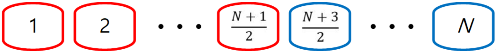
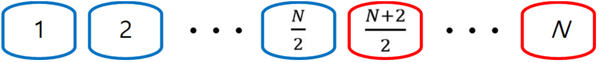
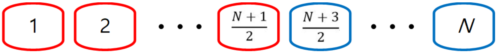
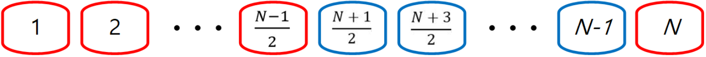
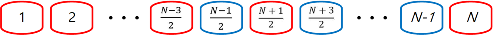
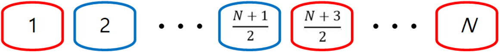

# Description:

Alice and Bob recently learned about large numbers and arithmetic sums.

Both of them love numbers and playing cards, so they came up with a new card game they can play together.

They first pick an integer N, and write down one integer per card, using the integers from 1 to N exactly once.

Then, they put them down on the floor in an arbitrary order, and begin playing. For convenience, let us refer to the numbers (written on the cards) C[1], C[2], ..., C[N] from left to right.

They play the game in turn, and Alice goes first. Each person can take a card, either the left-most one or the right-most one -- and must take one.

Alice and Bob are kids, so they simply pick the card with the larger number, and take it.

Let SA (SB) the sum of the numbers written on the cards in Alice's (Bob's) hands, after the game ends when the last card is taken by either kid.

For instance, suppose N = 4 and C = [2, 4, 1, 3].

* Alice would first take the right-most card with number 3 on it.
* Bob would then take the left-most card with number 2 on it.
* Alice would then take the left-most card with number 4 on it.
* Bob would take the last card with number 1 on it.

Therefore, SA = 3+4 = 7 and SB = 2+1 = 3.

After watching Alice and Bob play this game many times, you asked yourself the following question: After choosing N and x, can you order the cards in a certain way so that SA - SB = x?

Of course, depending on the value of x, this may or may not be possible, and there may exist more than one way to arrange the cards. You want to write a program that can answer this question.

# **Input**
The first line will contain the number of test cases, T.

For each test case, a single line will contain two integers, N and x, separated by a whitespace.

* **Output**
For each test case, you must output "YES" or "NO" (without quotes).

If there is a way to arrange the N cards so that SA - SB = x can be obtained, then output "YES" in the first line, followed by N integers separated by whitespace in the next line that describe the order of the N cards.

If there are many ways to achieve this, you may output any one of them.

If this is impossible, output "NO" (without quotes).

* **Limit**
```
1 ≤ T ≤ 10
|x| ≤ (30,000)2 (x may be negative)
Subtask 1 (4 Points)
2 ≤ N ≤ 10
Subtask 2 (10 Points)
2 ≤ N ≤ 30,000
```

* **Sample Input 1**
```
5
3 1
5 1
6 -1
7 2
8 0
```

* **Sample Output 1**
```
NO
YES
2 3 5 1 4
YES
5 1 2 6 3 4
YES
1 2 3 4 5 7 6
YES
6 8 1 2 4 7 5 3
```

* For Case 1, there is no way we can order the three cards [1, 2, 3] such that SA-SB = 1.

# Solution:

When the value of N is given, the range of maximum and minimum of Sa-Sb can be estimated.

And the Sa-Sb value must be in the form of "min + 2n***".

n***: the integer number equivalent to 0 or bigger.

Print “NO” if the range of x is over or cannot be expressed in the form of min + 2n.

If not, print “YES” and the array of numbers decided by the procedures below:

* The cards collected by Alice: Red lining
* The cards collected by Bob: Blue lining

**When N is an odd number** (Alice always takes the number 1card.)

* Min : Sa = 1 + 2 + … + (N+1)/2, Sb = (N+3)/2 + … + N



* Max : Sa = 1 + (N+3)/2 + … + N, Sb = 2 + … + (N+1)/2


**When N is an even number** (Bob always takes the number 1card.)

* Min : Sa = 2 + … + (N+2)/2, Sb = 1+ (N+4)/2 + … + N


* Max : Sa = 1 + ... + N/2, Sb = (N+2)/2 + ... + N



When x is in the range of min<= x <=max and can be expressed in the form of `min + 2n`, it is required to find ways to arrange the cards.

According to the value of `n`, the cards collected by Alice and Bob can be decided as below.

**N being an odd numbers**

* When n=0 (in case of x has a minimum value)



* When n=1 (Increase the number by 1 of the cards collected by Alice starting from the biggest number card.)


Increase the number by 1 of the cards collected by Alice starting from the biggest number card.

* When n=(N-1)/2 (in case of N=the biggest number card collected by Alice.)



When n=(N-1)/2+1 (when the 2nd biggest card collected by Alice has increased by 1.)



As the value of n changes according to the explanation above, the value of the number of the cards collected by Alice will be increased by 1 starting from the biggest number card and cannot be increased any more, (when there is no more biggest number card among the cards collected by Bob), increase the 2nd biggest number card by 1 with same method.)


When n = N(N+1)/2 – (N+1)(N+3)/4 + 1, (in case of Min +2n = Max)



Once the cards Alice and Bob should collect are decided, there can be many ways to arrange the cards in a line.

Here is one example. (C++ code)

Arrange the number 1 card in the first in the line.

And in case of N being an odd number, start from Bob. If N being an even number, start from Alice and print the card to be selected in turn.