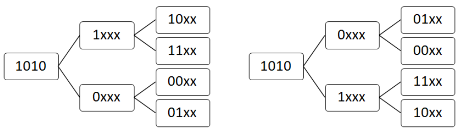

# Description
Albert is interested in binary XOR operations and data structures.

Albert wants to create a data structure that can efficiently process XOR operations.

At the beginning, the data structure must be initialized with an input array S0 that contains n integers.

Then, the data structure must process q operations and output correct answers.

There are five types of operations, and some operations may modify the numbers stored within the data structure (hence, subsequent operations' results will be affected by a previous operation).

1. find_min(v): If S is the current set of numbers stored in the data structure, find an element s in S that minimizes (v XOR s), and output (v XOR s). S remains unchanged.
2. find_max(v): If S is the current set of numbers stored in the data structure, find an element s in S that maximizes (v XOR s), and output (v XOR s). S remains unchanged.
3. add(v): Add v to the current set S of numbers stored in the data structure. Then, output the number of unique numbers in S.
4. remove_min(): Output the smallest number stored in S of the data structure, and remove it. If there are multiple smallest numbers in S, remove them all.
5. remove_max(): Output the largest number stored in S of the data structure, and remove it. If there are multiple largest numbers in S, remove them all.

For instance, let S0 = {1,1, 3, 3} (which initializes "S" of the data structure), and we process the following q = 7 operations.

1. find_min(2): Because (1 XOR 2) = 3 and (2 XOR 3) = 1, it must output 1. Afterwards, S remains unchanged, so S = {1, 1, 3, 3}.
2. find_max(2): Because (1 XOR 2) = 3 and (2 XOR 3) = 1, it must output 3. Afterwards, S remains unchanged, so S = {1, 1, 3, 3}.
3. add(2): By adding a new number 2 to S, now S becomes S = {1, 1, 2, 3, 3}. There are three unique numbers in S, so it must output 3.
4. remove_min(): It must output 1, the smallest number in S, and remove all 1's. Afterwards, S = {2, 3, 3}.
5. remove_max(): It must output 3, the largest number in S, and remove all 3's. Afterwards, S = {2}.
6. find_min(2): Because (2 XOR 2) = 0, it must output 0.
7. find_max(2): Because (2 XOR 2) = 0, it must output 0.

In the example above, the correct output (in order of the given operations) is [1, 3, 3, 1, 3, 0, 0].

Given n, S0, q, and details of the q operations, output q numbers (outputs obtained by applying the given operations).

* **Input**
The first line will contain the number of test cases, T.

The first line of each test case will contain two integers, n and q, separated by a whitespace.

The second line of each test case will contain n integers, separated by a whitespace.

Each of the following q lines will describe one operation.

Each line will contain 1 or 2 integers (separated by a whitespace) where the first integer describes the type of an operation (one of {1, 2, 3, 4, 5}).

As described in the problem statement, 1 refers to find_min, 2 refers to find_max, 3 refers to add, 4 refers to remove_min, and 5 refers remove_max.

For operations of type 1, 2, or 3, the same line will contain the second integers, "v".

* **Output**
For each operation given in the input, output the correct answer in a single line.

* **Limit**
```
1 ≤ T ≤ 10
1 ≤ n, q ≤ 50,000
For every number v (given along with operations), assume 0 ≤ v < 2^25
For every number s in S0, assume 0 ≤ s < 2^25
For every operation, you may assume that S is non-empty both before and after processing the operation.
```
* **Sample Input 1**
```
3
4 7
1 1 3 3
1 2
2 2
3 2
4
5
1 2
2 2
10 11
1 3 5 7 9 2 4 6 8 10
1 6
1 8
2 6
2 8
3 10
4
5
1 2
1 17
2 2
2 17
5 11
2 5 8 13 17
1 6
1 8
2 6
2 8
3 10
4
5
1 2
1 17
2 2
2 17
```
* **Sample Output 1**
```
1
3
3
1
3
0
0
0
0
15
15
10
1
10
0
18
11
25
3
0
23
25
6
2
17
7
20
15
28
```
Case 1: Explained in the problem statement.

Case 2: No explanation is provided.

Case 3:

Before processing any operations: S = {2, 5, 8, 13, 17}

1. find_min(6): (6 XOR 5) = 3
2. find_min(8):  (8 XOR 8) = 0
3. find_max(6): (6 XOR 17) = 23
4. find_max(8): (8 XOR 17) = 25
5. add(10): S = {2, 5, 8, 10, 13, 17} (6 unique numbers)
6. remove_min(): S = {5, 8, 10, 13, 17} (2 has been removed)
7. remove_max(): S = {5, 8, 10, 13} (17 has been removed)
8. find_min(2): (2 XOR 5) = 7
9. find_min(17): (17 XOR 5) = 20
10. find_max(2): (2 XOR 13) = 15
11. find_max(17): (17 XOR 13) = 28

# Solution:
Given a multiset S, all the q number of operations should be done with S within the time limit.

The following operations are defined:

1. find_min(v) : Print the minimum value of v xor s from S, where s is each element of S.

2. find_max(v): Print the maximum value of v xor s from S, where s is each element of S.

3. add(v): Add v into S and print the number of unique elements. S will grow.

4. remove_min(): Remove all elements being the minimum value from S and print that value. S might get shrunk.

5. remove_max(): Remove all elements being the maximum value from S and print that value. S might get shrunk.


* Step 1. Multiset

"set" is a data structure that guarantee each element is unique within the data structure, while "multiset" that our input is can have more than one element for a single value. However, we can use "set" here since no operations actually require the property.

* Step 2. Brute force

We could solve this problem simply by xor-ing the parameter v with each element for the operation 1 and 2, and applying add(), min() and max() to S for the operation 3, 4 and 5. However, it would take O(T * N * Q) time complexity which is of course not an optimal. Instead, we rather need to search S for element satisfying each operation's requirement.

※ FYI, T = 10, N = 50000, Q = 50000


* Step 3. Understanding of xor bit operation

Q. Given v e.g. a binary 1010, what value should s be so that s xor v is the minimum?

→ s should be 1010 so 1010(=s) xor 1010(=v) is 0000.

Q. What if there's no element of the value 1010 in S?

→ Search for element that matches up the most with 0 or 1 at each position of v in bit, starting from the most significant bit.

Q. What if we need to look for the maximum of s xor v instead?

→ Search for element that matches up the most with 0 or 1 the other way around at each position of v in bit, starting from the most significant bit.



* Step 4. What about the operation 4 and 5?

Check each bit from the most significant bit if it's 0 or 1 depending on what we like to get between max and min.


* Step 5. The best structure for this purpose is Trie.

Use typical Trie as the data structure!!!

※ It's worth noting only demanded allocations should be made to avoid memory exhaustion.

