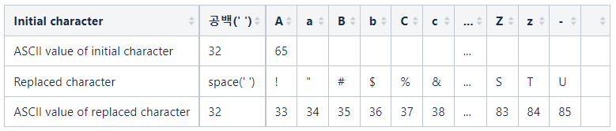

# Description:
Bob needs to create a program that sorts strings.

Each string may contain hyphens ('-') in addition to English alphabets, which makes things tricky. For this problem, the "lexicographic order" between two distinct strings `X` and `Y` is defined as follows:

1. If X is a prefix of `Y`, then `X` comes before `Y`. Conversely, if `Y` is a prefix of `X`, then `Y` comes before `X`. 
2. Otherwise: Let $i$ be such that $X$ and $Y$ differ for the first time at the $i$-th character. Let `X_i` be the i-th character of `X` and `Y_i` be the i-th character of `Y`.
    1. If only one of the two is a hyphen ('-'), the string with the hyphen comes later. For instance, if `X_i` is a hyphen and `Y_i` is not, then `Y` comes before `X`.
    2. If both characters are different alphabets (while ignoring letter case), then the order follows the alphabet's lexicographic order. If both characters are the same alphabet but only differ in letter case, then the string with the uppercase alphabet comes before the other string.

For instance, consider the following pairs of strings:
* `X` = "Santa-Mar", `Y`= "Santa-Maria": Due to Rule 1, `X` comes before `Y` as `X` is a prefix of `Y`.
* `X` = "San-Francisco", `Y` = "Santa-Clara": The two strings differ at the 4-th character ('-' vs 't'). Due to Rule 2-1, `X` comes after `Y`.
* `X` = "Seoul", `Y` = "seoul": Due to Rule 2-2, "Seoul" comes before "seoul".
Given `n` strings, sort the `n` strings and output them.

## Input
The first line will contain $T$, the number of test cases.

Each test case will contain $n$, the number of strings. For the next $n$ lines, each line will contain one string.

## Output
Output each test case's answer in $n$ lines that must contain the $n$ sorted strings, one in each line.

## Limit
```
 $1 ≤ T ≤ 10$ 
 $1 ≤ n ≤ 15\,000$ 
Within each test case, for the n strings in the case:
 $1 ≤ $Length of each string$ ≤ 50$ 
Each string will only contain uppercase English alphabets ('A'-'Z'), lowercase English alphabets ('a'-'z'), and hyphens ('-').
```

## Sample Input 1
```
4
3
Aa-
a-A
Aa-
7
San-Francisco
Santa-Clara
Santa-Clarita
San-Luis-Obispo
San-Pedro
Saint-Paul
Saint-Louis
2
Santa-mar
Santa-Mar
3
-
--
---
```
## Sample Output 1
```
Aa-
Aa-
a-A
Saint-Louis
Saint-Paul
Santa-Clara
Santa-Clarita
San-Francisco
San-Luis-Obispo
San-Pedro
Santa-Mar
Santa-mar
-
--
---
```

Case 1: The string "Aa-" was given twice in the input, so it must be output two times. Between "Aa-" and "a-A", due to Rule 2-2, "Aa-" comes first.

Case 2: In case of "Saint-Louis" vs "Saint-Paul", 'L' comes before 'P'.

Case 3: In case of "Santa-Mar" vs "Santa-mar", 'M' comes before 'm'.

Case 4: No further explanation provided (see Rule 1).

# Solution1 :  Data manipulation for sorting

First of all, if the alphabet and '-' are arranged in a dictionary order according to each rule, it can be seen that they are as follows.

 (space) A a B b C c ... X x Y y Z z -


ASCII code can be used to easily compare alphabets.
The ASCII code of the upper case letters A to Z is 65 to 90, and the ASCII code of the lower case letters a to z is 97 to 122.


Therefore, according to the dictionary rules set above, if we convert to ASCII codes of appropriate values that we can compare,
This is replaced with a new string according to the dictionary performed by the existing comparison operation, which can be easily sorted through sorting.

For example, 'A' is replaced by 1 and 'a' is replaced by 2.



# Solution 2 Comparison function manipulation for sorting


It creates a string comparison function and applies it to quick sort, a relatively fast sorting method with an average time of O(nlogn).
The comparison function is defined as follows.

- For rule 1, you can compare from the first string in order and find that the short string precedes the long string when there are no more strings to compare.
- In rule 2, if either of the two '-' exists in the part that is different from the first string, the string is searched and the comparison is terminated.

    * If both are alphabets, capital letters are preceded by checking for capital letters.
    * If both are uppercase or lowercase, follow the alphabetical order