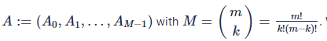
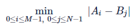
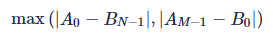
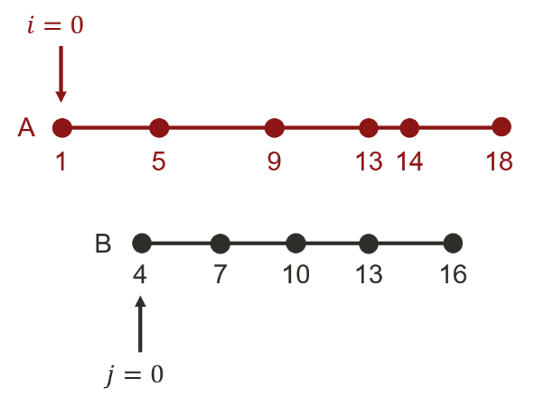

# Description:

Alice and Bob love playing card games with numbers written on them.

Bob has `n` cards and Alice has `m` cards where each card has a positive integer written on it.

Each kid will choose `k` cards out of their cards, and compute their score by summing up the numbers written on the `k` cards - let `B` be the score of Bob's and `A` be the score of Alice's. Since their scores may change depending on which `k` cards they choose, they are curious to know what the minimum and maximum values of `|B - A|` would be.

For instance, suppose that `k = 2`, Bob has `3` cards with `[2, 3, 5]` on them and Alice has `4` cards with `[1, 4, 8, 9]` written on them.

Bob's score will be one of `5`, `7`, and `8` if Bob were to choose two cards.
Alice's score will be one of `5`, `9`, `10`, `12`, `13`, and `17`, if Alice were to choose two cards.
In this case, the minimum value of `|B - A|` is `0` (when `B = A = 5`) and the maximum is `12` (when `B = 5` and `A = 17`).
Given `k` and the numbers written on the cards owned by the two kids, compute the minimum and maximum value of their score difference, `|B - A|`.

## Input
The first line will contain ``, the number of test csaes.

Each test case will consist of three lines. The first line will contain `n`, `m`, and `k`, separated by whitespace. The second line will contain `n` numbers separated by whitespace, describing Bob's `n` cards. The third line will contain `m` numbers separated by whitespace, describing Alice's `m` cards.

## Output
For each test case, output the minimum and maximum score differences, separated by whitespace, in each line.

## Limit
```
 1 ≤ T ≤ 5 
 2 ≤ n, m ≤ 20 
 2 ≤ k ≤ \min{(n, m, 10)}
 1 ≤ Number on each card ≤ 10^8 
```

## Sample Input 1
```
4
3 4 2
2 3 5
1 4 8 9
3 4 3
2 3 5
1 4 8 9
5 5 3
1 2 1 2 3
3 2 3 2 1
2 2 2
2022 2021
2022 2000
```
## Sample Output 1
```
0 12
3 11
0 4
21 21
```
Cases 1-2: Discussed in the problem statement.

Case 3: Bob and Alice can each choose `(1, 2, 3)` to score `6`, which leads to the minimum score difference of `0`. If Bob chooses `(1, 1, 2) = score of 4` and Alice chooses `(2, 3, 3) = score of 8`, then the maximum score difference would be `4`.

Case 4: Bob can only score `(2022+2021)` and Alice can only score `(2022+2000)`, where both the minimum and maximum of score difference are `21`.

# Solution
## Analyze requirements.
We begin with the following information from the problem.


Next, we define` A`, the collection of the sums of the elements of all the length k subsequences of a, and denote it 

We assume that A is sorted in ascending order. We can similarly define:  from `B`.

Forget how to construct `A` and `B` for now.

For a concrete example, we consider the first case mentioned in the problem description.

[image info](./4.png)

Now the problem reduces to finding the maximum difference , and the minimum difference  of `A` and `B`

## Algorithm:
The solution consists of the following parts.

1. Construction of A and B
2. Computation of the maximum difference (max-diff)
3. Computation of the minimum difference (min-diff)

### 1. Construction of A and B:
Contrary to initial impression, construction of A and B is not as hard as it looks. With n,m≤20 and k≤10, 


which is not that large. Then, listing all the length k subsequences of the sequence a can be done pretty easily. For Python users, this is a one-liner with itertools.combinations(). Each of these subsequences, in turn, can be mapped to the sum of its elements. The resulting list of the sums can then be easily sorted to produce the sequence A. We can also produce B in the same manner.

### 2. Computation of the maximum difference (max-diff)

First, it is immediately clear that the max-diff can never be achieved by interior points from either A or B. We can always run towards one end or the other to increase the difference.

Next, the relative placement of A against B (or B against A) can be one and only one of what we see in the following figure. Careful examination reveals that the maximum difference is attained with one end of A (or B) and the other end of B (or A) in all three cases.  (Larger dots in the figure) 

Therefore, the max-diff is 

### 3. Computation of the minimum difference (min-diff)

Computation of the min-diff is more demanding as the solution is not obvious from an outright inspection. Neither computing |Ai−Bj| for every (i,j) is practicable, requiring M×N comparisons. Instead we begin with the following insight:

Assume 0≤i≤M−1, 0≤j≤N−1, and Ai≤Bj. Once we compute |Ai−Bj|, then we need not consider any `(i′,j′)` with `i′<i` and `j′>j`.This insight allows us to carry on with the following algorithm.



```
Assign pointers i and j to A and B respectively. Set i←0,j←0
Create a variable D to keep track of min-diff. Set D←∞
while i<M and j<N
    D←min(D,|Ai−Bj|)
    if D=0 then break the loop
    while i<M and j<N
return D
```
Explained in English, the algorithm assigns pointers to the first elements of A and B. Next, it compares the values of the elements of A and B at the location of the pointer and tracks the difference. Then, the algorithm increments the pointer for the smaller number by 1. The algorithm repeats until the pointers reach the end of A and B.

### Why does this algorithm work?

* Let 

be the location of the pointers that achieve the min-diff. The correctness of the algorithm is proved by verifying that (i, j) visits (i*, j*) over the course of the algorithm.

Case 1. (i*, j*) = (0, 0)

trivial as (i, j) is initially at (0, 0)

Case 2. (i*, j*) is not (0, 0)

* Step 1: Starting from (i,j)=(0,0), we have either i=i∗ or j=j∗ but not both after at most i∗+j∗−1 iterations (could be zero) over the while loop. Without loss of generality, we assume `i=i∗` and `j<j∗`.
* Step 2: We claim that Ai∗>Bj at this moment. Suppose otherwise. Then, we have `j<j∗` with `Bj<Bj∗`. This implies `|Ai∗−Bj|<|Ai∗−Bj∗|`, contradicting the definition of `(i∗,j∗)`.
* Step 3: There is no element of B that is strictly between `Ai∗` and `Bj∗`. Otherwise, that element and `Ai∗` will produce a smaller difference and contradict the definition of `(i∗,j∗)`.
* Step 4: Steps 2 and 3 imply that the while loop will keep advancing `j` from `(i∗,j)` until `j=j∗`. Therefore the loop ensures that `(i,j)` visit `(i∗,j∗)`.