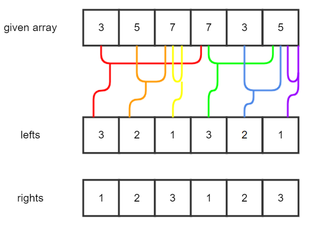
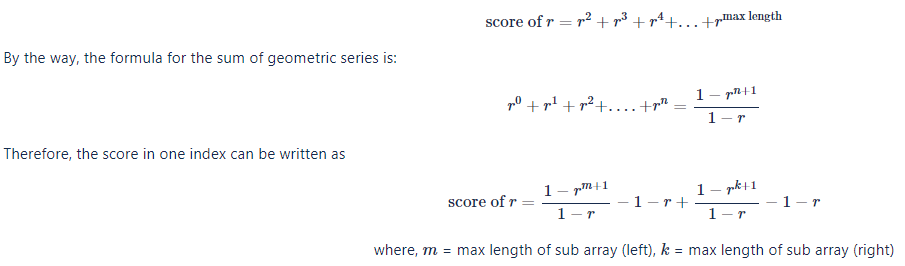

# Description:
Alice likes to play with integer arrays.

Let `A` be an integer array of length `n`, and let the `i`-th element of `A` be `A[i]` (`i = 1, 2, \dots, n`). Define `A[i, j]` be the subarray of `A`, containing elements from `i`-th to `j`-th, inclusive, whose length is `(j - i + 1)` where `1 ≤ i ≤ j ≤ n`. For instance, if `A = [1, 3, 5, 7]`, then `A[1, 2] = [1, 3]` and `A[2, 4] = [3, 5, 7]`. Note that the number of subarrays of `A` is `n \times (n+1) / 2`.

For each subarray `A[i, j]`, Alice computes its score as follow -- for convenience, let `Score(i, j)` be the score of `A[i, j]`. (`1 ≤ i ≤ j ≤ n`)

* [Rule 1] If `i = j`, then `Score(i, j) := 0`.
* [Rule 2] If `i < j` and `A[i, j]` contains any duplicates, then `Score(i, j) := 0`.
* [Rule 3] If `i < j` and `A[i, j]` contains no duplicates, then `Score(i, j) := i^{(j - i + 1)} + j^{(j - i + 1)}`.

Suppose that `A = [1, 1, 2]`.

* Due to Rule 1, `Score(1, 1) = Score(2, 2) = Score(3, 3) = 0`.
* Due to Rule 2, `Score(1, 2) = Score(1, 3) = 0`. Since both subarrays contain the same number `1` twice.
* Due to Rule 3, `Score(2, 3) = 2^2 + 3^2 = 13`.

Consider another example where `A = [1, 3, 5, 7]`.

* Due to Rule 1, `Score(1, 1) = Score(2, 2) = Score(3, 3) = Score(4, 4) = 0`.
No subarrays are subject to Rule 2.
* Due to Rule 3, the score of every subarray of length `2` or more is:
    * Score(1, 2) = 1^2 + 2^2 = 5 
    * Score(2, 3) = 2^2 + 3^2 = 13 
    * Score(3, 4) = 3^2 + 4^2 = 25 
    * Score(1, 3) = 1^3 + 3^3 = 28 
    * Score(2, 4) = 2^3 + 4^3 = 72 
    * Score(1, 4) = 1^4 + 4^4 = 257
 
Given an integer array `A`, help Alice compute the sum of the scores of all its subarrays.

## Input
The first line of the input will contain `T`, the number of test cases.

The first line of each test case will contain `n`, the length of `A`. The second line will contain `n` numbers describing `A`'s elements, separated by whitespace.

## Output
Output each test case's answer in each line. Since the answer can become very large, output the answer modulo `10^9+7` instead.

### Subtask 1 (10 Points)
``` 
`1 ≤ T ≤ 10` 
 `2 ≤ n ≤ 1\,500` 
 `1 ≤ A[i] ≤ 300\,000` 
```

### Subtask 2 (20 Points)
```
 `1 ≤ T ≤ 10` 
 `2 ≤ n ≤ 100\,000` 
 `1 ≤ A[i] ≤ 300\,000` 
```

## Sample Input 1
```
4
3
1 1 2
4
1 3 5 7
6
1 2 3 1 3 2
6
1 2 3 2 3 1
```
## Sample Output 1
```
13
400
525
453
```

# Solution:
## Analyze Problem:
The problem of finding a subarray with a length of 2 or more among all subarrays of a given array, and finding the sum of the scores obtained by squaring the starting and last indices of the subarray without duplicate elements by the length of the subsequence.

That is, when the given array is A and the subarray of A is a[i, j], the score of the subarray a is as follows.

score of a=i^(j−i+1)+j^(j−i+1)

where,
i
 = index of start,
j
 = index of end

The total score is obtained by calculating and adding the scores in the same way for all subarrays.

## Algorithm - 2 pointer and geometric series

The score of a subsequence is related to the index and length of the selected subsequence, not to the values of the array. Therefore, if you know in advance the length of the longest subarray when a point in a given array becomes the left boundary and the right boundary of the subarray, you can calculate the sum of the sequences with the same base and increasing exponent at one point. This makes it easier to get results.

It is shown in the figure as follows.



In the figure above, given array is the given array, and lefts array indicates the maximum length of the subarray when the index is the left boundary of the subarray. That is, when index 1 is the left boundary of the subarray, the maximum subarray length is 3, and when the index 1 is the right boundary of the subarray, the maximum subarray length is 1. In the same way, when index 2 is the left boundary of a subarray, the maximum subarray length is 2, and in the case of the right boundary of the subarray, the maximum subarray length is 2.

In this way, for all indices of a given array, the maximum subarray length can be found when the indices are the right and left bounds of the subarray.

If the length of the largest subarray is known when the index is on the left or right boundary of an index, it is possible to calculate a score that is added to the total score due to the index. That is, the score added in one index becomes the sum of the scores when the index is used as the left boundary and the scores when the index is used as the right boundary. In the definition of a score, since only subarrays of length 2 or greater have a score, the score that one index `r` adds to the overall score is: 

However, the question asks you to submit the remainder of dividing by 10^9+7, as the score may be too large. Therefore, modular operation must be performed using the modular operation law.

When trying to perform modular operation of the above expression, the problem is how to handle the division part in the middle. This is because, unlike the rest of the arithmetic operations, the modular operation for division must use the modular inverse.

However, the method of calculating the modular inverse using the Fermat's Little Theorem is already widely known, so let's simply apply the following equation and use it. 


