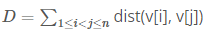

# Description
Alice and Bob love playing games using the "Integer Graph."

The Integer Graph is an undirected graph of infinite size, which is defined as follows:

Nodes: For every positive integer, there exists a unique, corresponding node in the graph. Hence, a node can be represented by a positive integer.

Edges: If two nodes x and y satisfy the following condition, then there exists an edge between them:
```
If x > y: If d is the smallest divisor of x greater than 1 and x/d = y, then there exists an edge between x and y whose length is d.
If x < y: If d is the smallest divisor of y greater than 1 and y/d = x, then there exists an edge between x and y whose length is d.
A shortest path is defined in the standard way, and dist(x, y) denotes the length of a shortest path between x and y (which is the sum of the lengths of the edges in any shortest path).
For instance, the following image illustrates a part of the Integer Graph.
Between 10 and 20, there exists an edge of length 2 and between 25 and 5 an edge of length 5.
```


Two kids will play the following game:

* First, Alice will pick n positive integers v[1], v[2], ..., v[n] (the same number may be picked multiple times).
* Then, D is defined as follows: 
    - That is, D is the sum of shortest path distances over all pairs of numbers that Alice picked.
* Next, Bob will discard one of the n integers, and will re-calculate the value of D using the remaining n-1 integers.
    - That is, if Bob were to discard the k-th integer, then the new value for D (which we call E(k)) will be 

Bob wishes to find k that yields smallest E(k) value.

For instance, suppose that Alice chooses v = [10, 15, 25]:
```
dist(v[1], v[2]) = 5, dist(v[2], v[3]) = 8, dist(v[3], v[1]) = 7, and thus D = 5+8+7 = 20.
If Bob discards v[1], then using v[2] and v[3], he obtains E(1) = 8.
If Bob discards v[2], then using v[1] and v[3], he obtains E(2) = 7.
If Bob discards v[3], then using v[1] and v[2], he obtains E(3) = 5.
```

Given n positive integers that Alice chose, compute the smallest E value that Bob can achieve.

* **Input**
The first line of the input will contain T, the number of test cases.

Each test case will be given by two lines. The first line will contain n and the second line will contain n integers separated by whitespace.

* **Output**
Output each test case's answer in each separate line.

* Subtask 1 (10 Points)
```
1 ≤ T ≤ 10
1 ≤ n ≤ 500
1 ≤ v[i] ≤ 1,000,000
```
* Subtask 2 (20 Points)
```
1 ≤ T ≤ 10
1 ≤ n ≤ 100,000
1 ≤ v[i] ≤ 1,000,000
```

* **Sample Input**
```
6
3
10 15 25
4
24 36 20 30
6
10 20 30 30 20 10
4
12 18 24 36
8
10 10 20 20 20 30 30 30
4
1 1 1 2
```
* **Sample Output**
```
5
46
40
22
94
0
```

# Solution 1:
1) The Integer Graph is defined as follows:

    a) Nodes : For every positive integer, there exists a unique, corresponding node in the graph.

    b) Edges : If two nodes x and y satisfy the following condition, then there exists an edge between them

        If x > y: If d is the smallest divisor of x greater than 1 and x/d = y, then there exists an edge between x and y.

        If x < y: If d is the smallest divisor of y greater than 1 and y/d = x, then there exists an edge between x and y.

            * The length of edge is d.

    c) The shortest path : It is defined in the standard way, and dist(x, y) denotes the length of a shortest path between x and y.

            * the sum of the lengths of the edges in any shortest path = the length of a shortest path


2) Find the sum of shortest path lengths. However, there are the following conditions:

    a) Alice will pick N positive integers v[1], v[2], … , v[n].

        Then the sum of the shortest path lengths will be: D = ∑2_(1≤i<j≤n)=dist(v[i], v[j]).

    b) Bob will discard the k-th node from N nodes, and re-calculate the sum of the shortest path lengths.

        Then the sum of the shortest path lengths will be: E = ∑2_(1≤i<j≤n, i≠k, j≠k)=dist(v[i], v[j])

        That is, the shortest path length between the k-th node and the other nodes is excluded.

    c) Note that the correct answer is the minimum value of E.

        Thus, the k-th node should be selected so that the length of the path that disappears when the k-th node is removed is the largest.