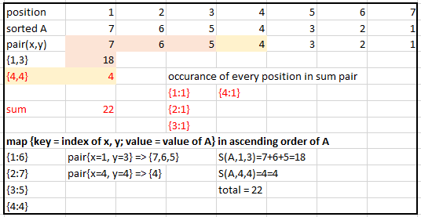
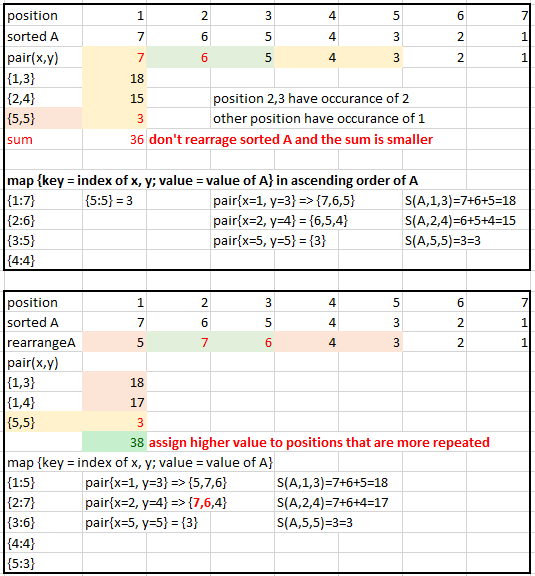
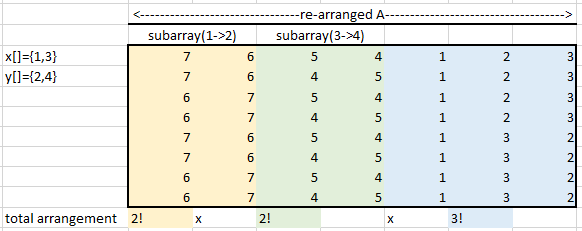

# Description

Alice likes to play the "Subarray Summation Game" according to the following rules:

First of all, she would choose an integer `array A` of length `n`. Let `A[1], ..., A[n]` be the elements of `A`, and these `n` values must be distinct.

Next, she would pick `m pairs` of indices of `array A`, `(x[1], y[1]), ... , x[m], y[m])` with `1 ≤ x[i] ≤ y[i] ≤ n`.

Using `A` as well as `pairs of x and y` , define the subarray sum S(A, x, y) as follows: S(A, x, y) = total sum of (x+y) pairs. 


The objective of the game is to re-arrange the `elements of A` arbitrarily in order to maximize `S(A, x, y)`. Since `A` contains `n` elements, there are `n!` ways to re-arrange the elements of `A`.

For instance, suppose that `n = 3, m = $, A = [10, 100, 1000], x = [1, 2], and y = [2, 2]`. Because n = 3, there are six ways to obtain a new array by re-arranging A -- to differentiate this from the original array, let the new array be `B`.
```
When $B = [10, 100, 1000]: S(B, x, y) = (10 + 100) + (100) = 210.
When $B = [10, 1000, 100]: S(B, x, y) = (10 + 1000) + (1000) = 2010.
When $B = [100, 10, 1000]: S(B, x, y) = (100 + 10) + (10) = 120.
When $B = [100, 1000, 10]: S(B, x, y) = (100 + 1000) + (1000) = 2100.
When $B = [1000, 10, 100]: S(B, x, y) = (1000 + 10) + (10) = 1020.
When $B = [1000, 100, 10]: S(B, x, y) = (1000 + 100) + (100) = 1200.
```
In this case, the maximum possible value for `S(A, x, y) is 2100`, and it can be achieved by having `B = [100, 1000, 10]`.

To give another example, suppose n = 2, m = 1, A = [20, 22], x = [1], and y = [2]. Because n = 2, there are two ways to re-arrange A -- to differentiate this from the original array, let the new array be `B`.
```
When B = [20, 22]: S(B, x, y) = (20 + 22) = 42.
When B = [22, 20]: S(B, x, y) = (22 + 20) = 42.
```
In this case, the maximum possible value for S(A, x, y)` is 42, and there are two different ways to achieve it.

Given A, x, and y, compute the maximum possible value for S(A, x, y) by re-arranging elements in A, and also compute in how many different ways Alice can achieve the said maximum value.

* **Input**
  The first line of input will contain T, the number of test cases.

   For each test case, the first line will contain n and m separated by whitespace. The second line will contain `n` elements of A, separated by whitespace. Each of the next m lines will contain two integers x[i] and y[i], separated by whitespace.

* **Output**
  Output the answer of each test case in each line: The maximum possible value for `S(A, x, y)` and the number of ways to achieve it should be output in a single line, separated by whitespace. Since the number of ways can be very large, output the number modulo 10^9+7 (i.e., the remainder if divided by 10^9+7).

* **Limit**

  ```
    1 ≤ T ≤ 10
    1 ≤ n ≤ 50000 
    1 ≤ m ≤ 200000 
    1 ≤ each element of A ≤ 10^8
    Elements in A are distinct
    For each i with 1 ≤ i ≤ m: 1 ≤ x[i] ≤ y[i] ≤ n
  ```

# Approach 1 - Brute Force -Time Limit

* Two answers must be provides:
1. Calculate the max sum.

We have the following observations:
   - The max sum are max sum of subsets of A. The number of subsets are n*n. For example: {1,2,3} ==> subset of pairs are {11,12,13,21,22,23,31,32,33}. Therefore, if using brute force to generate all subsets, and get max value it will be time-limited.
   - The subarrays are elements of A that are within positions indicated by (x[i], y[i]). *Note*: there is no position 0.
For example, `x={1,2}; y={2,2}, B = [100, 1000, 10]` => we have:
```
x[1]=1; y[1]=2; S(B,x,y) = `{B[1]+B[2]}  +  {B[2]+B[2]}`
```
   - the sum is cumulative. If using DP equation for sum, we have:
```
dp[i] = A[x[i]]+A[x[i+1]] + .... + A[y[i]] + dp[i-1]
i range from 0 to m-1 (number of pairs -1)
values of A are from positions in range x[i] to y[i]
```

- **Greedy approach 1**: we need to find the best way to put the highest values of A[] into subarrays whose boundaries are indicated by indicated by `{x[i], y[i]}` values.
     - Case 1: arrange A so that the largest values of A are assigned to *the position indicated by values of x[] and y[]*

        For example: `A={1,2,3,4,5,6,7}; x={1,4}, y={3,4}`
        

     - Case 2: when there is a repeating index, it is best to assign higher values of A to *indexes indicated by values of x, y* that have more occurance.

        For example: `A={1,2,3,4,5,6,7}; x={1,2,5}, y={3,4,5}`
        

     - we can use `hashmap (value of x or y, occurance)` to store occurance and sort the map by value of occurance.
     - we can also map elements of A to values of x or y by using `hashmap (values of x,y, values of A)`

2. Calculate the number of arrangements
    - case 1: when all position has occurance of 1 (there is no overlap between subarrays)
      - each subarray in range (x,y) has `(y-x+1)`
      - the remaining position outside of (x,y) range have `(N - (y-x))!` arrangement

        For example: `A={1,2,3,4,5,6,7}; x={1,4}, y={3,4}`
        

    - case 2: when some position are repeated. Subarrays in range (x[i],y[i]) are overlapped.
      - the remaining position outside of (x,y) range have `(N - (y-x))!` arrangement

        For example: `A={1,2,3,4,5,6,7}; x={1,2,3}, y={3,4,5}`
        

# Algorithm:
* **Step 1**: count position's frequency in subarray (how many time a position appear in any subarrays)
* **Step 2.1**: sort the position-frequency in order of decreasing frequency

* **Step 2.2**: count how many times the same frequency occurs again.
* **Step 3.1**: calculate sum from {position,frequency} pairs and {position, value}.
```
unordered_map<int, int> position_value(m);                         // map keeps track of value of rearranged A at a position
                                                                       // first: position
                                                                       // second: higher value of A to be placed at the position
int index = 0;
long long int sum = 0;
// Step 3.1: calculate sum
for (auto i : sorted_position_freq) {
    position_value.emplace(i.first, A[index]);
    index++;
    int position = i.first;
    int valueOfA_atPosition = position_value[position];
    int freqOfthePosition = i.second;
    sum += valueOfA_atPosition * freqOfthePosition;
}
```
**Note**: we could improve this code to remove redundant steps of making {position, value} map-pair
```

```
* **Step 3.2**: calculate the number of arrangement based on number of repetition of the same frequency
```
// Step 3.2: calculate arrangement
long long int numberOfArrangement = 1;
for (int i = 0; i < countSameFreq.size(); i++) {
    if (i == 0 && countSameFreq[i] == 0)              // conner case: there is no item in A that is not in subarray
        continue;
    else if (countSameFreq[i] == 0) {       // for other cases
        break;
    }
    numberOfArrangement *= factorial(countSameFreq[i]);
    numberOfArrangement = numberOfArrangement % 100000007;
}

cout << sum << " " << numberOfArrangement << endl;
```
**Note**
- Step 3.1 and 3.2 could be combined by checking the vector that stores {position,frequency} and sort them base on decreasing frequency. The following show improvement in file `SubarraySumGame_sol1_improve1_LTE.cpp`
```
int index = 0;
long long sum = 0;
long long  numberOfArrangement = 1;
int frequencyAlreadyCounted = 0;
// Step 3: calculate number of arrangement, and sum
for (auto i : sorted_position_freq) {
    position_value.emplace(i.first, A[index]);
    index++;
    int position = i.first;
    int valueOfA_atPosition = position_value[position];
    int freqOfthePosition = i.second;
    sum += valueOfA_atPosition * freqOfthePosition;
    if (freqOfthePosition != frequencyAlreadyCounted) {
        int numberOfPositionsThatHaveTheSameFreq = count[freqOfthePosition];
        numberOfArrangement *= factorial(numberOfPositionsThatHaveTheSameFreq);
        numberOfArrangement = numberOfArrangement % 100000007;
        frequencyAlreadyCounted = freqOfthePosition;
    }
}
```

# Approach 2 - Still some wrong answers.

# Approach 3
