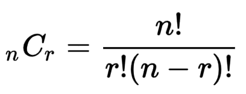

# Description:
Given `n` cities, and `distance[i][j]` to store a distance between city `i` and city `j`. Find a shortest path from `starting city = 1` to visit `k` cities where `k<n` and come back to city `1`.

# Solution: Brute force and backtracking
* The total distance from city `1` to `K-1` is the subset `x[1],...x[i]` where the size of subset is `k`

* This problem askes to find combination `k` of `n` items (find subset of `k` items from `n` items). 
* The combination has distinct members and order of selection (order of member within the subset) does not matter.
* The subset
## Algorithm:
* The search space is limited by the range `x[i-1]+1` to `n - k + 1`
    * we have subsets of k items from {x(1), x(2), x(3), ... x(k)} in a collection {1,2,3...,n}
    * observation:

    ```
    x(k) ≤ n
    x(k-1) ≤x(k) - 1 ≤ n -1
    ....
    x(i) ≤ n - k + i
    ...
    x1 ≤ n -k + 1
    ```

    * therefore

    ```
    x(i-1) + 1 ≤ x(i) ≤ n - k + i (1 ≤ i ≤ k)    ==> search space is limited by the range `x[i-1]+1` to `n - k + 1`
    ```
* Code template:

    ```
    void try(int i) {
        for (int v = x[i - 1] + 1; v <= n - k + i; ++v) {               // note the init value and limit value
            x[i] = v;
            if (i == k)
                print(x);
            else
                try(i+1);
        }
    }
    ```
## Complexity:
* O(N!) where N <14