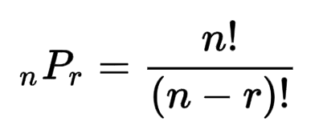

# Description
Given `n` cities, and `distance[i][j]` to store a distance between city `i` and city `j`. Find a shortest path from `starting city = 1` to visit `k` cities where `k<n` and don't come back.
# Solution 1:
* The total distance from city `1` to `K-1` is the subset `x[1],...,x[i], x[k]` where the size of subset is `k`
    * For example: n = 5 , k = 3. The paths and distances could be:
    ```
    x[1] -> x[2] -> x[3]
    x[1] -> x[3] -> x[2]
    x[1] -> x[4] -> x[5]
    x[1] -> x[5] -> x[4]
    The path and distances are all those paths are different. Thus the subset could be found by permutation.
    ```
* This problem finds the permutation `k` of `n` items. Find subset of `k` items from `n` items where the order of selection matters. 
## Algorithm:
* Use backtracking algorithm
    * search space: `i=1 to i=n`
    * stop condition: i == k  (when subset size is k)
    * mark candidate
* Backtracking algo follows 3 steps:
    * Step 1: mark potential candidates
    * Step 2: define search space
        * Step 2.1:
        * Step 2.2:
        * Step 2.3:
    * Step 3: define stop condition, and return subset configuration
* Template code:
```
// Step 1: mark potential candidates
vector<bool>c(n, true);
void try(int i) {
    // Step 2: define search space
    for (int v = 1; v <= n; ++v) {
        if (c[v]) {                     //giá trị v đang tự do
            x[i] = v;
            // step 3: stop condition
            if (i == k)                 // Nếu đã chọn đến bước thứ k thì chỉ cần in ra
                print(x);
            else {
                c[v] = false;           // Step 2.1: đánh dấu giá trị v đã được lựa chọn
                try(i+1);               // Step 2.2:
                c[v] = true;            // Step 2.3: bỏ đánh dấu, giá trị v trở thành tự do vì x[i] sắp được thử một các chọn khác.
            }
        }
    }
}
```
## Complexity:
* O(N!) where N<14