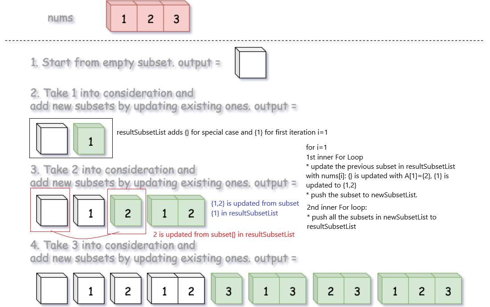
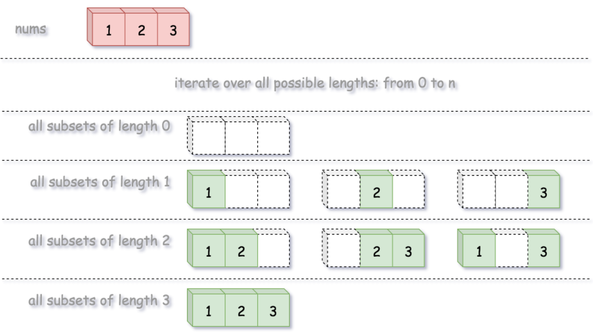
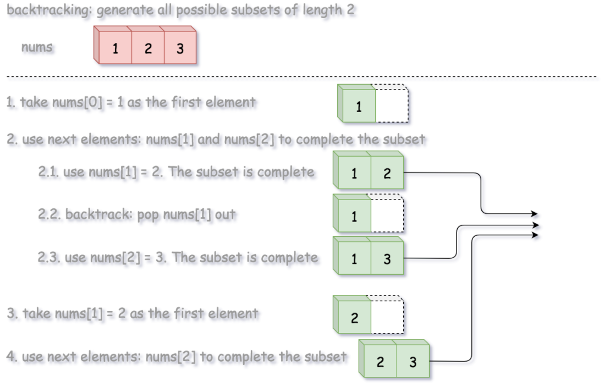

# Description
Return a subset of a given set of integer values

# Solution 1: use recursive function to backtrack.
Resource: https://www.geeksforgeeks.org/backtracking-to-find-all-subsets/

**Note**:
- Backtracking:
```
is an algorithm for finding all solutions by exploring all potential candidates. If the solution candidate turns to be not a solution (or at least not the last one), backtracking algorithm discards it by making some changes on the previous step, i.e. backtracks and then try again.
```

For set {1,2,3}:The following illustrates data flow and recursive function call:
- Red lines: recursive call
- Blue lines: passed data to recursive function or return data from recursive function


1. for every element in A at an index, we need to
    - add the element to subset.
    - add subset to list via recursive call `generateSubset(index+1)`
    - remove the element from subset after recursive call returns result to calling function.

2. the recursive function `generateSubset(index)`
    - returns void
    - performs adding subset to subsetList.
    - run `loop from i = index to i<n`, perform actions in (1)

# Solution 2: use recursive function to create tree-like path
**Note**:
- it can be also said that this approach use recursive to generate all permutations.
- generating permutations creates a tree.

Resource: Competitive Programming Book by Antti Laaksonen

1. from an index = 0, search for possible subsets by making recusive call `generateSubset(index)`
2. for each index, perform:
   - 1st recursive call, after returning a subset result, add more item to another subset.
   - 2nd recursive call, after returning a subset result, remove item from previous subset to make new subset
   - create a tree-like graph as below.

For set {1,2,3}: The following illustrates data flow and recursive function call:


- Red lines: recursive call
- Blue lines: passed data to recursive function or return data from recursive function

A simplified graph shows the added subset to subsetList at the children nodes.


3. For each recursive call `generateSubset(index)`
   - base case: push subset to subsetList when index reaches overflow.
   - recursive cases: perform actions as in **(1)**

# Solution 3: DP - Greedy - Cascading
1. For every element `A[i]`, make a new subset that includes `[], A[0], ... , A[i]` as similar to Solution 1
2. Instead of using recursive call, we use nested for loop to add items => O(N^2)
   - Outter loop: loop through the items in A[i]
      * create a temp `newSubsetList` : it is to store subsets from `[], A[0], ... , A[i]`
   - First inner for loop: for every *copy* of subset in resultSubsetList
      * `subset` add A[i] - it means the element A[i] is push-back to a *copy* of subset. The result is `{A[0], A[1],...,A[i-1], A[i]}` - in other words, it is updating every existing subsets in `resultSubsetList` to `A[i]`;
      * `newSubsetList` adds the subset
   - Second inner for loop: for every *copy* of subset in `newSubsetList`
      * `resultSubsetList` adds the subset in `newSubsetList`

For set {1,2,3}: The following illustrates data flow and recursive function call:


**Notes** The following code would fails because:
   - It doesn't place the subset in order as same as in original set
   - It would miss some subsets.
```
vector<vector<int>> subsets(vector<int>& nums) {
        vector<vector<int>> subsetList;
        subsetList.push_back({});
        for (int i = 0; i<nums.size(); i++){
            vector<int>subsets;
            for (int j = i; j>=0; j-- ){
                subsets.push_back(nums[j]);
                subsetList.push_back(subsets);
            }
        }
        return subsetList;
    }

Output:
[[],[1],[2],[2,1],[3],[3,2],[3,2,1]]
Expected Output:
[[],[1],[2],[1,2],[3],[1,3],[2,3],[1,2,3]]
```

# Solution 4: Recursive - Backtracking by length.
1. generate subset by their max length = 0, 1, 2 ... A.size();
2. for each subset of certain lengths:
    - **Step1**: add items from `A[0]` to `A[startIndex]` to fill up the subset, then add subset to list.
    - `startIndex` indicates that starting items to be added to subsets.
        * For example, for subset `length =2, start= 1, A[1]=2, A[2]=3`, the subset will add all items from startIndex=1, and thus `subset={2,3}`
    - **Step2**: add items until subset of length is filled via recursive call `backtrack(subset, startIndex = i+1)`.

    **note** recursive call works similar to inner for loop in double for loop: add every item after startIndex, or `startIndex+1` to subset until subset is full.
    - **Step3**: backtracking: remove an item, add a different item to make a new subset, then add subset to list.
        * For example, for subset `length =2, start= 0, A={1,2,3`, the subset will add all items from startIndex=1, and thus `subset={1,2}`, then backtrack: `subset={1}`, then add `A[2]=3` to subset: `subset={1,3}`

The following illustrates subsets of different lengths:


The following illustrates how backtracking works:

