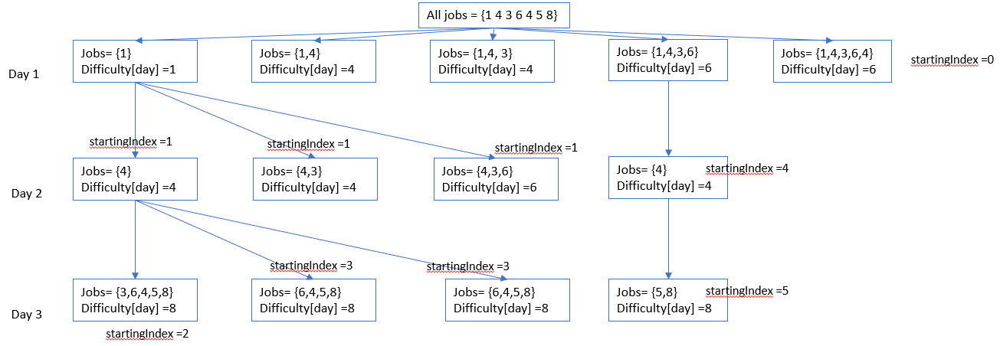

# Description: 
You want to schedule a list of jobs in d days. Jobs are dependent (i.e To work on the `ith` job, you have to finish all the jobs `j` where `0 <= j < i`).

You have to finish at least one task every day. The difficulty of a job schedule is the sum of difficulties of each day of the d days. The difficulty of a day is the maximum difficulty of a job done on that day.

You are given an integer array `jobDifficulty` and an integer d. The difficulty of the `ith` job is `jobDifficulty[i]`.

Return the minimum difficulty of a job schedule. If you cannot find a schedule for the jobs return -1.

## Example 1: 
```
Input: jobDifficulty = [6,5,4,3,2,1], d = 2
Output: 7
```

* Explanation: 
```
First day you can finish the first 5 jobs, total difficulty = 6.
Second day you can finish the last job, total difficulty = 1.
The difficulty of the schedule = 6 + 1 = 7 

If you do 1 job 1 first day. Difficulty is 6. 
Second day, you have to finish the remaining jobs, difficulty is 5.
The total difficulty is 6 + 5 = 11
Thus the minimum difficulty of a job schedule is 7
```

# Preliminary analysis:
Support we have jobDifficulty = [1 4 3 6 4 5 8], and 3 days following brute-force approach, a decision tree could be draw:



The above diagram shows some but not all paths of a decision tree. For each day, there are a number of possible jobs, starting from the a *job index* that is dependent on previous day. The total job difficulty of anyday is the sum difficulty of all the *previous* days. The result is minimum all off possible paths, the minimum of job Difficulty of the last day. Thus we could come up with the following definitions:

* `state`: the job Difficulty of each day, expressed as `Difficulty` array
* `state variables`: 
  * the starting job index of that day 
  * the current day
* `recurrence relation`: 
  * the jobs could have their indices from `starting index` to the maximum number of job for each day. 
  * the Difficulty of each day is calculated as: 
    `Difficulty[startingIndex, currentDay] = max(jobDifficulty[i, currentDay] + Difficulty[previousIndex, previousDay])` where `i` is from `startingIndex` to `i+ max number of jobs for each day`.
* `base case`:
  * if day 0, starting from index 0 is: `Difficulty[0][1] = max(jobDifficulty.begin(), jobDifficulty.end())`;

# Top down approach: 
* Top down approach is similar to brute-force approach: it generates all possible cases and traverse the decision tree from top to bottom, left to right. 
  * Traversing is implemented via *recursive calls*, where each call returns a state calculation, and the input arguments are the state variable
* Top down approach is an improvement of brute-force approach: it use memorization to prevent traversing branches that has saved values.
  * 2D array is used to stored the state result. Each array element is initialized to -1. 
  * When the element is not -1, retrieve the previously stored result instead of making further recursive call.

# Bottom-up approach: 
* Bottom-up approach use DP equations instead of recursive calls.
* DP equations are calculated in specific orders, implemented via for loops. 
  * calculated the equation is the day progresses from day `1` to day `d` in outter for loop
  * For each day, calculate the max difficulty for jobs from `startingIndex` to maximum of jobs for the day in inner for loop.

# Monostack approach: