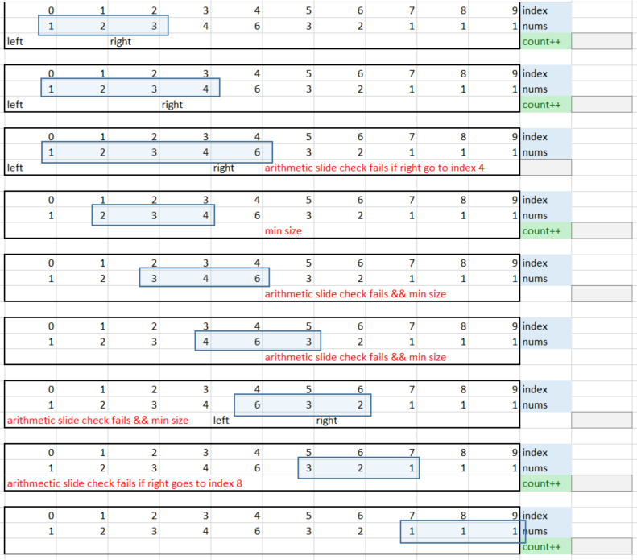
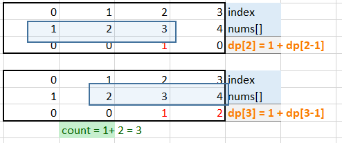
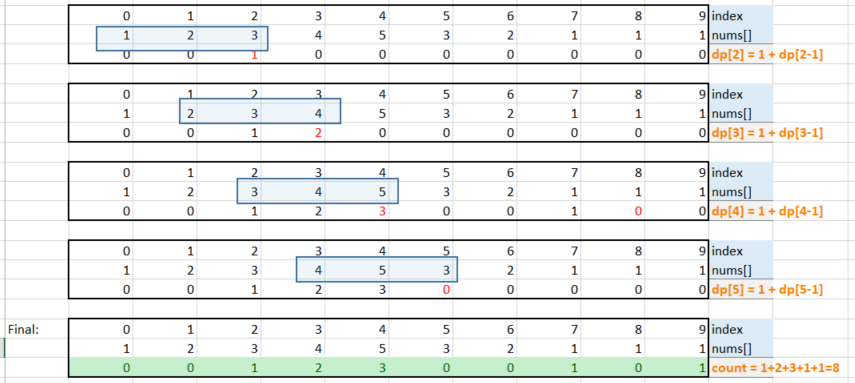

# Problem description
An integer array is called arithmetic if it consists of at least three elements and if the difference between any two consecutive elements is the same.

For example, `[1,3,5,7,9]`, `[7,7,7,7]`, and `[3,-1,-5,-9]` are arithmetic sequences.
Given an integer array nums, return the number of arithmetic subarrays of nums.

A subarray is a contiguous subsequence of the array.

# Solution 1 with BruteForce
## Data Structure
## Algorithm
* use double for loop to create subarray
```
for (i = 0-> i = length -1)
   dif = A[i+1]-A[i];
   for (j=0 -> j = length -1 )
   if A[j]- A[j-1] = dif;
```
* different between 2 first items in subarray are calculated
* compare different of remaining items in subarrays to check if the subarray is arithmetic slice.

# Solution 2 sliding windows approach CANNOT BE SOLVED !
* Sliding windows of min size = 3 could be used to count/return the arithmetic subarrays.

For test case = {1,2,3,4,6,3,2,1,1,1}, the movement of sliding windows are illustrated:



## Algorithm:

Template for sliding windows has 3 steps:

* **Step 1**: create boundary and starting points:
   - left = 0, right = left+3;
* **Step 2**: move the sliding windows to the right, and satisfy the problem requirements.
   - if arithmetic check pass => `right++`;
   - if arithmetic check fail => `left = right -1`, then `right = left+2`,
      - corner case: check condition `left + 3< nums.size-1`
   - check arithmetic condition:
      ```
         dif = nums[left+1]-nums[left]
         if (nums[right]-nums[right-1]== diff) check = true;
       ```
   - check other corner cases conditions.
   ** why sliding is too complicating and cannot help **

   ```
      For example: For array = [1,2,3,4,5]
   * going from left to right, we have
   [1,2,3]
   [1,2,3,4]
   [1,2,3,4,5]
   *  going from right to left, we have
   [3,4,5]
   [2,3,4,5]

   but we also have
   [2,3,4]           ==> the middle subarray was not covered.
   ```
* **Step 3**: check for exit condition, return result

# Solution 3
* DP equation returns values to DP array.
* the equation calculates values as we loop through original data array.
* the size of the DP array is usually the same size of original data array.

For example: the DP[] updates the total arithmetic slice for nums=[1,2,3,4] as below:

- at index = 2, the arithmetic slice is {1,2,3}
- at index = 3, the arithmetic slice are {1,2,3} and {2,3,4} => dp[3]= 1+1=2
- in addition total arithmetic slice is count = dp[2]+ dp[3] = 1+2 3 ; this update the large arithmetic slice {1,2,3,4}



- For test case nums=[1,2,3,4,5,3,2,1,1,1] we have:



