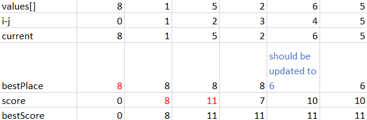
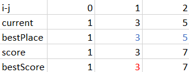
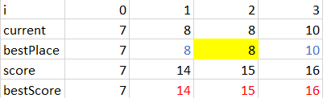
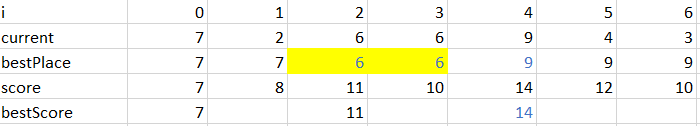

# Problem description
You are given an integer array values where values[i] represents the value of the ith sightseeing spot. Two sightseeing spots i and j have a distance j - i between them.

The score of a pair (i < j) of sightseeing spots is `values[i] + values[j] + i - j`: the sum of the values of the sightseeing spots, minus the distance between them.

Return the maximum score of a pair of sightseeing spots.

# Approach 1 - make DP Equation - Tabulation Table - Fail
* trying to make a tabulation table and update variables as looping from i to N
* check condition to find best candidates to add or subtract score from result.
* update bestValue as looping from i to N

## Algorithm
This approach fails  because it doesn't have enough conditions to find best candidates to add or subtract score from result.

1. The algorithm check the currentScore vs the bestScore:
```
// update best score
if (current_score > bestScore){
    bestScore = current_score;
}
```
The condition wouldn't be sufficient for case {1,3,5} where bestLocation should be updated to 3 from 1 as show follow:

 .


    - `value[4]=6` should be updated to bestPlace, even though it doesn't effect final result.
    - condition for bestScore is independent of condition for bestPlace ==> need to check extra conditions.

The Tabulation Table below shows that updating bestScore effect the final result (bestScore)

 

    - `value[1]=3` and `value[2]` are updated to bestPlace.

2. Add condition to update `bestPlaceSoFar` and `bestLocation`
```
if (current >= bestPlaceSoFar){
    bestPlaceSoFar = current;
    bestPlaceLocation = currentLocation;
}
```
For example: the tabulation below shows that ```current > bestPlaceSoFar``` is not sufficient.



    - `value[1]=8` is updated to `bestPlaceSoFar`, `value[2]=8` should also be.

For example: the tabulation below shows that ```current > bestPlaceSoFar``` is not sufficient for case [7,2,6,6,9,4,3]



    - `value[2]=6` and `value[3]=6` should be updated to bestPlaceSoFar despite that they are smaller than `value[0]=7`


# Approach 2 - make DP Inequality - Tabulation Table - Fail
* This solution fixes the shortcomming from `Approach1` by modifying condition 2.
## Data Structure
## Algorithm
* Note that:
  - `new_score = old_bestPlace + current + old_bestLocation - current_location`
  - `next_new_score = old_bestPlace + Next_current + old_bestLocation - Next_current_location`
  - `last_score = old_bestPlace + Last_current + old_bestLocation - Last_current_location`
  - `current_new_score = old_bestPlace + current + old_bestLocation - current_location`
  - We want score to increase, therefore:
```
if next_new_score > new_score
then
current-current_location < Next_current - Next_current_location`
```
  - we can re-write the code as:
```
if ((current - currentLocation) >= values[currentLocation-1] - (currentLocation-1)){
    bestPlaceSoFar = current;
    bestPlaceLocation = currentLocation;
}
```
* Reason for failure: the condition implementation doesn't it to the TC=[7,2,6,6,9,4,3].
For example: the tabulation below shows that it is wrong for case [7,2,6,6,9,4,3]


- i = 0: result = 7+0 + 2-1 = 8
- i = 1: result = 7+0 + 6-2 = 11   ==> so 6-2>2-1 and satisfies condition.
- i = 2: result = 6+2 + 6-3 = 11   ==> 6-3 is not larger than 6-2 and doesn't satisfies the condition.
  It doesn't satisfies because we don't compare `7+0+6-2` with `7+0+6-3` but `6+2 + 6-3`. Our inequality assumes `7+0` or `old_bestPlace+old_best_location` doesn't change, but it was when `old_bestPlace+old_best_location` was replaced immediatedly before.


# Solution 3 - make DP Inequality - Tabulation Table

* This solution fixes the shortcomming from `Approach2` by modifying condition 2.

## Algorithm
 the tabulation below shows that then bestLocation, bestPlaceSoFar is updated for case [7,2,6,6,9,4,3] 
- i = 0: result = 7+0 + 2-1 = 8
- i = 1: result = 7+0 + 6-2 = 11   ==> 6+2 > 7+0 ==> `bestPlaceSofar = 6; bestLocation = 2`
- i = 2: result = 6+2 + 6-3 = 11   ==> 6+3 > 6-2 ==> `bestPlaceSofar = 6; bestLocation = 3`

