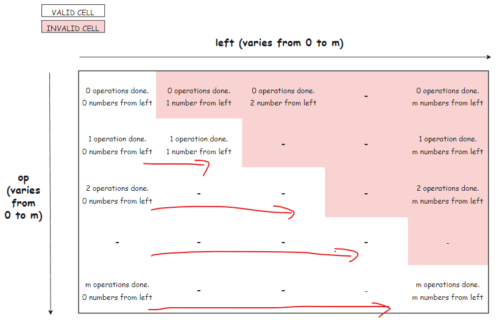

# Description:

You are given two 0-indexed integer arrays `nums` and `multipliers` of size `n` and `m` respectively, where `n >= m`.

You begin with a score of 0. You want to perform exactly m operations. On the ith operation (0-indexed) you will:

* Choose one integer x from either the start or the end of the array nums.
* Add multipliers[i] * x to your score.
* Note that multipliers[0] corresponds to the first operation, multipliers[1] to the second operation, and so on.
* Remove x from nums.

Return the maximum score after performing m operations.

## Example 1:
```
Input: nums = [1,2,3], multipliers = [3,2,1]
Output: 14
```

* Explanation: An optimal solution is as follows:
- Choose from the end, [1,2,3], adding 3 * 3 = 9 to the score.
- Choose from the end, [1,2], adding 2 * 2 = 4 to the score.
- Choose from the end, [1], adding 1 * 1 = 1 to the score.
The total score is 9 + 4 + 1 = 14.

## Example 2:
```
Input: nums = [-5,-3,-3,-2,7,1], multipliers = [-10,-5,3,4,6]
Output: 102
```

*Explanation: An optimal solution is as follows:
- Choose from the start, [-5,-3,-3,-2,7,1], adding -5 * -10 = 50 to the score.
- Choose from the start, [-3,-3,-2,7,1], adding -3 * -5 = 15 to the score.
- Choose from the start, [-3,-2,7,1], adding -3 * 3 = -9 to the score.
- Choose from the end, [-2,7,1], adding 1 * 4 = 4 to the score.
- Choose from the end, [-2,7], adding 7 * 6 = 42 to the score. 
The total score is 50 + 15 - 9 + 4 + 42 = 102.
 

## Constraints:

n == nums.length
m == multipliers.length
1 <= m <= 300
m <= n <= 105
-1000 <= nums[i], multipliers[i] <= 1000
# Solution 1: Brute Force
# Solution 2: Top-down 
## Approach
We approach any DP problems by figuring out `state variable`, `state`, `base condition`, `relation recurrence`. 
1. `state variable`: at each state, when a new operation is carried out, we have 3 state variables:
  * `i`: the index of operations. zero-indexed
  * `left`: the index of the leftmost number remaining in nums. Conveniently, `Left` is also the number of left elements that have been picked.
  * `right`: the index of the rightmost number remaining in nums. 
  * if `i` and `left` are given, then the total number of right elements that have been picked is `i-left`. 
  * Therefore, `right = nums.size() - 1 - the total number of right elements that have been picked` or `right= nums.size() - 1 -( i - left)` 
  * Therefore, 2 `state variables` are needed: `i` and `left`.
 
1. `state`: for top down approach, we use recursive call to generate the result from "decision tree". For example: 
  * each branch has 2 child branches where state variable changes as: `i++` and  `left++`,  `right--`
  * a 2D array size `m x m` is used to stored cache and thus optimized running time. 
1. `relation recurrence`:
  * for any state, we get `currentScore` by `multipliers[i]* nums[position]` where:
    * `position = left` if we pick a number from the left, the current position = the number of elements have been picked from the left, including current element
    * `position = right` if we pick a number from the right
  * after that, we can move to the next state, by either choosing another element from the left or from the right. Thus the next state variable is `i+1` and either `left+1` or `right-1`. 
    * if we pick a number from the left, make recursive call to: `nextScore = nextOperation(nums, multi, i+1, left+1, right)`   
    * if we pick a number from the right: `nextScore = nextOperation(nums, multi, i+1, left, right-1)`
1. Base case: 
	* it is intuitive to see that the recursive call should stop if the number of operation i reaches the size of the `multiplier` array.
	* when it happens, it should return 0 as there is no more element from the `nums` array.
## Complexity Analysis: 
Credit to Leetcode user: pratiksaha198
* Time Complexity: O(m^2). We have 2 recursive calls, each of which runs `m` operations, thus O(M^2)
* Space Complexity: O(m^2). We have 2D cache array with size `m x m`, thus O (M^2)

# Solution 2: Bottom-Up

We approach any DP problems by figuring out `state variable`, `state`, `base condition`, `relation recurrence`. 
1. `state variable`: at each state, when a new operation is carried out, we have 3 state variables:
  * `i`: the index of operations. zero-indexed
  * `left`: the index of the leftmost number remaining in nums. Conveniently, `Left` is also the number of left elements that have been picked.
  * `right`: the index of the rightmost number remaining in nums. 
  * if `i` and `left` are given, then the total number of right elements that have been picked is `i-left`. 
  * Therefore, `right = nums.size() - 1 - the total number of right elements that have been picked` or `right= nums.size() - 1 -( i - left)` 
  * Therefore, 2 `state variables` are needed: `i` and `left`.
  
1. `state`: for bottom up approach, we use 2D array structure `DP[i][left]` to store the score gained in any state. 
  * the total number of operation is the size of `multiplier` array. 
  * the max number of elements have been picked from the left is also the max number of operation. 
  * Thus the size of `DP array` is `n x n`
1. `relation recurrence`:
  * for any state, we get `currentScore` by `multipliers[i]* nums[position]` where:
    * `position = left` if we pick a number from the left, the current position = the number of elements have been picked from the left, including current element
    * `position = right = nums.size() - 1 -( i - left)` if we pick a number from the right
  * after that, we can move to the next state, by either choosing another element from the left or from the right. However, *if we increment i keeping left constant, it would be ultimately equivalent to decrementing right, thus `right-1` also means `left` unchanged.*          
    * if we pick a number from the left: nextScore = `DP[i+1][left+1]`    
    * if we pick a number from the right: nextScore = `DP[i+1][left]`  