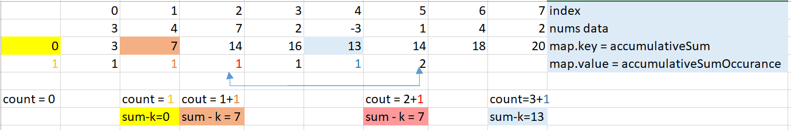
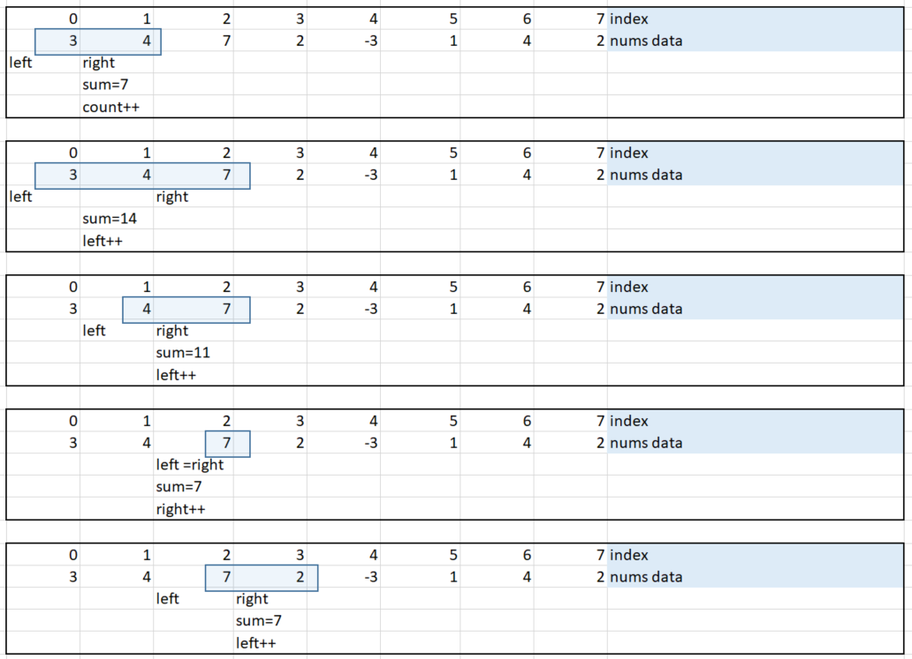
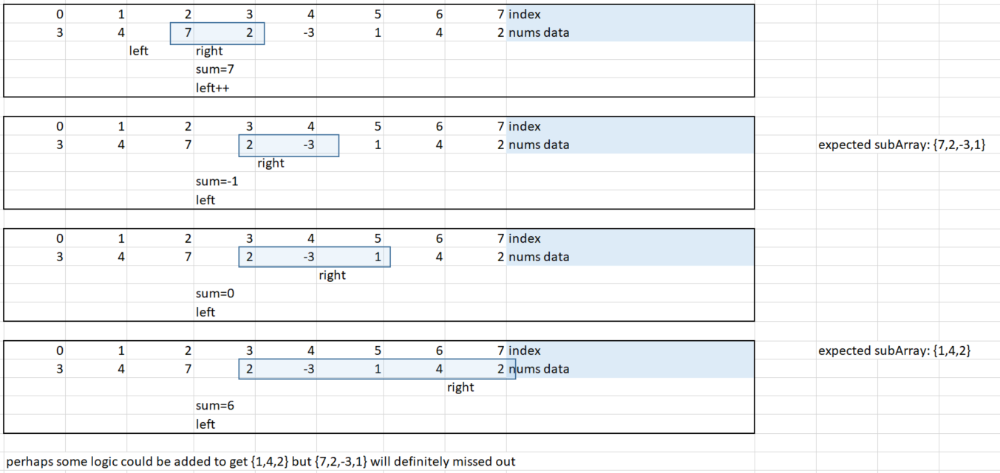
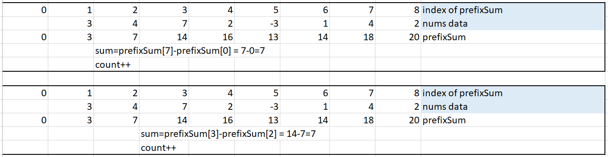

# Description:
Given an array of integers nums and an integer k, return the total number of subarrays whose sum equals to k.

Example:
```
Input: nums = [1,1,1], k = 2
Output: 2
```
# Solution 1 - Bruteforce
* create continuous subarray with 2 nested for loops.
* loop through the subarray to add up sum, and make comparison to K.
* Complexity is O(n^3)

# Solution 2 - Hashmap
Similar problems using hashmap method:
* 1 level harder than this problem: https://leetcode.com/problems/two-sum/
* 1 level easier than this problem: https://github.com/mnpham2101/algorithmPractice/tree/main/4.%20Hashmap/Harshmap_SumOfBinaryNumbers

* use hashmap to return result in one for loop => improve complexity.
* observation:
    - if accumulativeSum[j] - accumulativeSum[i] = k => then the items in index i -> j are in subarray whose sum = k.
    - a `hashmap (value = cumulativeSum, key= occuranceOfCumulativeSum)` indicates the number of subarrays:
        - if the `value = multiple of k`: it indicates a subarray whose sum = k already occurs as shown:  
        - the number of subarray is added by the number of occurance of the *same* accumulativeSum  
## Complexity
* outer for loop O(N)
* search function to find/add item to map: O(logN)

# Approach 2 - Sliding Windows WILL NOT WORK

Basic template for Sliding Windows methods:
* use sliding window with border left, right.
* **Step1**: start at left=0, right =0 and move toward the right.
* **Step1**: Have a while/for loop inside to increase/reduce the window side by sliding toward right. Movement will be based on constraints of problem.
    - calculate Sum.
    - right++ when `Sum < K`
    - left++ when `Sum > K`

The movement of sliding windows are illustrated as following:



However, it turns out sliding windows work best with sorted array. This problem required unsorted array to form *continuous subarray*

The movement and sum calculation starts to get wrong here:



Further discussion: https://leetcode.com/problems/subarray-sum-equals-k/discuss/1302784/why-sliding-window-doesnt-work-for-this-problem

# Solution 4 - prefixed sum

* a prefixed sum array is generated.
* observe that: if `prefixSum[i] - prefixSum[j] = k` , then a subarray occurs.


## Algoritm:
* Generated a prefixed sum array. `prefixSum[0]=0`, `prefixSum[1] = nums[0] + prefixSum[0]`
* Double for loop to calculate requirement.
## Complexity
* O(N) to generate prefixed sum array.
* O(N^2) to perform calculating number of subarray from prefixed sum