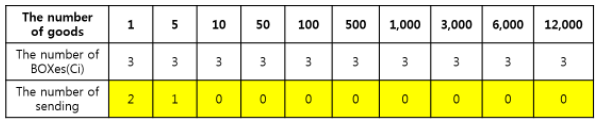
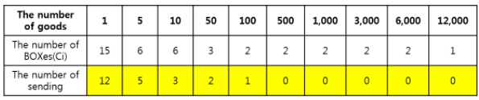
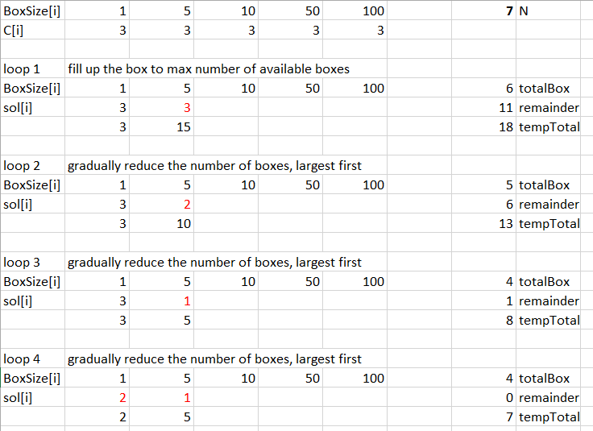
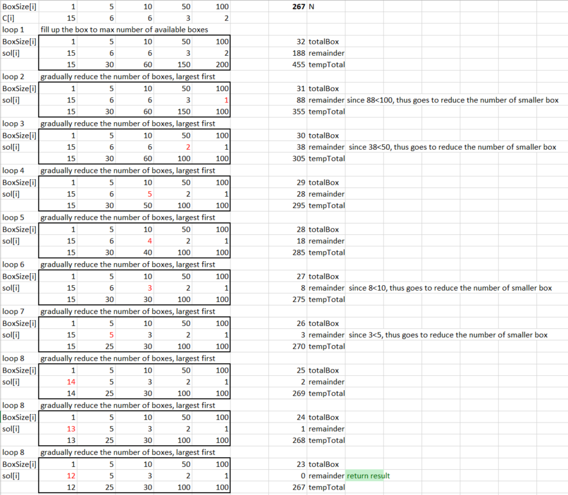
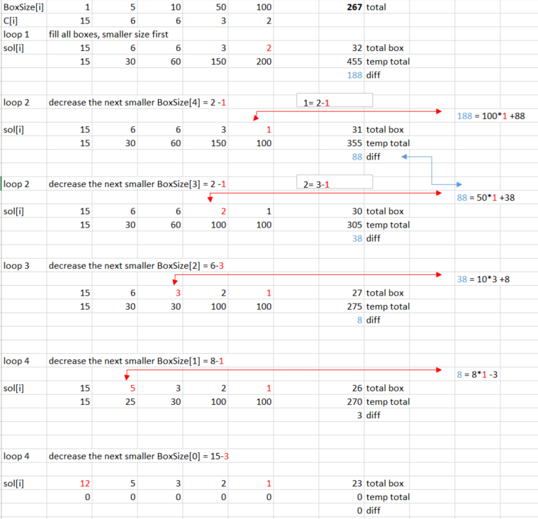

# Description

Goods are packed in various numbers in the warehouse. There are 10 types of items (1,5, 10, 50, 100, 500, 1000, 3000, 6000, 12000) according to Box size. The number Ci of each types of Box varies equally.

The inventory manager wants to empty the warehouse as much as possible by sending as many boxes as possible while sending N goods correctly.

* **Sample 1**
If the number of goods N is 7 and the inventory status is :

Sending with the table above, 3 Boxes can be sent and there is no better way than this.

* **Sample 2**
If the number of goods N is 267, and the inventory status is :

Sending with the table above, 27 Boxes can be sent and there is no better way than this.

* **Limit**
1<=N<=453320
0<=Ci<=20

# Solution 1: Greedy - common sense - DP - Fail 1/2 test cases.
* Similar problem: https://leetcode.com/problems/coin-change/
* Differences:
    - This problem askes for
        - maximum number of boxes
        - all the boxes are packed with maximum goods. (their size are fully used, and the total input N are guaranteed to fully fit all boxes)
    - Therefore, the problem differs to coin-change problems:
        - it is not neccessary that all the smallest box will be used as in sample 1. (But when paying bill, if we want to max the number of bills, we will use all the smaller bill first)
        - it is not neccessary that all the biggest box will be used as in sample 2. (But when paying bill, if we want to minimize the number if bills, we will use all the bigger bill first)

* Solve this problem by fill up the `sol[]` array with max number of box (C[i]) until `total >= N`, get the `remainder = total-N`
* Gradually decrease the number of box, from largest box first, `sol[i]` until remainder is zero.

For sample 1, we would have the data run as follow:

For sample 2, we would have the data run as follow:

## Algorithm

* **Step 1**: fill up the BoxSize[i] with max number in C[i] until `total > N`  get `index i_max` and `remainder= total-N`
* **Step 2**: loop from BoxSize[i_max] to BoxSize[0]
    - decrease the number in sol[i_max] by 1, update the remainder
    - if the `total == N` return result
    - if the `remainder < BoxSize[i]` => cannot reduce the number of current box size,but proceed to the next smaller box size.

# Solution 2: Greedy - math - DP

* Solve this problem by fill up the `sol[]` array with max value until `total >N`, then adjust each value in the array by divisor and modular.
* This approach optimize *Step 2* in *Solution 1*. Instead of gradually decreasing the number of box, the actual number of box to be deleted is calculated.
For sample 2, we would have the data run as follow:

## Algorithm

* **Step 1**: fill up the BoxSize[i] with max number in C[i] until total > N  get `index i_max`
* **Step 2**: loop from BoxSize[i_max-1] to BoxSize[0]
    - add just the number of box in sol[i] by subtracting a `numberOfBoxToReduce = lastRemainder / BoxSize[i]`
    - update total number of box, and number of box for the current box size `sol[i]`
    - update the remainder to use for next

# Solution 3: Greedy - common sense - DP

* The approach of this problem is similar to Solution 1.
* the different is that initially, `remainder = N- BoxSize[0]*C[0]`, then `remainder -= BoxSize[i]*C[i]`
* in *Solution 1*, we have `remainder= total-N`

## Algorithm

* **Step 1**: start with smallest BoxSize[i=0], fill with maximum available box. Get the `remainder = N- BoxSize[0]*C[0]`
    - continue until the `remainder` cannot fill the next BoxSize. The `remainder` for each iteration loop is `remainder -= BoxSize[i]*C[i]`. 
    - stop if the remainder cannot fill up the next box size. Get `index i_max` where `BoxSize[i_max]` cannot be filled
* **Step 2**: start to adjust the C[i] of next smaller boxSize by `-1` so that the `remainder` could fit the next box size:  `if(remainder == BoxSize[i_max+1])` then break;

