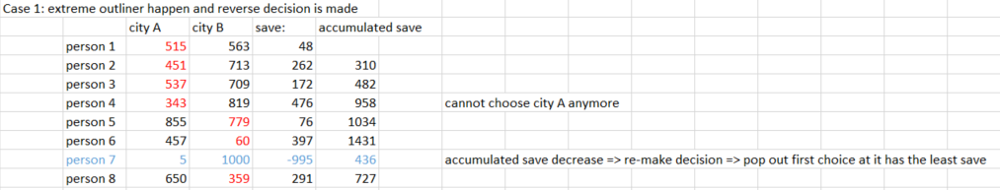
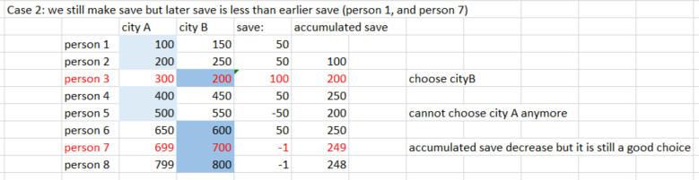
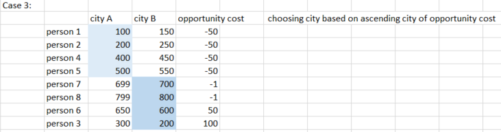

## Description
A company is planning to interview 2n people.
Given the array costs where `costs[i] = [aCosti, bCosti]`, the cost of flying the ith person to city a is aCosti, and the cost of flying the ith person to city b is bCosti.
Return the minimum cost to fly every person to a city such that exactly n people arrive in each city.
Example:
```
Input: costs = [[515,563],[451,713],[537,709],[343,819],[855,779],[457,60],[650,359],[631,42]]
Output: 3086
CityA  515 451 537 343
CityB  779 60 359 42
```
## Solution - Greedy solution
# Approach
* consider opportunity cost or save: the decision is based on **saving $$** or **getting less opportunity cost**
  1. **save $$**
  ==> make local decision: as long as city A is cheaper, pick city A
    - **Candidate set** = `save = higher cost - lower cost`
    - **Feasibility function**: push `save` and `person_index` to a map to check the last choice that has the least save   ==> O(N). Size of map should be max number of person to send to city A
    - **Decision function**: if accumulated save is decreased ==> pop out the last saved and make reverse choice.  ==> O(N) + map sorting O(logN) 
    - **Solution function**: but if accumulated save decreases but the save from earlier decision outweight the decrease ==> shouldn't reverse condition 
        - **Solution function**: compare `currentsave` to any earlier `save` value in the map => log(N)
  2. **less opportunity cost**
    - **Candidate set** = `opportunity_cost = cost of sending to city A - cost of sending to city B`
    - **Feasibility function**: sort `cost` 2D array based on opportunity cost => make choice base on which has lower opportunity cost 
    - **Decision function**: decision is made on choosing lower the opportunity cost
    - **Solution function**: run a for loop through a sort `cost array` and choose the cost of the city so that the cost is lower to higher
# Algorithm
1. sort the cost array based on opportunity cost of choosing city A
2. loop through the sorted array, add up the cost of city A until n = size/2. then add cost of city B.
# Complexity Analysis
1. sorted function: O(logN)
2. loop function: O(N)