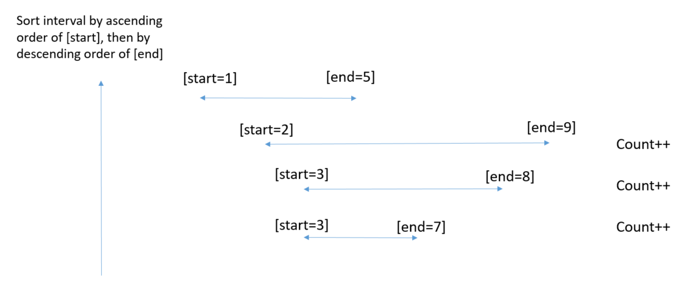

# Description
We have an array intervals where intervals[i] = [li, ri] represent the interval [li, ri),
Remove all intervals that are covered by another interval in the list.
The interval [a, b) is covered by the interval [c, d) if and only if c <= a and b <= d.
Return the number of remaining intervals.
# Approach 1
* sort the intervals in order as show .
## Algorithm
## Complexity Analysis