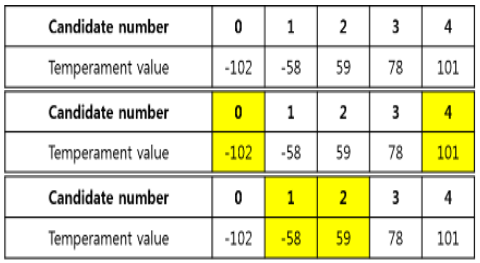

# Description
Given an array of psychological score, find the indexes of 2 items in the array such that their sum is closest to 1.

Return the first pair found (first index is smallest)

Example: The pair (-102, 101) has the sum -1 and is closest to 0. The pair {-58,59} also has the sum 1 and is close to zero but its first index is 1 and is found later.

 

# Solution 1: Greedy and sort
* The array must be sorted in ascending order.
* start from `left=0, right=N-1` and move toward the middle.
* if the `A[left] + A[right] > 0` make it less positive,
* if the `A[left] + A[right] < 0` make it less negative,
* also keep track of the requirment: `best = abs(A[left] + A[right])`

# Solution 2: Greedy and sliding windows ????  need review
* The array must be sorted in ascending order.
* start from `left=0, right=0` and move toward the window toward the right
