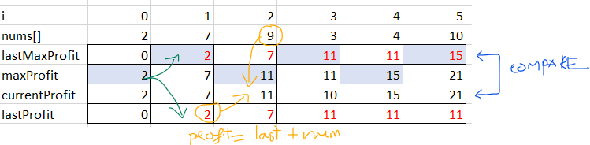

# Problem description
You are a professional robber planning to rob houses along a street. Each house has a certain amount of money stashed, the only constraint stopping you from robbing each of them is that adjacent houses have security systems connected and it will automatically contact the police if two adjacent houses were broken into on the same night.

Given an integer array nums representing the amount of money of each house, return the maximum amount of money you can rob tonight without alerting the police.

# Solution 1 with DP and Tabulation Method
* Note: the houses don't have to be 2 houses apart.
*
## Data Structure
* ~~use array to store maxProfit. array size = total Houses.~~
* `profit` is updated by DP Equation `nums[currentHouse] +  lastProfit`
* `currentMaxProfit` is the max between `profit` and `lastMaxProfit`
* `lastProfit` is updated so that it stored accumulated profit from early houses.
* `lastProfit` is also updated after `lastMaxProfit` at the end of each cycle.
  For example: the following shows Tabulation Table: 
## Algorithm
1. Step 1: make special case totalHouses == 0.
2. Step 2: fill up Tabulation Table/DP equation
3. Step 2.1: define and solve the "sub-problem": find maxProfit received from previous house.
## Complexity:
* Step 2: 0(n)
* Step 2.1: O(n) as claimed by C++ STL library document
Final time complexity: O(logN)

# Solution 2
## Data Structure
## Algorithm
## Complexity:
