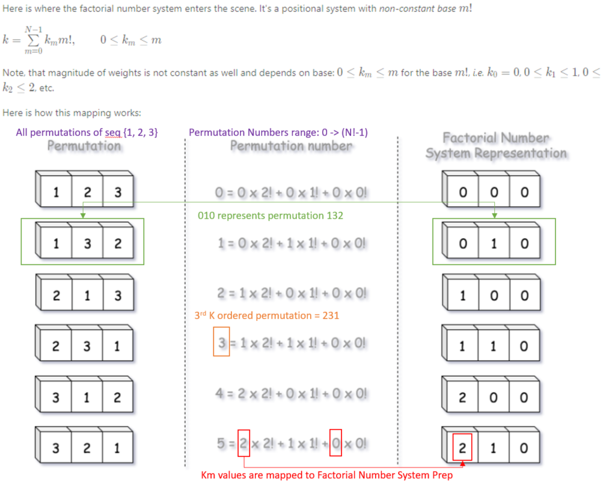
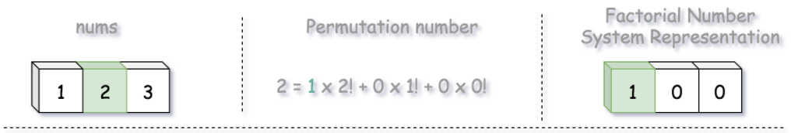
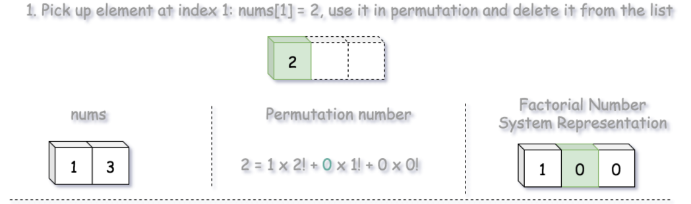
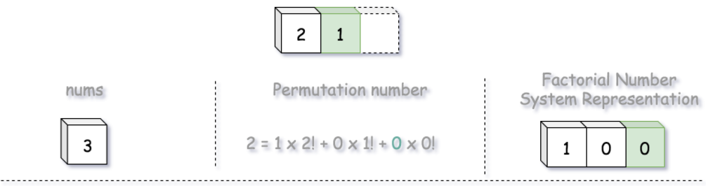
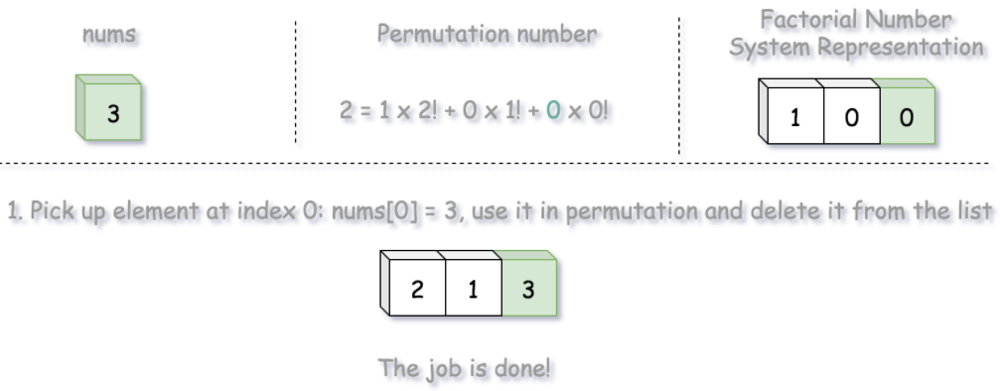
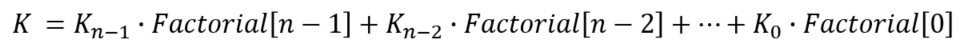
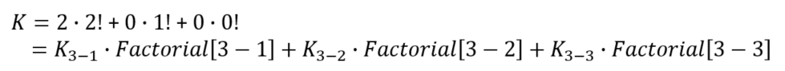

# Description
The set [1, 2, 3, ..., n] contains a total of n! unique permutations.

By listing and labeling all of the permutations in order, we get the following sequence for n = 3:
```
"123"
"132"
"213"
"231"
"312"
"321"
```
Given n and k, return the kth permutation sequence.

**Note** the sequences are also lexicographically sorted.

# Approach 1:
1. Explaning Binary Number Representation System
2. Explaning Factorial Number Representation System
    - Factorial Number Representation System can show the Kth permutation sequence

    - The coefficient Km in factorial representation are indexes of elements in the input array. These are not direct indexes, but the indexes after the removal of already used elements. That's a consequence of the fact that each element should be used in permutation only once.

Example: nums = {1,2,3}

    - if `index = 1`, `nums[1]=2`
    - we have the first coefficient K=1 because nums[index=1]=2 as show below



    - then we remove `nums[1]`, and have remaining `nums={1,3}`. We use `index=0` to get `nums[index=0]=1` ==> the coefficient is K=index=0. Permutation result is now {2,1}



    - then we remove `nums[0]=1`, and have remaining `nums={3}. We use `index=0` to get `nums[index=0]



    - the result permutation for 3rd k or K=2 is {2,1,3}



## Algorithm
* General formula for Factorial Number Representation System is:



For example, with nums = {1,2,3}, we have



* From the fomular, we need to loop from size-1 down to 0
* **Step 1**: Calculate K-Coefficient
```
int K_Coeff = k / factorials[i];
k -= K_Coeff * factorials[i];
```
* **Step 2**: add the element of nums, at the index = K_Coefficient to the `string permutationAtKthOrder`
```
permutationAtKthOrder.append(to_string(nums[K_Coeff]));
```
* **Step 3**: remove the element of nums, at the index = K_Coefficient
```
nums.erase(next(nums.begin()+K_Coeff-1));
// has to subtract 1 to compensate the value at nums.begin()
```
## Complexity
O(n) to generate nums from 1 to n and factorial from 1 to n
O(n) to calculate K-Coefficient

# Approach 2: BFS + DP