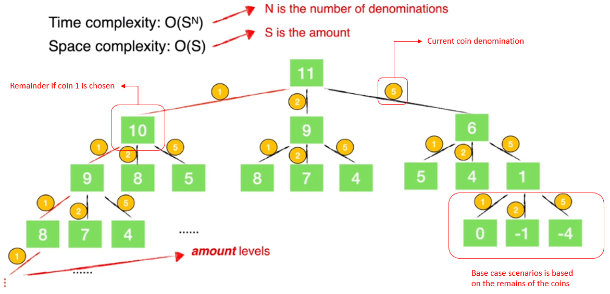

# Description:
You are given an integer array coins representing coins of different denominations and an integer amount representing a total amount of money.

Return the fewest number of coins that you need to make up that amount. If that amount of money cannot be made up by any combination of the coins, return -1.

You may assume that you have an infinite number of each kind of coin.

# Approach 1: Bad Greedy.
* attempt to sort the array coin, from lower denomination to higher denomination.
* start to "exchange coin" from higher denomination first, and update the remainder. Use the remainder to exchange for lower denomination coins until finish.
* this solution is bad because:
    - it assumes that the highest denomination coin can be used for exchange in every cases. This is not true.
    - it assumes that the coins could be exchanged in order from higher denomination to lower denomination and will return the optimum answer. This is not true.

# Solution 1: Tree traversal - Topdown - Memoization.
* construct a tree where each node is the `remainder` after using a single coin to exchange => use recursive call to generate the tree.
* use memoization technique to reduce the time complexity to traverse the tree.

The following tree illustrate an amount = 11 and coins denomination are {1, 2, 5}


* There are 2 challenges with this implementation:
1. getting minimum values from every child branch.
2. saving the cache[amount] ==> with dynamic array or vector, the vector should be initialized to largest coin denomination.
## Algorithm
* Use recursive call to generate the tree `Top down`.
* The recursive is defined as `recursiveCall(vector<int> coins, int amount)` where in each recursive call, amount is updated by `amount = amount - coins[index]` and index indicates `current coin denomination`.
1. Base case: Top down
    - if `remain == 0` return result = 0 ==> subproblems on parent nodes will be calculated from child node.
    - if `remain >0` return -1 ==> all subproblem branch will have result -1
2. Other cases:
    - increment count for each recursive case
    - make recursive call to get `count = count + recursiveCall(coins, amount - coins[index]`) where `index` indicates the *current coin denominations*.
    - get the final result by getting min of all recursiveCall at the same tree depth. In other words:
        ```
        for (int coin: coins){
            return min (recursiveCall(coins, amount - coin));           // need to return the minimum from all result of every child branch.
        }
        ```
    - The trick to do this comparison:
    ```
    for (int coinIndex=0; coinIndex < coins.size(); coinIndex++){         // result based on exchange by every coint denomination
            int coinCountTmp = recursiveCall(coins, amount - coins[coinIndex]);         // result from 1 child branch
            // get minimum coins counts
            if (coinCountTmp>=0 &&                          // if the child branch returns a valid result, not -1
                coinCountTmp < accumulatedCount){           // and if the child branch returns min value: value from a child branch is compared with accumulated result
                                                            // because of this comparison, accumulatedCount was initilized to INT_MAX
                accumulatedCount = 1 + coinCountTmp;
            }
            // cout<<"amount "<<amount<<" accumulatedCount "<<accumulatedCount<<endl;
        }
    ```
* use cache[remainder] to store the result. Cache has to be initialize to `size = given amount`.
## Complexity Analysis
1. Time Complexity is O (amount^n) where n is the number of coin denominations.
2. Space Complexity is the depth of tree or the number of coin denominations.

# Solution 2: Tree traversal, topdown, memoization

