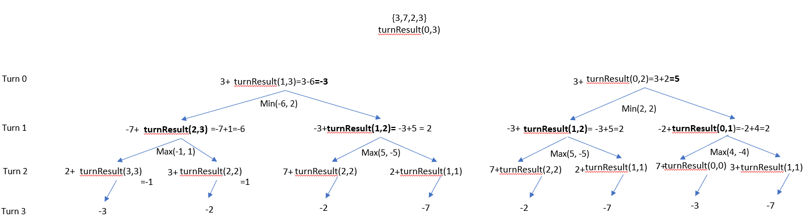

# Description
Alice and Bob play a game with piles of stones. There are an even number of piles arranged in a row, and each pile has a positive integer number of stones piles[i].

The objective of the game is to end with the most stones. The total number of stones across all the piles is odd, so there are no ties.

Alice and Bob take turns, with Alice starting first. Each turn, a player takes the entire pile of stones either from the beginning or from the end of the row. This continues until there are no more piles left, at which point the person with the most stones wins.

Assuming Alice and Bob play optimally, return true if Alice wins the game, or false if Bob wins.

# Approach 1: Brute Force + Greedy
## Algorithm
* use recursive call to return result after each turn. 
* base case condition: left > right 
* other case conditions:
  - turn: AliceTurn or not
  - score is positive if Alice score; score is negative is opponent scores.
  - score is dependent if piles[left] > piles[right]    ===> this approach is GREEDY!
  - the local solution is optimum but doesn't lead to optimul final result! see test case {3,2,10,4}

```
 int turnResult(vector<int>&piles, bool AliceTurn, int score, int left, int right){
        if (left> right){
            return score;
        }
        else if ( (AliceTurn) && (piles[left] == piles[right]) )
        {
            score = score;
            cout<< score<< endl;
            return max( turnResult(piles, !AliceTurn , score + piles[left], left+1, right), 
                       turnResult(piles, !AliceTurn , score + piles[right], left, right-1));
        }
        else if ( (AliceTurn) && (piles[left] > piles[right]) )
        {
            score = score;
            cout<< score<< endl;
            return turnResult(piles, !AliceTurn , score + piles[left], left+1, right); 
        }
        else if ( (AliceTurn) && (piles[left] < piles[right]) )
        {
            score = score;
            cout<< score<< endl;
            return turnResult(piles, !AliceTurn , score + piles[right], left, right-1);
            
        }
        else if ((!AliceTurn) && (piles[left] == piles[right]))  
        {
            score = score;
            cout<< score<< endl;
            AliceTurn = true;
            return min( turnResult(piles, AliceTurn , score - piles[left], left+1, right), 
                       turnResult(piles, AliceTurn , score - piles[right], left, right-1));
        }
        else if ((!AliceTurn) && (piles[left] > piles[right])) 
        {
            score =score;
            cout<< score<< endl;
            AliceTurn = true;
            return turnResult(piles, AliceTurn , score - piles[left], left+1, right);
        }
        else if ((!AliceTurn) && (piles[left] < piles[right])) 
        {
            score =score;
            cout<< score<< endl;
            AliceTurn = true;
            return turnResult(piles, AliceTurn , score - piles[right], left, right-1);
        }
        else
            return false;    
    }
```
## Complexity Analysis:
- O(heigh of the tree ^ number of leaf) = O (n^n)

# Approach 2: make decision tree, use memoization
* make decision tree .
* use recursive call `turnResult(left, right, turn)
  - left, right: the position/card that each user chooses ==> that is why it is decision tree.
  - each user maximize their choice => use min max to get the best value when 2 child branches return result.
  - turn % 2 decides the user choice
* 2D array cache[left][right] stored values of the tree for later retrieve ==> tree prunning ==> don't have to retraverse the tree if a branch result is already stored.
## Algorithm
* decision tree is implemented via `turnScore`
```
int turnScore (vector<int>piles, int left, int right, int turn, vector<vector<int>>&cache){
        // base case
        if ((left == right) && (turn % 2 == 0)){   
            cache[left][right] = piles[left];                       // memoization - save cache 
            return + piles[left];
        }
        else if ((left == right) && (turn % 2 != 0)){      
            cache[left][right] = - piles[left];                     // memoization - save cache 
            return - piles[left];
        } 
        // memoization - retrieve cache 
        if (cache[left][right] !=INT_MAX ){
            cout<<"return cache["<<left<<"]["<<right<<"]="<<cache[left][right]<<endl;
            return cache[left][right];
        }  
        // 
        else if ((left < right) && (turn %2 == 0)){           
            int a = piles[left] + turnScore(piles, left+1, right, turn+1, cache);     
            int b = piles[right] + turnScore(piles, left, right-1, turn+1, cache);
            int c = max(a,b);          
            cout<<"turn: "<<turn<<" (left,right="<<left<<","<<right<<")"<<endl;
            cout<<"a:"<<a<<" b:"<<b<<" c:"<<c<<endl;
            cache[left][right] = c;                                          // memoization - save cache 
            return c;
        } 
        else if ((left < right) && (turn %2 != 0)){
            int a = -piles[left] + turnScore(piles, left+1, right, turn+1, cache);
            int b = -piles[right] + turnScore(piles, left, right-1, turn+1, cache);
            int c = min(a,b);  
            cout<<"turn: "<<turn<<" (left,right="<<left<<","<<right<<")"<<endl;
            cout<<"a:"<<a<<" b:"<<b<<" c:"<<c<<endl;
            cache[left][right] = c;                                            // memoization - save cache 
            return c;
        }
        else
            return 0;
}
```
## Complexity Analysis