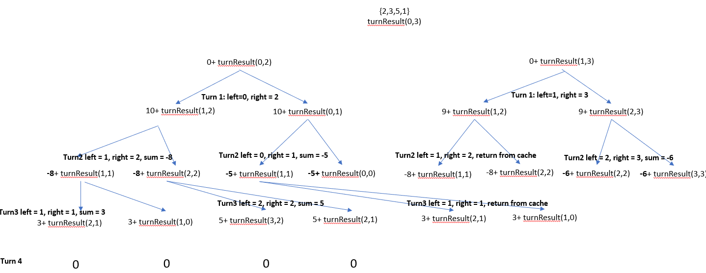

# Description
Alice and Bob take turns playing a game, with Alice starting first.

There are n stones arranged in a row. On each player's turn, they can remove either the leftmost stone or the rightmost stone from the row and receive points equal to the sum of the remaining stones' values in the row. The winner is the one with the higher score when there are no stones left to remove.

Bob found that he will always lose this game (poor Bob, he always loses), so he decided to minimize the score's difference. Alice's goal is to maximize the difference in the score.

Given an array of integers stones where stones[i] represents the value of the ith stone from the left, return the difference in Alice and Bob's score if they both play optimally.
**Example**
Input: stones = [5,3,1,4,2]
Output: 6
Explanation: 
- Alice removes 2 and gets 5 + 3 + 1 + 4 = 13 points. Alice = 13, Bob = 0, stones = [5,3,1,4].
- Bob removes 5 and gets 3 + 1 + 4 = 8 points. Alice = 13, Bob = 8, stones = [3,1,4].
- Alice removes 3 and gets 1 + 4 = 5 points. Alice = 18, Bob = 8, stones = [1,4].
- Bob removes 1 and gets 4 points. Alice = 18, Bob = 12, stones = [4].
- Alice removes 4 and gets 0 points. Alice = 18, Bob = 12, stones = [].
The score difference is 18 - 12 = 6.

# Approach 1: topdown + memoization
The result of the each turns follows a decision tree:

* each turn's result is the value of piles[left] or piles[right]
* left, right value follows a patterns: if a left stone is taken, the next left is left+1; if a right stone is taken, the next right is right-1
* each turn is called recursively:
```
score = player's score in current turn   + recursivefunction  (data set, next left, next right, cache, prefixSum)


```
Illustration of decision tree
.

* **player's score** in current turn is calculated by `prefixSum`  - that way we don't have to run for loop to calculate score.
Note: see the implementation of `TopDown_memoization_StoneGameVII_timeout.cpp`, it demonstrate a bad way of calculating score using for loop. Due to the repetition of this for loop in each branch, the program runs timeout. 

```
for example: for data set { 5,2,3,1 }
The value {5,2,3}, if a player takes 1 is: 5+ 2 + 3 = 10 = (5+2+3+1) - 1 =prefixSum[4] - prefixSum[3]
The value {2,3,1} if a player takes 5 is: 2+3+1 = 6 = (5+2+3+1) - 5 = prefixSum[4] - prefixSum[0]
prefixSum[0] = 0
prefixSum[1] = 5
prefixSum[2] = 5+2=7
prefixSum[3] = 5+2+3=10
prefixSum[4] = 5+2+3+1=11      // note that prefix sum has size + 1
``` 

* the player turn is identified by even/odd values: Zero turn: game starts; Odd turn: Alice plays, Even turn: Bob plays.
* the result of each turns is the different = Alice score - Bob score. Thus when Alice plays, score += AliceScore; and when Bob plays, score -=BobScore
* the final score is returned to original call of recursive funtion , turn 0. 

Memoization is implemented: an array cache[left][right] saved a value for later retrieval. It helps pruning the tree: the branch that are repeated will not be visited again; instead, its value is returned from saved cache. Cache is initialized to INT_MAX (must use #include #include <bits/stdc++.h>)

Traversing the tree is topdown. Top = root of tree = turn index = 0 (left =0, right = size of piles -1)

To further optimizing the run-time, pass by reference is used in recursive function; it saves time from making copy of piles, cache etc while invoking functions.

The code could be further optimized by not declaring local variables, but I used them anyway, for better code reading. 
