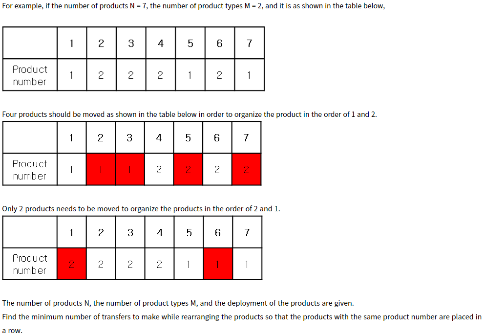
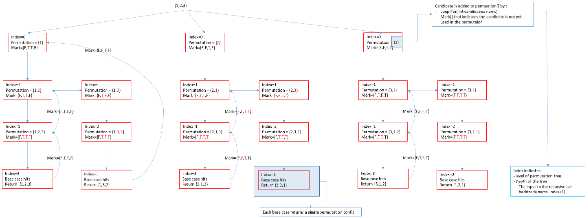
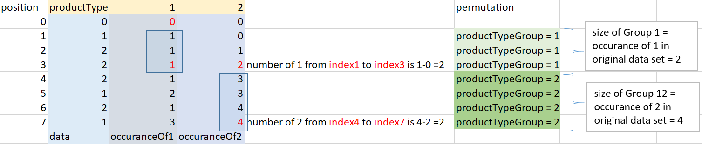

# Description
There are N products wrapped in the same sized boxes, aligned in a line.

There are M types of products, and each box is attached with the product number. We need to arrange products of the same type in a row for efficient management.

The initial arrange of the products are presented by a sequence of integer where each number is product number.

For example: 

Find minimum transfer to make the required arrangement.

* **Input**
    - 1st line: the total number of product `N ( 7 ≤ N≤ 10^5)` and number of product type `M (2 ≤ M ≤9)`
    - 2nd line: the sequence that shows product arrangement.
* **Output**
    - minimum number of arrangement.

# Solution 1: Backtracking and Bruteforce
* This problem is similar to Leetcode pb:
- https://leetcode.com/problems/minimum-swaps-to-group-all-1s-together/ with very similar question and methods: `slidingWindows`, `two-pointer`
- https://leetcode.com/problems/longest-repeating-character-replacement/ with similar methods: `slidingWindows`, `two-pointer`
* Use `back tracking algorithm` to create permutation of different arrangement of product type.

For example: with N = 2, product type = {1, 2}, then the arrangement are: {1,2} and {2,1}. Backtracking algorithm could achieve this.

Ref: backtracking is explained in Leetcode pb: https://leetcode.com/problems/permutations/

* The original product arrangement is an array that could be partitioned to subarrays, where each subarray includes a single product type.
* The size of subarray is the occurance of each product type.

For example:
```
with N = 2, original data = { 1 2 2 2 1 2 1}
we can have following 2 subarrays if we swap the products:
{1 2 2} is swapped to {1 1 1} and {2 1 2 1} is swapped to {2 2 2 2} ==> this arrangement requires 4 swaps
{1 2 2 2} is swapped to {2 2 2 2} and {2 1 2 } is swapped to {1 1 1 } ==> this arrangement requires 2 swaps
{1 1 1} and {2 2 2 2} or {2 2 2 2} and {1 1 1} are results of backtracking algorithm
size of {1 1 1} is the occurance of `1` in the original data array.
size of {2 2 2 2} is the occurance of `2` in the original data array.
```
* The number of swaps required is the Total Occurance of a product type - Current Occurence of the product type in a subArray.

For example:
```
{2 1 2 } is swapped to {1 1 1 } ==> this arrangement requires 1 swap
```
## Algorithm:
* **Step 1**: couting the occurance of each product type:
* **Step 2**:use backtracking to create permutation of product type:
    - Note: refer to backtracking template and basic problem: Leetcode pb: https://leetcode.com/problems/permutations/ and https://github.com/mnpham2101/algorithmPractice/tree/main/DP_ArrayProblems/Math_LexicographicalOrder_1_Backtracking_PermutationSeq
    - sample permutation tree created by backtracking algorithm for `productType = {1, 2, 3}`

    

    Thus the arrangement of productType will be partitioned in 3 subArrays. The order of the subarrays is same as the permutations. Such as {1,2,3} , {1,3,2}, {1,2,3}

    The size of each subarray depends on the occurance of each productType. For example, the size of subarray of productType = 1 will be 3 if there are 3 of productType1 in original data set.

* **Step 3**:For each configuration of the permutation, perform couting the number of swaps need:
    ```
        for each productType in permutation
            for each item in subArray whose size if occurance of productType
                count the number of items of the productType.
            numberOfSwap = subArray size - number of items of productType
    ```
## Complexity:
- Backtracking algorithm : O (N*N!)
- Brute Force algorithm to calculate swap: O (N^2)

# Solution 2: Backtracking and Sliding Windows
Sliding algorithm could also be used in place of Brute Force algorithm to calculate swap. But there is no change in time complexity.

# Solution 3: Backtracking and 2D array mapping
* This solution dramatically improves the time complexity of couting swap operations.
* The original data set is partitioned to multiple subArray of productTypes.
* The goal is get each subArray to have items of 1 particular productTypes.
* The subarray size is the occurence of the items of a productTypes from the original data set.
* The number of swap needed is:
`total occurance of items of the productType in original set - occurance of the item of the productType in subArray`
* Therefore we need a quickway to store and access the number of `occurance of the item of the productType in subArray`
* One way to do that is to use 2D arrays:

The following illustrates TC ={ 1, 2, 2, 2, 1, 2, 1} and how to count swap

 