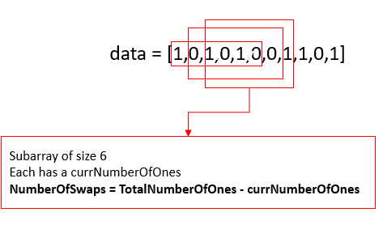
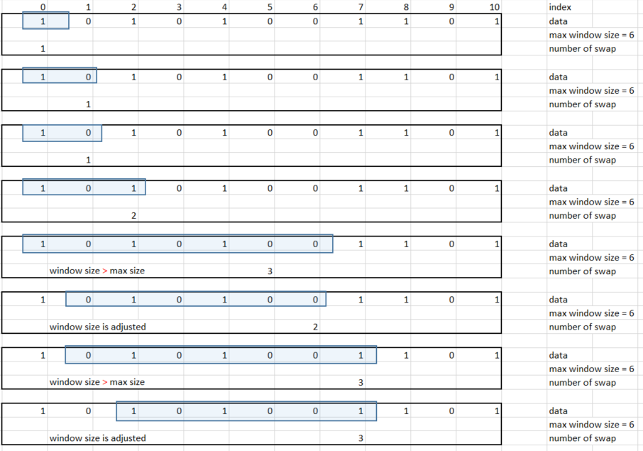

# Description
Given a binary array data, return the minimum number of swaps required to group all 1’s present in the array together in any place in the array.

Example:
```
Input: data = [1,0,1,0,1]
Output: 1
Explanation: There are 3 ways to group all 1's together:
[1,1,1,0,0] using 1 swap.
[0,1,1,1,0] using 2 swaps.
[0,0,1,1,1] using 1 swap.
The minimum is 1.
```

Example:
```
Input: data = [1,0,1,0,1,0,0,1,1,0,1]
Output: 3
Explanation: One possible solution that uses 3 swaps is [0,0,0,0,0,1,1,1,1,1,1].
```

# Solution 1: Brute Force - *Moving* windows
* count the number of `1` in array => the width of the window
* make all possible subarray of window's size.
* for each subarray, the number of swap is: `total number of 1 - number of 1 in the subarray`
* this approach uses "moving" windows as the constant size subArray are created from left to right if the original array.

## Algorithm:
* Outer for loop: construct the subarrays from the original data array.
* Inner for loop: search through the subarray to find the number of `1`
```
for (int i = 0; i <= data.size() - totalNumberOfOnes; i++){             // condition equal is needed. Test Case: 1 0 0 1 1 1
    int currNumberOfOnes=0;
    for (int j = i; j < i + totalNumberOfOnes; j++){                    // condition equal is NOT needed
        currNumberOfOnes += data[j];            // add up  if data[i] == 1
    }
    currNumberOfSwap = totalNumberOfOnes - currNumberOfOnes;
    minSwap = min(minSwap, currNumberOfSwap );
}
```
## Complexity:
* Because of the double for loop we have: O(N*M) as
- N: number of elements in data array
- M as number of `1`

# Solution 2: *Sliding* Windows - Two Pointers
* improve solution 1 by using Sliding Windows/Subarray:
- Windows has left and right boundary. This is why we call the method "two pointers"
- left and right started at index zero.
- right moves until exceeding the subarray size which is the total number of `1` in the original data array or the max width of the window, count the `currNumberOfOnes` at the same time.
- left moves once the subarray size exceed the max width of the window, update the `currNumberOfOne`

The following illustrate how slidingWindow are moved.

## Algorithm:
* Basic template for Sliding Windows methods:
```
Step1: Have a counter or hash-map to count specific array input and keep on increasing the window toward right using outer loop.
Step2: Have a while/for loop inside to increase/reduce the window side by sliding toward right. Movement will be based on constraints of problem. Go through few examples below
Step3: Store the current maximum window size or minimum window size or number of windows based on problem requirement.
```
* *Step 1*: Count the number of `1` in original data array.
* *Step 2*: Use only one for loop to create, move subarray and update `currNumberOfOnes`.
## Complexity:
* O(N) where N is the size of N original data array size since only one for loop is used.