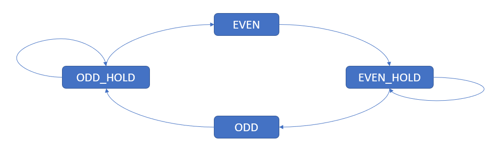
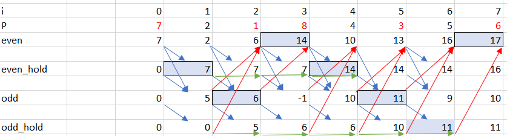

# Problem description
Given an array of `N<150000` size, each item with value `0<P<500`.
For each jump:
* even jump (jumpCounter = even) will add value equal to `P[i]` where `i` is the index in the array
* odd jump (jumpCounter = odd) will decrease equal to `P[i]` where `i` is the index in the array
* find the total value such that it goes maximum.
* there is no constrain on the number of jump, but its max is N.
Example: P = [7,2,1,8,4,3,5,6]
Make 8 jumps => total value = 7-2+1-8+4-3+5-6=-2
Make only 5 jumps => total value = 7-1+8-3+6=17    (note that the value of array[i] in odd jump should be selected to minize the creasing value)
Make only 3 jumps => total value = 7-1+8 = 16
Thus making 5 jump with value = 17 is the max achievable.

# Approach 1 - make Tabulation Table - Fail
* trying to make a tabulation table and update variables as looping from i to N
* apply if conditions to find best candidate to add or subtract from result.
  - analyse tabulation table for pattern and recognizable comparing conditions.
  - make state machine if possible.
* update bestValue as looping from i to N
## Data Structure
* make 4 states EVEN, EVEN_HOLD, ODD, ODD_HOLD using 4 equivalent variables. 

## Algoritm
* run for loop to update evey value of each state.
* from tabulation table, the optimum value is the max value that each state gets from previous valid states. 
* the final result is the max values of all 4 state, in each iteration cycle.

# Approach 2 - State Machine
*