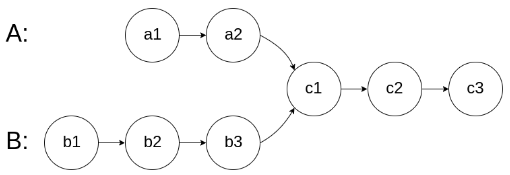
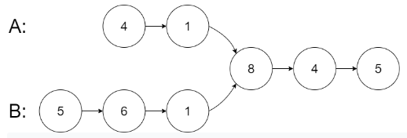
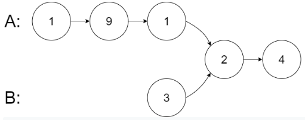
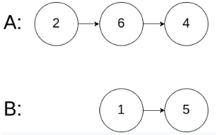
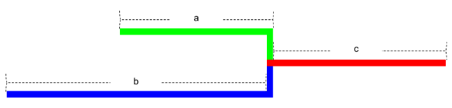
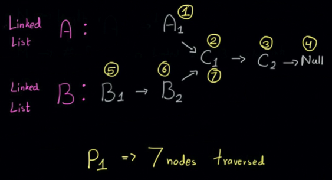
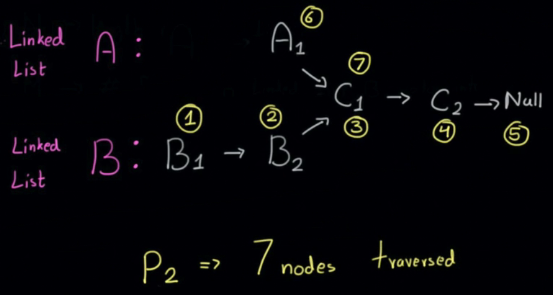

# Description:

Given the heads of two singly linked-lists headA and headB, return the node at which the two lists intersect. If the two linked lists have no intersection at all, return null.

For example, the following two linked lists begin to intersect at node c1: 


The test cases are generated such that there are no cycles anywhere in the entire linked structure.

**Note** that the linked lists must **retain their original structure** after the function returns.

**Custom Judge:**

The inputs to the **judge** are given as follows (your program is not given these inputs):

* intersectVal - The value of the node where the intersection occurs. This is 0 if there is no intersected node.
* listA - The first linked list.
* listB - The second linked list.
* skipA - The number of nodes to skip ahead in listA (starting from the head) to get to the intersected node.
* skipB - The number of nodes to skip ahead in listB (starting from the head) to get to the intersected node.

The judge will then create the linked structure based on these inputs and pass the two heads, headA and headB to your program. If you correctly return the intersected node, then your solution will be accepted.

* **Example 1:**


```
Input: intersectVal = 8, listA = [4,1,8,4,5], listB = [5,6,1,8,4,5], skipA = 2, skipB = 3
Output: Intersected at '8'
Explanation: The intersected node's value is 8 (note that this must not be 0 if the two lists intersect).
From the head of A, it reads as [4,1,8,4,5]. From the head of B, it reads as [5,6,1,8,4,5]. There are 2 nodes before the intersected node in A; There are 3 nodes before the intersected node in B.
```

* **Example 2:**

```
Input: intersectVal = 2, listA = [1,9,1,2,4], listB = [3,2,4], skipA = 3, skipB = 1
Output: Intersected at '2'
Explanation: The intersected node's value is 2 (note that this must not be 0 if the two lists intersect).
From the head of A, it reads as [1,9,1,2,4]. From the head of B, it reads as [3,2,4]. There are 3 nodes before the intersected node in A; There are 1 node before the intersected node in B.
```

* **Example 3:**

```
Input: intersectVal = 0, listA = [2,6,4], listB = [1,5], skipA = 3, skipB = 2
Output: No intersection
Explanation: From the head of A, it reads as [2,6,4]. From the head of B, it reads as [1,5]. Since the two lists do not intersect, intersectVal must be 0, while skipA and skipB can be arbitrary values.
Explanation: The two lists do not intersect, so return null.
```

**Constraints:**

```
The number of nodes of listA is in the m.
The number of nodes of listB is in the n.
1 <= m, n <= 3 * 104
1 <= Node.val <= 105
0 <= skipA < m
0 <= skipB < n
intersectVal is 0 if listA and listB do not intersect.
intersectVal == listA[skipA] == listB[skipB] if listA and listB intersect.
```

# Solution 1: Hashset
## Algorithm:
```
/**
 * Definition for singly-linked list.
 * struct ListNode {
 *     int val;
 *     ListNode *next;
 *     ListNode(int x) : val(x), next(NULL) {}
 * };
 */
class Solution {
public:
    ListNode *getIntersectionNode(ListNode *headA, ListNode *headB) {
        set<ListNode *> nodes_in_B;

        while (headB != nullptr) {
            nodes_in_B.insert(headB);
            headB = headB->next;
        }

        while (headA != nullptr) {
            // if we find the node pointed to by headA,
            // in our set containing nodes of B, then return the node
            if (nodes_in_B.find(headA) != nodes_in_B.end()) {
                return headA;
            }
            headA = headA->next;
        }

        return nullptr;
    }
};
```
## Complexity:
* Time complexity O(M+N)
    - time to search through linked list A and add to set O(M)
    - time to search through linked list B and check hashset if the node already occurs in linkedlist A: O (N)
* Space complexity O(M):
    - to create and store data to hashset, we need space = that o linked list A => O(M)

# Solution 2: 2 Pointers
* create 2 pointers:
    1. start condition: assigned to the start of linked list A and linked list B
    2. stop condition: and both pointers are equal, the intersection is found
    3. increment condition:
        - normal case: both pointers increment to next node in the linked list A and linked list B.
        - if a pointer hit null, reset it the head of *the other linked list.*
* Explaning why we reset the pointer to the head of the other linked list.
    - when a linked list is found, both pointers should traveled the same number of nodes:
        - consider the linked list A and linked list B below, where c is the shared part, aa is exclusive part of list A and bb is exclusive part of list B:
        
        - pointerA: starts at linked list B, and travel `b + c + a` nodes.
        - pointerB: starts at linked list A, and travel `a + c + a` nodes.
    - For example: the following show both P1, and P2 have traversed 7 nodes until meeting at the intersected node C1 , 

## Algorithm
```
class Solution {
    public:
    ListNode* getIntersectionNode(ListNode *headA, ListNode *headB) {
        ListNode *pointerA = headA;
        ListNode *pointerB = headB;

        while (pointerA != pointerB){
            if (pointerA == nullptr){
                pointerA = headB;
            }
            else{
                pointerA = pointerA->next;
            }
            if (pointerB == nullptr){
                pointerB = headA;
            }
            else{
                pointerB = pointerB->next;
            }
        }
        return pointerA;
    }
};
```
## Complexity