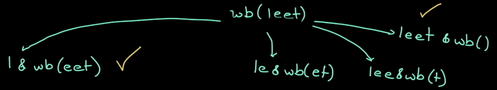
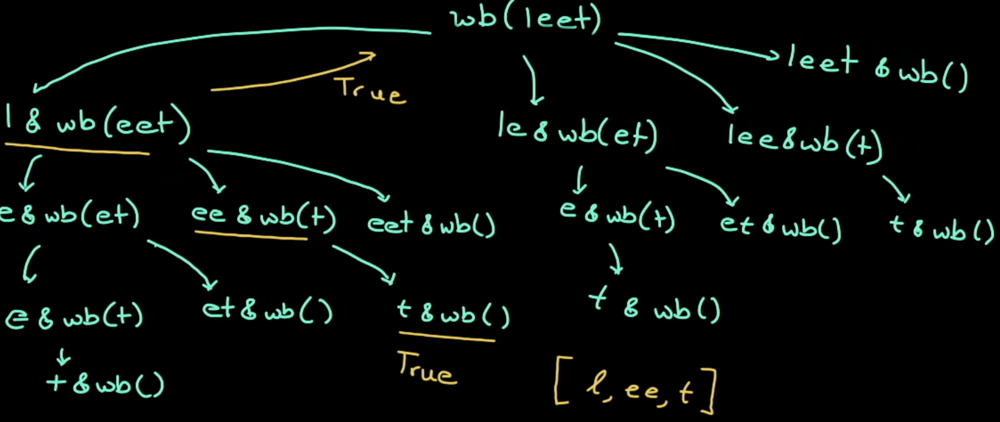
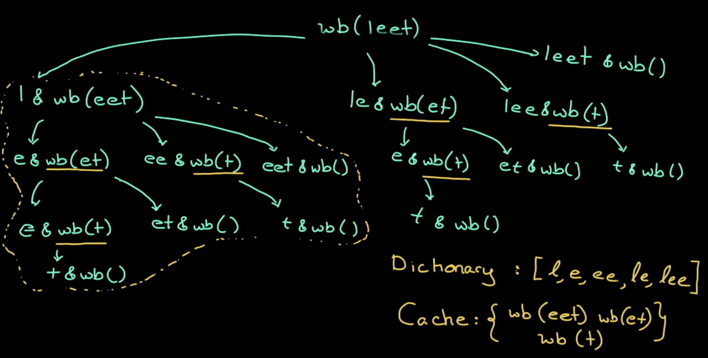

# Problem description
Given a string s and a dictionary of strings wordDict, return true if s can be segmented into a space-separated sequence of one or more dictionary words.

Note that the same word in the dictionary may be reused multiple times in the segmentation.
# Solution 1 - Brute Force
* How to break `string s` according to dictionary `wordDict`.
  - *Top Down Approach*: start from a complete `string s` to empty string, and compare with each item in wordDict.
  - *Bottom Up Approach*: start from empty string to a complete `string s`, and compare with each item in wordDict.
  - conditions required to be true: 
    1. left part of the `string s` is found in the `wordDict`
    2. right part of `string s` is also found in the `wordDict`
For example the word break up of `leet` is true if any othese branches are true: 
    3. Recursive calls are required
For example, the word break up of `leet` from a wordDict = [l,ee,t] would have the following recursive call:

## Data Structure 
## Algorithm
1. Run for loop over the string, reiterate over every character.
2. Step 1: Check first condition if left substring is found in `wordDict`
3. Step 2: Check second condition if right substring if found in `wordDict`
```
if (word_set.find(word) != word_set.end() &&   // Step 1:left substring of string s is searched in wordDict first
    wordBreakRecur(s, word_set, end)) {        // Step 2: when the first condition is true, the right substring is searched in wordDict    
    return true;
            }
```
this is the same as:
```
if (word_set.find(word) != word_set.end() {    // Step 1
  if(wordBreakRecur(s, word_set, end) ){       // Step 2
    return true;
  }
}   
```
Output of sample testcase: 
```
--wordBreakRecur-- stringIndex: 0
 --For loop Starts--
Substring to search in wordDict l
Substring to search in wordDict le
Substring to search in wordDict lee
Substring to search in wordDict leet
--wordBreakRecur-- stringIndex: 4
 --For loop Starts--
Substring to search in wordDict c
Substring to search in wordDict co
Substring to search in wordDict cod
Substring to search in wordDict code
--wordBreakRecur-- stringIndex: 8
```
## Complexity:
For worst case senarios, every branch is visited.

# Solution 2 - DP with memoization
* source: LeetCode solution.
* from Solution 1, we optimize the problem by caching some values ==> pruning the tree.
For example, `string s = "leetcode"` and `wordDict=[l,e,ee,le,lee]` we can cache the following values: `wb(eet), wb(et), wb(t)` 
## Data Structure 
* use `vector<int>cache(s.length, -1) to store value, where 1=true, 0=false, -1= not yet saved
## Algorithm
1. Step 1: search cache for saved values
2. Step 2: make recursive call to populate the decision tree. 
3. Step 2.1: Check first condition if left substring is found in wordDict
4. Step 2.2: Check second condition if right substring if found in wordDict

The following are outputs for `string s = "leet"` and `wordDict=["l", "e", "ee", "le", "lee"]".
*Note*: the saved cache was for `e`, `et`, `eet`  or (the right substrings)
```
---wordBreakRecur--- stringIndex: 0
 --For loop Starts--
---wordBreakRecur--- stringIndex: 1
 --For loop Starts--
---wordBreakRecur--- stringIndex: 2
 --For loop Starts--
---wordBreakRecur--- stringIndex: 3
 --For loop Starts--
save cache t false                      =====> save cache 
save cache et false                     =====> save cache 
---wordBreakRecur--- stringIndex: 3
return cache
save cache eet false                    =====> save cache 
---wordBreakRecur--- stringIndex: 2
return cache
---wordBreakRecur--- stringIndex: 3
return cache
save cache leet false

```
## Complexity:
