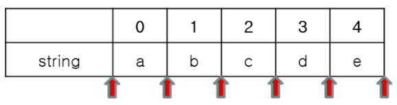
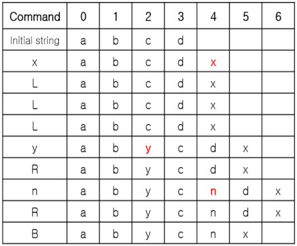
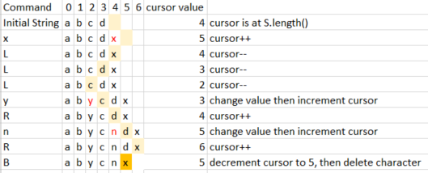
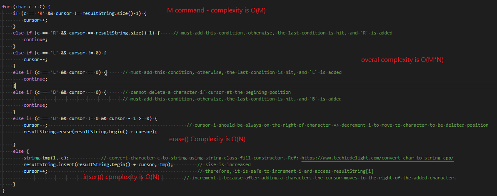

# Description

A string is given. A cursor inital position is at the right most position of the string.

Possible currsor position are:
- to the left of the first character
- to the right of the last character
- between the characters.
- if character lenghth are L, then there are L+1 position.



A `string command` is defined as:
- `L` will shift the cursor to the left by 1 step.
- `R` will shift the cursor to the right by 1 step.
- any lower character will add the character to the left of the cursor, and reposition the cursor to the right of the added character.
- `B` will remove the character to the left of the cursor.

For example: a string `abcd` is given. A command `xLLLyRnRB` is typed. The output string is `abycnx`. The following image illustrated step by step change 

* **Input**
- 1st line: enter the initial string S
- 2nd line: enter the command string C
* **Output**
- output the resulting string

# Solution 1: BruteFoce

Simulate the process, stepSS by step, by using:
- create `vector<string> resultString` to keep track of both position of cursor and characters.
  * the length of cursor should be: `(length of initial string S+1)`
  ```
  resultString.resize(S.length() + 1                    // S.length()+1 stores S string and last cursor
  ```
    For example: if `S = abcd, C = xxx, then resultString = abcdxxx_` where `_` is a cursor position. From the `vector resultString` final result can be extracted.

  * the elements in the `vector resultString` should be initialized with `characters from string S` and a `space` for the cursor at the end.
- create the resulting string by manipulating `vector resultString` with `[] operator`.
- Overal complexity is O(n) but n could be very large and lead to time limit.
## Algorithm
* use for loop for every character in string command C
* change the initial string according to requirements.
* the position of cursor could be incremented/decremented accordingly.

For example: 

## Complexity Analysis
- To input the `vector resultString` intiallly, needs O(M+1) time and space
- To process the command string => needs O(M) where M is the length of command string C.
- To process/edit the initial string such as `insert` or `erase` => needs O(N) where N is the length of initial string S.
=> overal complexity is O (M*N)

For example: 

# Solution 2: Use 2 stacks to optimize the time performance
* `1st stack` is initialized with initial string
* `2nd stack` is empty
* processing the command string C:
  - if `L` pop the `1st stack` and move to top character to `2nd stack`.
  - if cursor is at the left most position => `1st stack` must be empty => skip.
  - if `R` pop the `2nd stack` and move to top character to `1st stack`.
  - if cursor is at the right most position => `2nd stack` must be empty=> skip.
  - if `B` pop the `2nd stack`.
  - if insert character, push_back character to `1st stack`.
* ending result is by adding stack 2 to top of stack 1.
