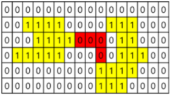
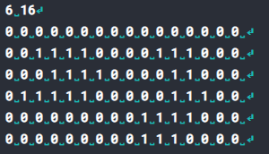

# Problem description
Find a shortest path to connect the 2 regions highlighted in a 2D array 
The problem will have to accept input to an array `50x50`, whose each item is marked `0` or `1` 
* Input Format:
  - In the first line, accept vertical size of array N, and horizontal size M. `1<M,N<50`
  - next lines, populate maps with 0, 1 
* Output Format: 
  - output the minimum number needed to connect the 2 regions.
# Solution 1 with map (Time Limitted Reach)
* accept input(1,1) for each item in `inputArray[50][50]`
* mark region A by searching item in `inputArray` 
  - if `inputArray[a][b]==1` set `inputArray[a][b] = 2`
  - search neighbor of `inputArray[a][b]`, if neighbor ==1 , set neighbor = 2 
* region B are remaining item that has value 1.
* for each item in regionA, push to traversingQueue, run BFS to find path to regionB.
## Data Structure
* `InputArray[50][50]` 
* `queue<Point>traversingQueue`
* `queue<Point>regionA
* `struct Point`
## Algorithm
* run Floodfil algorithm to fill regionA.
* run BFS search to find shortest path to region B, node = 1
1. ~~Step 1: Make adjacent List of all nodes.~~  Dont need because we can get the list easily by calculating coordinates of the node
2. Step 2: Make a queue `traversingQueue` to process traversing.
3. Step 3.1: Add the starting node (first node in regionA) to `traversingQueue`.
4. Step 3.2: Add neighboring vertices to `traversing queue`: those could be node with value `0` or node with value `1`
5. Step 3.3: increment counting if: 
   - adjacent of a node in regionA is 0. 
   - until meet a node in regionB
   - couting should be done by marking the value of node `0`: 
```
if (inputArray[adjNode.x][adjNode.y] == 1){
    return inputArray[currentNode.x][currentNode.y]-2;
    // return counter;
}
if (inputArray[adjNode.x][adjNode.y] == 0){
    traversingQueue.push(adjNode);
    inputArray[adjNode.x][adjNode.y] = inputArray[currentNode.x][currentNode.y]+1;
    // counter++;
}
```
## Complexity Analysis