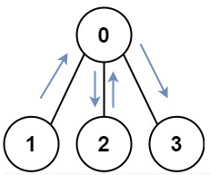

# Description:

You have an undirected, connected graph of `n` nodes labeled from `0` to `n - 1`. You are given an array graph where `graph[i]` is a list of all the nodes connected with node i by an edge.

Return the length of the shortest path that visits every node. You may start and stop at any node, you may revisit nodes multiple times, and you may reuse edges.

## Example 1:

```
Input: graph = [[1,2,3],[0],[0],[0]]
Output: 4
Explanation: One possible path is [1,0,2,0,3]
```

## Example 2:
```
Input: graph = [[1],[0,2,4],[1,3,4],[2],[1,2]]
Output: 4
Explanation: One possible path is [0,1,4,2,3]
``` 

## Constraints:
```
n == graph.length
1 <= n <= 12
0 <= graph[i].length < n
graph[i] does not contain i.
If graph[a] contains b, then graph[b] contains a.
The input graph is always connected.
```

# Solution 1: BFS by level
## Problem Analysis:
* The path, starting from different nodes, will have different length. 
    * Thus multiple BFS/DFS run for different nodes result in a shortest via the starting node only. The final answer is the shortest of all. 
* There is no disconnected node, as implicitly stated in the problem description.
* The path can revisit a node, reuse an edge many times. Is there a way to prevent infinitive loop? 
    * Observe that the node is could be reached from different nodes. For example: the following show the paths 0->1->0->2->0->3->0 
    * Even if the node is reached from the same nodes, the path must have been different. For example, the following show the paths 0->1->0->2->3->2->0->4 
* Special case: `graph.size()==1` then `ans = 0`. 
* BFS guarantees that starting from each node, if we run BFS, the resulting path will be the shortest path.
## ALgorithm:
* Run BFS for each node, to find the shortest path that start from the node. Then get the minimum result. In addition, return 0 if `graph.size()==0`
  ```
  int result = INT_MAX;
        int n = graph.size();
        
        if (graph.size()==1)
            return 0;
        for (int node = 0; node<n; node++){
            // cout<<"startingNode "<<node<<endl;
            int pathLength = bfs(graph, node);
            result = min(pathLength, result);
        }
        return result;
  ```
* For each BFS: 
    * *Construct graph*
        * Current Node: is `pair<int,int>` where first = nodeId, second = mask
            * Mask: bitmask which length = number of nodes. Value `1` at the position `x` indicates the `nodeId=x` has been visited. 
                * The position `x` is acquired by `1<<nodeId`
            * distinguish the path of the nodes by `visited[node][mask]`. 
            * For example: 
                * If the path just start from `0`, `numberOfNodes=5`, `visited[0][000001]=true`;
                * If the path is `0->1`, `numberOfNodes=5`, `visited[1][000011]=true`;
                * If the path is `0->1->2`, `numberOfNodes=5`, `visited[2][000111]=true`;
                * If the path is `0->1->2->1`, `numberOfNodes=5`, `visited[1][000111]=true`; In this case, the path goes back to `1`, but it is still allowable as visited[1][000111] was not set to true before
                * If the path is `0->1->2->1-3`, `numberOfNodes=5`, `visited[3][001111]=true`; 
                * The path `0->1->2->1->2` is clearly rejected because `visited[2][000111]=true` was set to true before.
        * Neighbor nodes are directly queried from `graph` where `row = currentNode`, and `int nextNodeId = graph[row][i]`
    * Run level ordered traversal:
        * path length is incremented after all the nodes at the same levels have been pushed to and poped out from queue. 
        ```
        int length = 0;
        while (!bfsQueue.empty()){
            int n = bfsQueue.size();
            for (int i = 0; i<n; i++){                      // level ordered traversal, length is incremented after nodes on the same level have been processed.
                pair<int, int> curr = bfsQueue.front();
                bfsQueue.pop();
                // mark curr node as visited
                // process neighbor nodes, 
                for ( int i = 0; i < graph[nodeId].size(); i++){
                    // return length when all nodes are visited
                    // otherwise, add nodes to bfsQueue.
                }
            }
            length++;       // increment length after all nodes at the same level have been popped out
        }
        ```
## Complexity: 