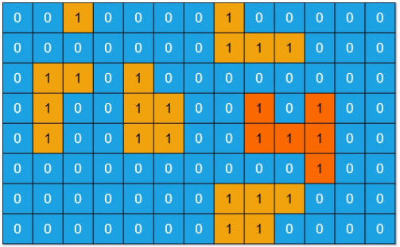

# Description:
You are given an m x n binary matrix grid. An island is a group of 1's (representing land) connected 4-directionally (horizontal or vertical.)

You may assume all four edges of the grid are surrounded by water.

The area of an island is the number of cells with a value 1 in the island.

Return the **maximum** area of an island in grid. If there is no island, return 0.

* **Example 1:** 
```
Input: grid = [[0,0,1,0,0,0,0,1,0,0,0,0,0],[0,0,0,0,0,0,0,1,1,1,0,0,0],[0,1,1,0,1,0,0,0,0,0,0,0,0],[0,1,0,0,1,1,0,0,1,0,1,0,0],[0,1,0,0,1,1,0,0,1,1,1,0,0],[0,0,0,0,0,0,0,0,0,0,1,0,0],[0,0,0,0,0,0,0,1,1,1,0,0,0],[0,0,0,0,0,0,0,1,1,0,0,0,0]]
Output: 6
Explanation: The answer is not 11, because the island must be connected 4-directionally.
```

* **Example 2:**
```
Input: grid = [[0,0,0,0,0,0,0,0]]
Output: 0
```

# Solution 1: BFS - Queue - No recursive call
* use BFS to find the area of an island.
    * BFS stack process a `grid[x][y]` and its neighbors until the stack is empty.
    * each time the stack pops (a grid node is processed), the area is incremented.
    * when the stack is empty, the area of the whole island is found and compared with max value
## Algorithm
## Complexity