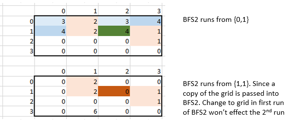
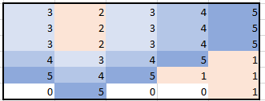

# Description: 
You are given an n x n binary matrix grid where 1 represents land and 0 represents water.

An island is a 4-directionally connected group of 1's not connected to any other 1's. There are exactly two islands in grid.

You may change 0's to 1's to connect the two islands to form one island.

Return the smallest number of 0's you must flip to connect the two islands.

* **Example 1:**
```
Input: grid = [[0,1],[1,0]]
Output: 1
```

* **Example 2:**
```
Input: grid = [[0,1,0],[0,0,0],[0,0,1]]
Output: 2
```

* **Example 3:**
```
Input: grid = [[1,1,1,1,1],[1,0,0,0,1],[1,0,1,0,1],[1,0,0,0,1],[1,1,1,1,1]]
Output: 1
``` 

* **Constraints:**
```
n == grid.length == grid[i].length
2 <= n <= 100
grid[i][j] is either 0 or 1.
There are exactly two islands in grid.
```

# Solution 1:
* Note: this problem is the same as the problem `BFS_UnmannedTrain`
* Run BFS1 to find the first island and mark all of its cell as '2'
* Run BFS2 to find the shortest path from each cell is the first island, marked `2` now, to the second island, marked `1`
  * start from any cell in the first island. 
  * add to `bfsQueue2` neighbor cell where neighborCell is not out-of-bound or is `0`.
  * mark the neighbor cell as visited and mark distance: `grid[neighborCell] = 1+ grid[currentCell]`
  * return distance if a `neighbor cell = 1`
  * return 0 if `bfsQueue2` is empty. 
  * the shortest distance among *all the shortest distance from every cell in first island to the second island* is the result. 

* Note: 
    * since BFS2 needs to be ran multiple time. 
    * and a cell could be a neighbor to multiple cells, it would be marked visited on a path by a previous cell. The path may not be the shortest path. 
    * Example: The following show that `cell [1,3]` is skipped becuase it was marked visited the running BFS2 from `cell [0,1]` 
    * actions must be taken to prevent a cell on a valid shortest path be skipped in later BFS2 run. 
      * *Solution 1*: use pass by value in BFS2 so that change on grid is not returned after each BFS2 run ==> cause memory limit exceeded. 
        * Example: 

      * *Solution 2*: when running BFS1, add every cell of the first island to bfsQueue2 so that BFS2 could be ran from there ==> better implementation of BFS.  
        * Example: The following shows the result of BFS2, marking all cells from first island to second island, near to far 
## Complexity: 
* O(n + edge) where n = number of cells = grid.size(), edge = ????