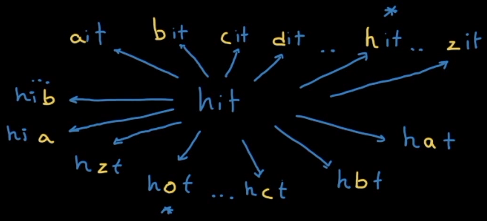

# Description:

A transformation sequence from word beginWord to word endWord using a dictionary wordList is a sequence of words `beginWord -> s1 -> s2 -> ... -> sk` such that:
* Every adjacent pair of words differs by a single letter.
* Every `si` for `1 <= i <= k` is in wordList. Note that beginWord does not need to be in wordList.
sk == endWord

Given two words, `beginWord` and `endWord`, and a dictionary `wordList`, return the number of words in the shortest transformation sequence from `beginWord` to `endWord`, or `0` if no such sequence exists.

 

## Example 1:
```
Input: beginWord = "hit", endWord = "cog", wordList = ["hot","dot","dog","lot","log","cog"]
Output: 5
Explanation: One shortest transformation sequence is "hit" -> "hot" -> "dot" -> "dog" -> cog", which is 5 words long.
```

## Example 2:
```
Input: beginWord = "hit", endWord = "cog", wordList = ["hot","dot","dog","lot","log"]
Output: 0
Explanation: The endWord "cog" is not in wordList, therefore there is no valid transformation sequence.
```

# Solution 1: BFS + UnorderedSet
## Problem Analysis:
* Special cases:
    * Return `0` immediately if endWord is not in `wordList`. 
    * Return `0` when the transformation from `beginWord` is not found anywhere in `wordList`.
    * `Count = 0` if beginWord is already in wordList. In other word: beginWord should not transform into itself. 
* Brute Force approach:
    * Begin with *any* character of beginWord and change a character, if the `nextWord` is in `wordList`, `nextWord` is a valid transformation, `count++`.
    * Count++ increments for every *same-level* transformation. 
        * For example: `beginWord = hit; wordList="hot","dot","dog","lot","log","cog"` count=1 for the following transformation: hot
        * `beginWord = hit; wordList="hot","dot","dog","lot","log","cog"` count=2 for the following transformation: `dot, dog, lot, log`
        * `beginWord = hit; wordList="hot","dot","dog","lot","log","cog"` , if 3nd transformation is `dot`, count=3 for the following transformation: ` dog, lot, log`

    * Searching and comparing transformation to wordList in array would take O(n) where n is the size of worldList
    * The transformation could be at any character, not just the first characters. 
    * Creating all the transformation without limit, without skipping for words not in wordList, would take `O(24*n*n)` where n = length of `beginWord` 
        * Overal complexity is `O((M^2)*N)` where M: length of `beginWord`, N: size of `wordList`
* Improvement from BFS:
    * put the wordList into set => searching complexity os O(logN)
    * put valid characters for transformation to a set => don't have to generate invalid transformations.
    * using BFS to find shortest path
## Algorithm
1. create a list of set of wordList for *faster find()/count()*, saved as `wordSet`
2. create a list of valid characters to be used in transformation, saved in `possibleTransform`
3. run BFS and perform "level-order-counting": increment count at each level. Save the bfsQueue.size() to for loop's limit. Process all the next transformation of current string until for loop reach limit
```
int count = 1;
bfsQueue.push(beginWord);
while(!bfsQueue.empty())
{
    
    int n = bfsQueue.size();
    
    for (int i = 0; i <n; i++){
        string curr = bfsQueue.front();
        bfsQueue.pop();
        // process transformation, return count if ending condition hit.
    }
    count++
}
```
4. *construct graph*:
   * current node: string, front word of bfsQueue. 
   * neighbor: 
       * Use only the character from valid `possibleTransform`, replace the character at any position of current word.
        ```
        for (int position = 0; position<beginWord.length(); position++){
            string next = curr;
            for (auto character: possibleTransform){            // limit possible transformation to list of valid characters    
                next[position] = character;
                // other logic
            }
        ```
       * If the resulting transformation is found in `wordSet`
           * push to bfsQueue.
           * mark visited by removing the word from `wordSet`
       * return count+1 if `next == endingWord`
           * count+1 because at that level, count has not incremented.
       * if there is not possible transformation path that result in endingWord the `bfsQueue` will be empty. Return 0
## Complexity analysis:
* Transformation is O(N*N) where M is length of wordBegin. Note that the size of `possibleTransform` is also N.
* Search logic to find valid transformation from wordSet is O(logN) where N is the size of wordSet
* Thus final complexity is O(N^2 + logN)


