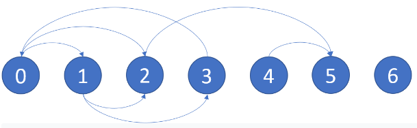
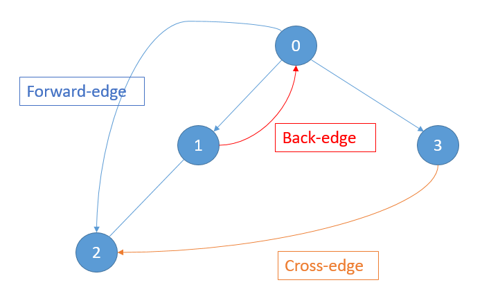

# Description:
There is a directed graph of n nodes with each node labeled from 0 to n - 1. The graph is represented by a 0-indexed 2D integer array graph where graph[i] is an integer array of nodes adjacent to node i, meaning there is an edge from node i to each node in graph[i].

A node is a terminal node if there are no outgoing edges. A node is a safe node if every possible path starting from that node leads to a terminal node.

Return an array containing all the safe nodes of the graph. The answer should be sorted in ascending order.

* **Example 1:**

```
Illustration of graph
Input: graph = [[1,2],[2,3],[5],[0],[5],[],[]]
Output: [2,4,5,6]
Explanation: The given graph is shown above.
Nodes 5 and 6 are terminal nodes as there are no outgoing edges from either of them.
Every path starting at nodes 2, 4, 5, and 6 all lead to either node 5 or 6.
Nodes 0 is not safe because one of the paths, 0->1->2->0, is a cycle. The path 0->2->5 is not.
Nodes 1 is not safe because one of the paths, 1->2->0->1, is a cycle. The path 1->2->5 is not.
```
* **Example 2:**
```
Input: graph = [[1,2,3,4],[1,2],[3,4],[0,4],[]]
Output: [4]
Explanation:
Only node 4 is a terminal node, and every path starting at node 4 leads to node 4.
```

* **Constraints:**
```
n == graph.length
1 <= n <= 104
0 <= graph[i].length <= n
0 <= graph[i][j] <= n - 1
graph[i] is sorted in a strictly increasing order.
The graph may contain self-loops.
The number of edges in the graph will be in the range [1, 4 * 10^4].
```

# Solution:DFS
## Analysis requirements:
* disjoined networks: every nodes in graphs is connected, but some are disjoined networks.
    * each DFS will traverse all nodes in a disjoined networks, and mark the nodes visited. Multiple DFS runs are required to traverse all` disjoined networks`.
* graphs contains self-loops.
    * must mark the nodes as visited in DFS, don't traverse back
    * a DFS finishes when stack is empty, and all nodes in a disjoined network is visited.
    * if a node has a path that traverse back to itself => not a safe nodes.
    * not every node in the same disjoined network is a safe node. For example, in the below diagrams, nodes `0,1,2,3,4` are in the same disjoined network; Only node `3,4` are safe nodes. 
* Special cases:
    1. every terminal node is included in the answers.
    2. a node can be visited twice and is still a safe node. For example: 
    3. if a node reaches an `unsafe node`, it is also unsafe ; in other words: `all parent nodes` of `unsafe nodes` are `unsafe`.
    4. child of `unsafe node` could be `safe node`.
    5. if a node is (directly or indirectly) connected to a `safe node`, *and there is no `back edge` found after*, it is a safe node.
        * a DFS has to run from a starting node to its child node and check if any branch has a `back edge`. If no back-edge is found, the starting node is a `safe node`
    For example, the following demonstrate safe and unsafe nodes 
## Algorithm:
* **Brute-Force DFS**:
    * for every nodes, run DFS check if every outward paths will lead to terminals

* **Detect cycle in directed graph** using *BLACK_WHITE_GRAY DFS*
    * definition: forward edge, back edge, cross-edge 
    * mark color on the edges:
        * white: node not yet visited
        * gray: nodes still in processed by DFS. Its child nodes are not yet processed.
        * black: All of its child nodes are processed. The nodes can be in the middle connection or at the end.
    * On this problem:
        * unvisted nodes are `white` and pushed to stack. After pop out from stack, the node is marked `gray`.
        1. if next node is a terminal node: mark as `black`.
        2. all DIRECT parents nodes connected to terminal nodes via `forward nodes` or `cross-over nodes` are then marked as `black` (`safe`)
        3. if a `gray` node is connected to a another `gray` node, there is a `back edge`, and all of its parents node mar mark `unsafe` ==> all of its parents are set as `unsafe`

        The following illustrate how all nodes are marked after DFS starts from node zero.  
* **Implementation**
    * every DFS will mark children nodes of a currentNodes are `1` or `2`
    * mark `2`
        1. if a node is the terminal
        2. if a starting node is connected to the terminal and has no `back-edge`
        3. if a node connects to a `marked 2` node because of (5) in analysis above.
    * mark `1`
        1. if a node is "In progress"
        2. if a node is connected to `marked 1` node (back-edge is found)