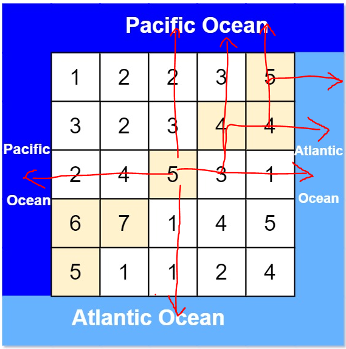

# Description:

There is an m x n rectangular island that borders both the Pacific Ocean and Atlantic Ocean. The Pacific Ocean touches the island's left and top edges, and the Atlantic Ocean touches the island's right and bottom edges.

The island is partitioned into a grid of square cells. You are given an `m x n` integer matrix heights where `heights[r][c]` represents the height above sea level of the cell at coordinate `(r, c)`.

The island receives a lot of rain, and the rain water can flow to neighboring cells directly north, south, east, and west if the neighboring cell's height is less than or equal to the current cell's height. Water can flow from any cell adjacent to an ocean into the ocean.

Return a 2D list of grid coordinates result where `result[i] = [ri, ci]` denotes that rain water can flow from `cell (ri, ci)` to both the Pacific and Atlantic oceans.

* **Example 1**:
The following `5x5` array illustrate an island. The yellow grids illustrate the cells where water can flow to both oceans


```
Input: heights = [[1,2,2,3,5],[3,2,3,4,4],[2,4,5,3,1],[6,7,1,4,5],[5,1,1,2,4]]
Output: [[0,4],[1,3],[1,4],[2,2],[3,0],[3,1],[4,0]]
```

# Solution:
* consider the following scenarios:
    1. if cell at corner, it already touches both oceans, it must be in the answer.
    2. the questions ask for "complete path", all cells that can be on the path flow to oceans.
        *  a single DFS can returns uncomplete path. For example, the following show a possible return where `cell[1][3]`, `cell[1][4]` and `cell[2][2]` are skipped 
    3. there are NO diagonal paths.
        * Note: in the below diagram, water from `cell[2][2]` can flow to both oceans via any paths such as: 