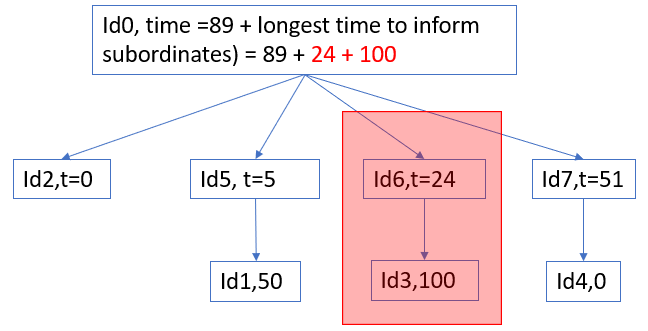
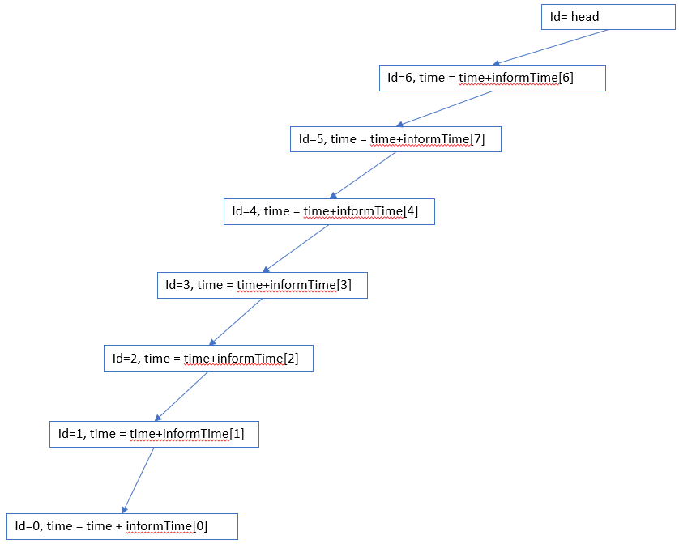
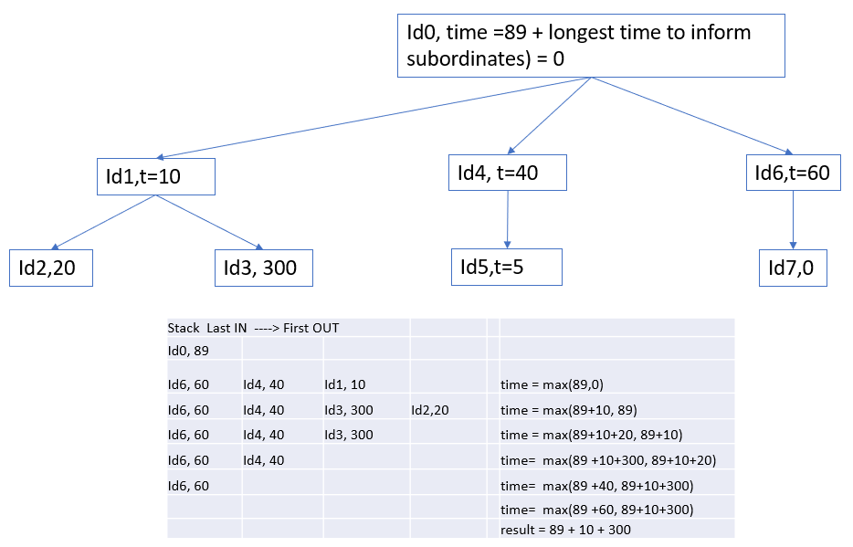

# Description:

# Solution: DFS with stack:

# Solution: DFS with recursive
* suppose a head leader has n-1 subordinates, then:
  * message is sent out to all subordinate at the same time.
  * each subordinate takes a certain time to process the message.
  * the time for leader would be the max time of all subordinates.
  * Example 1: For the below scenarios, 51 is the longest time for a subordinate to process the message. Thus the total time for the head is `89+51` 
  * Example 2: For the below scenarios, although the subordinate Id6 takes only 24s, his subordinate takes much longer time, the total time for the head to send the message is `89+21=4+100` 
* we need DFS to go as deep as possible for each branch. At the top, we choose the maximum time.
# Algorithm: Recursive
1. call recursive to process the employee tree from top (head) to subordinates (bottom)
    * the recursive ends when every employee is visited. (revisit may occur).
    * the time is accumulated as the DFS traverses further down the tree. 
2. calculate time:
  * The following illustrates how the time is calculated as each `employee` and his `informTime[employee]` is processed from the stack. 
  * `time[leader] = max(time[leader]+ time[subordinate1],time[leader]+ time[subordinate2], ...)`
  * The following illustrates how time is calculated in returned from recursive call of DFS. 
      * informTime[headId] is passed into initial DFS call, and time is calculated
      ```
      Step 1: time is calculated when DFS is called;
      time = max (time, subordinate_time);
      ```
      * to run DFS, we process the subordinates of the head. accumulated time that a message is passed from the head to the subordinate, `suborinated_time`, is calculated:
      ```
      // Step 2:
      subordinate_time += informTime[subordinate];
      ```
      * then a DFS is called to process subordinates of the subordinates.
      * when the DFS returns, accumulated time that a message is passed from the head to the subordinate is subtracted from `inform[subordinate]` so that the time could add the next subordinates without adding the current subordinate.
      ```
      // Step 3:
      subordinate_time += informTime[subordinate];
      ```
3. pruning with cache: NOT APPLICABLE as there is no case that a person is a subordinate of 2 leaders. Thus no branch is revisited.
4. **optimize with hash:** in order to find the subordinate and run the next dfs faster, a hash set is created.
   * hash has key = leaderID, and list = list of subordinates
   * how does this hash set help: it eliminates unnessary searching for subordinates of a leader on the input array `manager`

