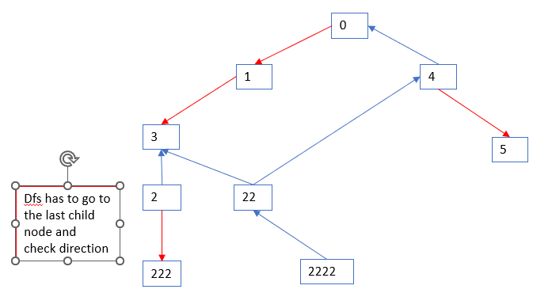

# Description: 

There are n cities numbered from 0 to n - 1 and n - 1 roads such that there is only one way to travel between two different cities (this network form a tree). Last year, The ministry of transport decided to orient the roads in one direction because they are too narrow.

Roads are represented by connections where connections[i] = [ai, bi] represents a road from city ai to city bi.

This year, there will be a big event in the capital (city 0), and many people want to travel to this city.

Your task consists of reorienting some roads such that each city can visit the city 0. Return the minimum number of edges changed.

It's guaranteed that each city can reach city 0 after reorder.

* **Example 1:**
    
```
Input: n = 6, connections = [[0,1],[1,3],[2,3],[4,0],[4,5]]
Output: 3
Explanation: Change the direction of edges show in red such that each node can reach the node 0 (capital).
```

* **Example 2:**
  
```
Input: n = 5, connections = [[1,0],[1,2],[3,2],[3,4]]
Output: 2
Explanation: Change the direction of edges show in red such that each node can reach the node 0 (capital).
```

* **Example 3:**
```
Input: n = 3, connections = [[1,0],[2,0]]
Output: 0
``` 

* **Constraints:**
```
2 <= n <= 5 * 104
connections.length == n - 1
connections[i].length == 2
0 <= ai, bi <= n - 1
ai != bi
Accepted
56,042
Submissions
91,560
```

# Solution: 
## Problem Analysis:
* Special cases:
  * If there is only city `0`: the ans is 0.
  * A city could be connected to 2 different cities => DFS run could re-visit a city. 
    * The number of paths that could be reordered at that city is the same
  * There is NO disconnected city.
## Algorithm:

DFS is suitable because it runs deeper to lowest child in each branch first, and allowed to save cache (number of paths that could be reordered) at every node. 

Recursive is suitable to allow backtracking to parent nodes and add up the counting of reordered path from lower child nodes.

1. run a single DFS from `city0` (top) to traverse down each branch, add up total `count` when the direction is downward but not upward
    * start: top, from `city0`
    * stop: when every city is visited. For each branch, the DFS has to go to the last child node.   
    * neighbors process: *how to find neighbor and knows the directions*
      * assume bi-direction graph, add both neighboring cities to 2D vectors "neighborList" to easily find the adjacent cities. 
        * row: city, col: vector of neighboring cities.
          * create a struct `cityProp` to store city name and mark it as `destination` or `source`. 
          ```
          struct cityProp{
            int city;                                   // cityName
            int type;                                   // source or destination
          };
          ```
        * Example: 
        ```
        connections = [[0,1],[1,3],[2,3],[4,0],[4,5]]
        cityMap =
        row 0: {city1}    where city1 = {1,0}   city 1 is a source
        row 1: {city3}
        row 2: {city3}
        row 4: {city0}
        row 5: {city5}
        ```
    * recursive DFS run:
      * base case: 
        * if there is no neighbor: `return count=0` (number of re-order path) 
      * *attempted pruning/memoization*: a city could be connected to 2 cities. Therefore a branch could be repeated. Thus cache[city] saves the `count` for the branch starting from that city downward. 
      * Example: 
      
      ```
      10 
      [[0,2],[2,3],[4,3],[5,3],[4,6],[5,7],[9,5],[8,0],[8,9]]
```
        * NOTE: HOWEVER, the code implementation never needs to use this case as the recursive will run to neighbor on "cross-over edge" 
      * normal case: process the neighbors. For every city in a row of `cityMap` (neighbors of city marked by row Id), check the direction. 
        * if the neighbor city is not a `source` (and a city is not yet visited), increment `count += 1 + dfs(neighborCity)`  (count of reorder path of "parents city  is increment of the count of reporder paths of "child cities")
        * if the neighbor city is a `destination` (and a city is not yet visited), just increment `count += dfs(neighborCity)