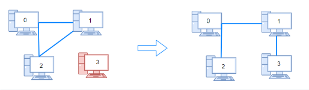
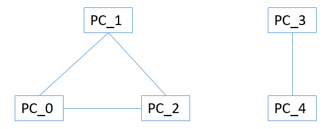

# Explanation:
There are n computers numbered from `0` to` n - 1` connected by ethernet cables connections forming a network where `connections[i] = [ai, bi]` represents a connection between computers `ai` and `bi`. Any computer can reach any other computer directly or indirectly through the network.

You are given an initial computer network connections. You can extract certain cables between two directly connected computers, and place them between any pair of disconnected computers to make them directly connected.

Return the minimum number of times you need to do this in order to make all the computers connected. If it is not possible, return `-1`.

* **Example 1:**


```
Input: n = 4, connections = [[0,1],[0,2],[1,2]]
Output: 1
Explanation: Remove cable between computer 1 and 2 and place between computers 1 and 3.
```

# Approach 1: DFS and Use for loop to recount disconnected PC _ WRONG
* this problem is similar to Room and Key  #Tag: connected-componenent
* number of connections = connections.size();
* total PC = n
* if connection < totalPC-1 => return -1
*   1. run DFS to mark connected PC
        * use unordered_map to mark `neighborPCs`;                    ======> BUG
        * BUG explanation: this approach fails to check `disjoined network`
        * For example, the following network is disconnected, but a single DFS run will mark 2 PC as disconnected. 
*   2. count number of disconnected PC from visited[]                ======> BUG
*   3. min number of operations = number of disconnected PC.         ======> BUG
        * BUG: as similar to the diagram above, multiple DFS runs would mark all PCs as `connected`. Therefore, the count will not work.
* Fix: (Approach 2)
    1. Run multple DFS to mark `connected PC` in for loop for every PC
    2. each time a DFS stops, a `disjoined network` is returned. Increment counter.
    3. the total operation needed is count - 1

# Approach 2: DFS to count disjoined network
* Special cases analysis:
    1. disconnectedPC: PC that are not connected to networks.
    2. disjoined network: included connected PCs, but that PCs are not connected to other networks. The case with disjoined network is to be implemented in this approach.
* total PC = n
* if connection < totalPC-1 => return -1
*   1. for each UNCONNECTED, computer, run dfs from each computer (the first PC is connected but marked not connected at first to start first DFS)
*   2. after a DFS finishes, increment count `disjoined network`
        * if loop continues => there are still  `disjoined network` and possibly `disconnectedPC`
        * if loop finishes => no more `disjoined network`
*   3. min number of operations = count - 1

# Approach 3: Union Find.
