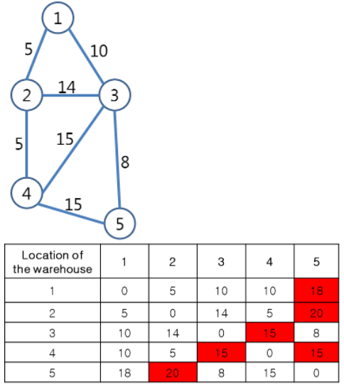
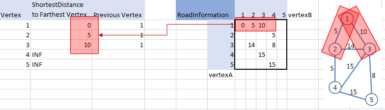
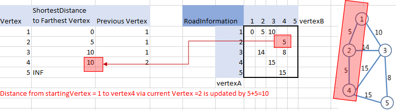

# Description

You plan to build a warehouse in one of the N factories that product products to manage the products. The closer the factory is to the warehouse, the better, because the products must be moved quickly to the warehouse.

You are going to build a warehouse in a place where the distance between the warehouse and its *farthest* factory is as close as possible.

The factories are number from 1 to N (0<=5<=100).

The number of road information (distance between the factories) are M ( 5<=M<=N*(N-1)/2)

For example, the road information is as shown as below:



The table indicates the distance from a warehouse {1,2,3,4,5} to a factory {1,2,3,4,5}. The row represents a location of a warehouse, and a column represents a location of a warehouse.

The farthest distance from warehouse 1 to factory 5 would be 18.The farthest distance from warehouse 3 to factory 4 would be 15. The parts shown in red are the factories that are the farthest when a warehouse is in each location.

Find the farthest distance when the warehouse is built in the *best location*. (the location from warehouse to the farthest factory is the smallest)

# Approach:
* The graph is a non-negative weighted graph. The distances from warehouses to factories are weighted values edges. The warehouses/fatories are vertices.
* Dijakstra algorithm helps:
  1. find the shortest distance from any vertices to ALL other vertices.
  2. find the the shortest distance for a pair of any 2 vertices.

This problem is type 1:
  1. start with Source Vertex =1, find the optimum paths to every other vertex using Dijkstra algorithm. Then find the longest distance.
  2. Continue with the remaining vertices, find the optimum paths to every other vertex using Dijkstra algoritm. Then find the longest distance.
  3. Find the shortest distance among the longest distances found in (1) and (2)

## Algorithm:

* **Step 1 Initialization process**
* **Step 1.1**: Create a table `ShortestDistanceTable` to keep track of the shortest distance from a vertex in question to every other vertex. Initialize the distance to infinitive.


* **Step 1.2**: Create a array of `Unvisited Vertex`. Mark every vertex as unvisited

```
    for (int vertex = 1; vertex <= N; vertex ++) {
        unvisited[vertex] = false;
        shortestDistanceTable[vertex] = INT_MAX;
    }
```
* **Step 1.3**: add neighboring vertices of every vertex to a harshmap and the distance between them
  - The neighboring vertices information is provided via `road information`. Therefore, while accepting input, `roadInformation[vertexA][vertexB]` we also store neighboring relations. The size of the array is initialized to 100+1 as there are max 100 vertices, but there is no vertex Zero (0)

* **Step 2 Dijsktra process**: Processing the `DijkstraQueue`, starting from the `Source vertex` in question, find the LONGEST distance when the path from `Source vertex` to every vertex via a `CurrentVertex` is optimized.
* **Step 2a**: get `CurrentVertex = DijkstraQueue.front()`. Pop the front vertex from the queue.
* **Step 2b**: Update the shortest path from the `Source Vertex` to every `unvisitedVertex` via `currentVertex` to other vertices in `ShortestDistanceTable`.

Example 1: Starting with the `Source vertex=1`  `currentVertex = 1`, we update the following to table: 

Example 2: Starting with the `Source vertex=1` and `currentVertex = 2`, we update the following to table: 

```
//Step 2b: update the shortest distance from the `SourceVertex` to other vertices via the current vertex
for (int vertex = 1; vertex<=N; vertex++ ){
    if (unvisited[vertex]!= true &&
        roadInformation[currentVertex][vertex] != INT_MAX           // if there is a direct path indicated in informationTable
        ){
        // if there is a shorter path from starting vertex 1 to vertex via current vertex
        if (shortestDistanceTable[vertex] < shortestDistanceTable[currentVertex] + roadInformation[currentVertex][vertex]){
            shortestDistanceTable[vertex] = shortestDistanceTable[currentVertex] + roadInformation[currentVertex][vertex]
        }
    }
}
```
* **Step 2c**: add the next unmarked vertex that has *the shortest distance* from `Source Vertex` to queue. Mark the current vertex as visited.

* **Step 2d**:  Go back to step 2a: get Current Vertex = queue.front() and update the shortest path from the Source Vertex to its Neighboring vertex via the Current Vertex. Continue until queue is empty. 

